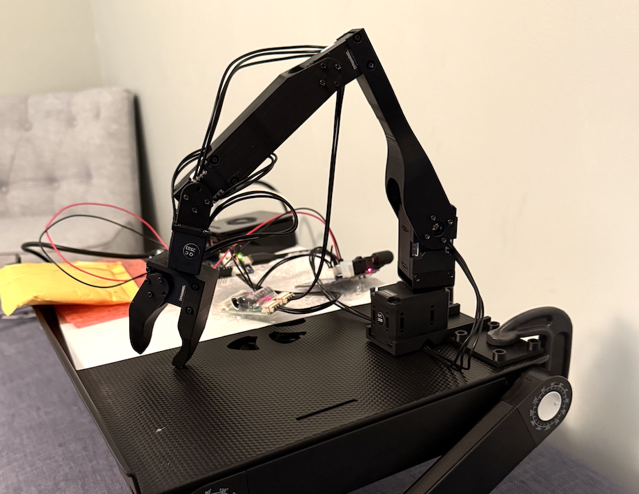
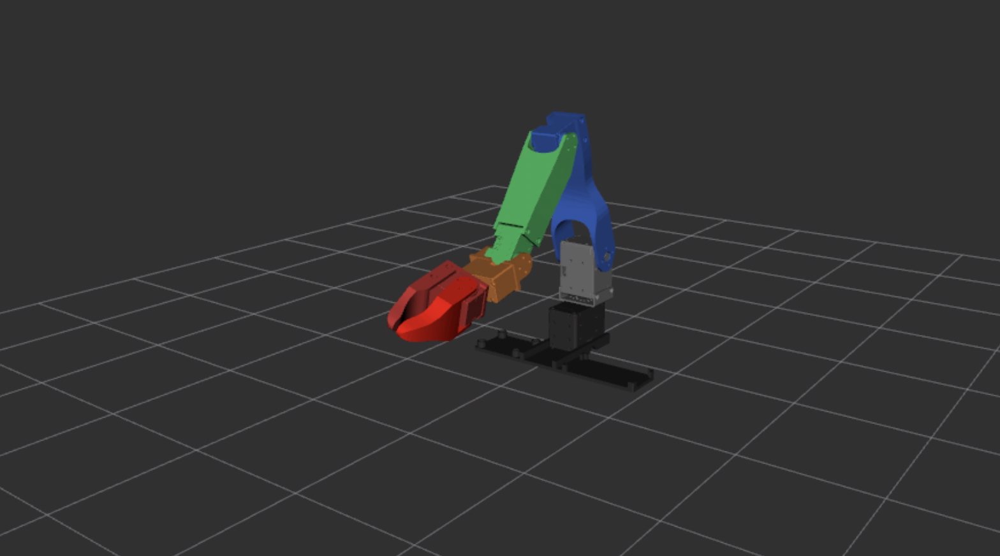
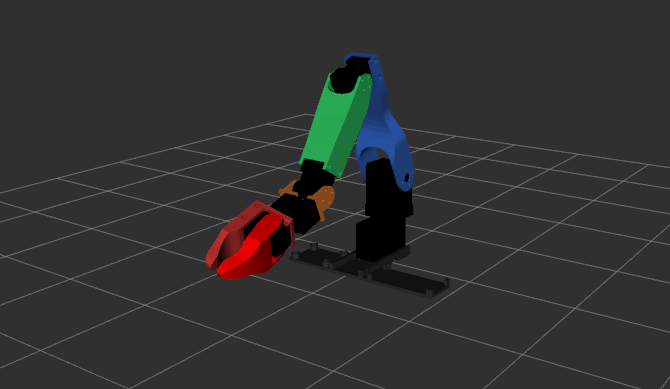
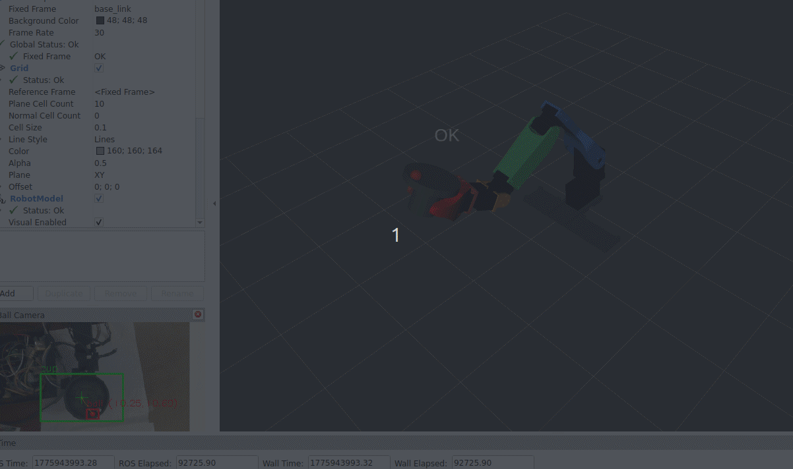

# Ros2 Robot Arm and Balance PID Controller Using Koch v1.1 Follower

## Summary
The following repository has the source, resources, and instructions for building a robotic arm and its digital twin. The arm is based on a modified Koch V1.1 "follower arm" physical design (see [Robotis Koch v1.1 follower arm](https://robotis.us/koch-v1-1-low-cost-robot-arm-follower/)) and its powered by The Robot Operating System v2 [ROS2](https://github.com/ros2).  

(**NEW**) The current effort is focused on enabling this robotic arm to balance a cup containing a metal ball bearing. Balancing is a perennial challenge with robotics (as humanoid robots often fall at embarrassing times ;-)). The koch v1.1 hardware is a bit limited to explore all aspects of balance, but useful as a starter task. This is being 
accomplished by enhancing the robot with additinoal hardware (IMU sensor and inferencing camera) and software, including a Balance [PID controller](https://en.wikipedia.org/wiki/Proportional%E2%80%93integral%E2%80%93derivative_controller) (PID = Proportional–integral–derivative) and a vision ML model among other modules. [Learn more ..](./documentation/balance.md)

This branch supports Ros2 Jazzy (4.2+) and a combination with Humble for the ball bearing detection inferencing.

The details in this project include:
 - Fabrication and/or purchase, modification, and assembly of robotic parts (brackets, Dynamixel servos, and related circuit boards and sensors)
 - Testing and tuning of the physical robot
 - Creating, calibrating, and tuning of the robot arm digital twin (that runs in [rviz](https://docs.ros.org/en/jazzy/Tutorials/Intermediate/RViz/RViz-User-Guide/RViz-User-Guide.html)),
 - Refinement of ROS2-based software to support various actions of the robotic arm and the gathering of physical statistics (current, voltage, temperature, etc)
 - The development of the ML models for ball detection and the PID controller for for balance.

  
  

The documentation for this repository covers the following:
- [Software Setup](./documentation/software_setup.md): how to create the docker envrionment and any additional setup commands. 
- [Hardware Setup](./documentation/hardware_setup.md): Although the setup of the koch_v11 physical robot (leader and follower arms) is partially documented ([Arm assembly by Jess Moss](https://www.youtube.com/watch?v=8nQIg9BwwTk)), those instructions lacked details on some of the required electrical setup. In addition, we are using different controller boards (e.g., Dynamixel OpenRB 150).
- [Firmware Setup and Configuration](./documentation/firmware.md): Notes on the firmware setup and configuration for the OpenRB 150, the servo motors, the current sensors, and the ESP32.
- [Notes on creating the digital twin](./documentation/digital_twin.md): A series of notes that cover the problems and solutions for creating the digital twin.
- [Launching the Physical Robot](./documentation/launching_physical.md) Steps involved in bringing up the physical robot.
- [Running the display only version of the Digital twin](./documentation/display_launch.md): This describes how to bring up the digital twin - either along side the physical robot or by itself as an rviz display-only flavor of the robot.
- [Pose Sequence Tools and Analysis](./documentation/utilities.md): Several tools are provided that drive the robot through a series of poses and analyze physical characteristics (position, temp, current, voltage, etc). This section also provides some analysis case studies that are of interest.
- **NEW** [Balancing a cup with the robotic arm ](./documentation/balance.md): These notes include detailed descriptions of the add-ons to the Koch v1.1 hardware (3D Inferencing camera and IMU) and software: PID related nodes and Machine Learning models for inferencing on the Camera and on an Nvidia Orin Nano.

  

Animations above:
1. The digital twin executing a series of poses that exercise all of the robotic joints.
2. The full rviz output showing a small excerpt of the pose and PID operations. The lower lefthand side is an bounding box annotated view of the camera (image after inferencing) and the right hand side 3D view shows the corresponding movement of the cup, ball, and robot. In this video 5 different tipping poses are set moving the ball bearing to one of the cup. Following each the balance pid controller kicks in and balances the ball within the cup.

## FAQ
### How can this repository be useful?
This repository can be of use to someone building robotics in several ways:
1. *Developers using the Koch V1.1 follower arm*: Although some of the design and operation of the Koch v1.1 robot arm is open source, a developer of it may encounter a number of gaps or issues when working with it. This repository should complement information and software from ROBOTIS and other sources. For example, we provide a  [koch v1.1 URDF](https://github.com/bueche/ros2_robot_arm/blob/main/writing_robot_description/urdf/koch_v11_arm_real.urdf) file that is configured and calibrated to provide a digital twin that matches the physical robot in appearance. In addition, we provide [complete and accurate wiring diagrams](https://github.com/bueche/ros2_robot_arm/blob/main/documentation/hardware_setup.md#electrical-notes) that detail how to co-exist the 12V and 5V Dynamixel servos in the same environment.
   
2. *Developers interested in PID controllers and balance*: Achieving balance in a robotics system has been a challenging research and development area. Humanoid robots still fall over regularly in critical demos. Although the koch v1.1 robot arm is limited in a number of ways the effort of getting it to balance a cup is a good starter task in this area.

3. *Developers integrating vision into their robotics system*: This is perhaps less challenging than achieving balance, but still difficult and covered in much detail. We explore inference on the camera vs. on an Nvidia Orin Nano.
 
4. *Developers wanting to pull more telemetry from Dynamixel servos in a ROS2 environment*: The ros2 interface for the Dynamixel servos is quite limited relative to the internal data it can pull (as compared with the Dynamixel Wizard tool). For example, one can't get a reading on the voltage seen by a servo, even though extra strain on the system could lead to an under-volt situation for the servos in series. We provide information on how to improve this for ros2 and how to set this up ([in code](https://github.com/bueche/ros2_robot_arm/blob/main/documentation/software_setup.md#dynamixel-software-changes)) and retrieve the values at runtime via ros2.

5. *Developers who are adapting robotic arms to ROS2 or not starting from a well defined kit*: ROBOTIS provides several full kits for someone getting started with robot arms that provide a good head start including this [Koch v1.1.](https://robotis.us/koch-v1-1-low-cost-robot-arm-follower/), [OMX AI manipulator](https://robotis.us/omx-ai-us/), [OMY AI manipulator](https://robotis.us/omy-ai3m/), and more. This project provides information for someone who is departing from an easy-to-assemble kit.

   
### What is a leader-follower robotic arm?
A leader-follower robotic arm system consists of two robotic manipulators where one arm (the leader) is manually controlled by a human operator, and the second arm (the follower) replicates those movements in real-time. It's essentially a form of bilateral teleoperation. In this project we are primarily focused on the follower arm.
### Why is this project focused on the follower?
In general leader arms are meant more for human manipulation as they define the poses that the follower will replicate. That limited operational scope for the leader means that its likely that the arm is under powered and/or has a design that is for human manipulation vs. automation. In this project we use the follower as the leader (to predefine poses and collect the measurements) albiet in a less automatic fashion. We also want to study the follower's load and physical characeteristics (e.g., temperature) as it repeatedly performs the activity.
