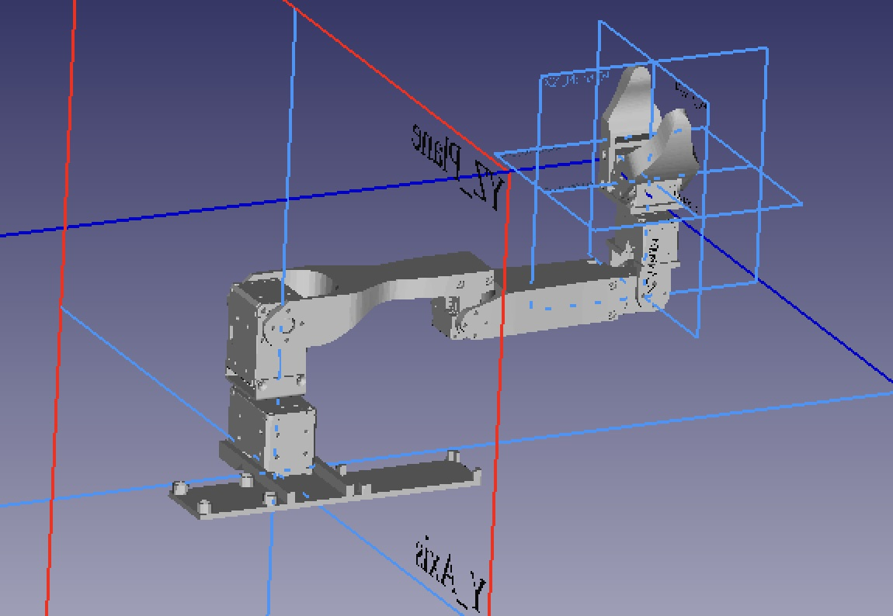
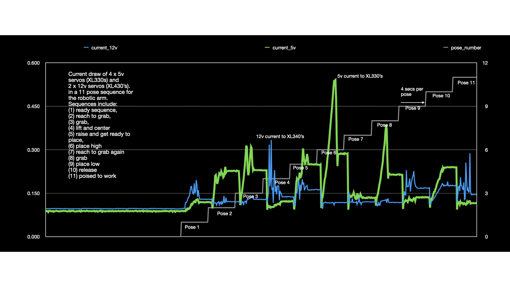

# Ros2 Robot Arm Study Using Koch v1.1 Follower

## Summary
The following repository has the source, resources, and instructions for building a robotic arm and its digital twin. The arm is based on a modified Koch V1.1 "follower arm" physical design (see [Robotis Koch v1.1 follower arm](https://robotis.us/koch-v1-1-low-cost-robot-arm-follower/)) and its powered by The Robot Operating System v2 [ROS2](https://github.com/ros2). This effort is meant to learn and explore both the software and hardware used in robotic arm development. This repository supports both Ros2 Jazzy and Ros2 Humble (see respective branches).

This includes:
 - Fabrication and/or purchase, modification, and assembly of robotic parts (brackets, Dynamixel servos, and related circuit boards)
 - Testing and tuning of the physical robot
 - Creating, calibrating, and tuning of the robot arm digital twin
 - Refinement of ROS2-based software to support various actions of the robotic arm and the gathering of physical statistics (current, voltage, temperature, etc)

  
  
  

The documentation for this repository covers the following:
- [Software Setup](./documentation/software_setup.md): how to create the docker envrionment and any additional setup commands. 
- [Hardware Setup](./documentation/hardware_setup.md): Although the setup of the koch_v11 physical robot (leader and follower arms) is partially documented ([Arm assembly by Jen Moss](https://www.youtube.com/watch?v=8nQIg9BwwTk)), those instructions lacked details on some of the required electrical setup. In addition, we are using different controller boards (e.g., Dynamixel OpenRB 150).
- [Notes on creating the digital twin](./documentation/digital_twin.md): A series of notes that cover the problems and solutions for creating the digital twin.
- [Launching the Physical Robot and its Digital Twin](./documentation/launching_physical.md) Steps involved in bringing up the physical robot and the digital twin.
- [Running the pose_test utility](./documentation/pose_test.md): The pose test utility will iterate through a series of predefined poses and take measurements of the physical robot during this time.
- [Running the servo_monitor tool](./documentation/servo_monitor.md): The servo monitor tool holds the robot in a pose and measures the temp, current, and voltage as this pose is held.
- [Running the pose load_test analysis tool](./documentation/load_test.md): Making projections on limits of the robot joints based on pose transitions.
- [Running the display only version of the Digital twin](./documentation/display_launch.md): Its possible to run only an rviz display only flavor of the robot.
- [Power monitoring using INA219, INA226, and servo-internal sensors](./documentation/power_monitoring.md): The utilities include a ros2 node that taps into INA219 sensors, INA226 sensors, and Dynamixel servo-internal sensors that have been added to measure voltage and current draw on the 5v and 12v set of servos. This provides insights into the servo dynamics and the corresponding power needs.
  

  

## Medium articles:
- TBD 🚧 

## FAQ
### What is a leader-follower robotic arm?
A leader-follower robotic arm system consists of two robotic manipulators where one arm (the leader) is manually controlled by a human operator, and the second arm (the follower) replicates those movements in real-time. It's essentially a form of bilateral teleoperation. In this project we are primarily focused on the follower arm.
### Why is this project focused on the follower?
In general leader arms are meant more for human manipulation as they define the poses that the follower will replicate. That limited operational scope for the leader means that its likely that the arm is under powered and/or has a design that is for human manipulation vs. automation. In this project we use the follower as the leader (to predefine poses and collect the measurements) albiet in a less automatic fashion. We also want to study the follower's load and physical characeteristics (e.g., temperature) as it repeatedly performs the activity.
