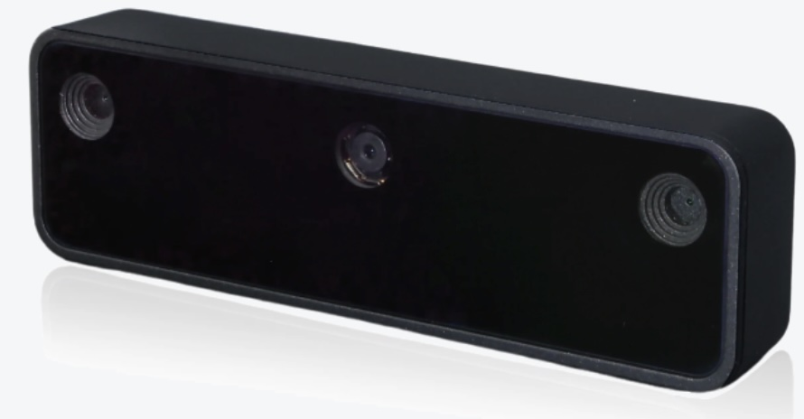

# Balancing a cup with the robot arm
**DRAFT ... UNDER CONSTRUCTION**

In this section we describe the project to balance a cup using the koch v1.1 robotic arm. This high-level ROS2-based architecture is shown below. We highlight some of the differentiating nodes, clients, and controllers.
We have enhanced the koch v1.1 follower robot with an [IMU sensor](https://en.wikipedia.org/wiki/Proportional%E2%80%93integral%E2%80%93derivative_controller) and a [Luxonis OAK-D lite 3D inferencing camera](https://www.luxonis.com/). A shallow cup has been 3D printed and 
attached to the arm end-effector along with a ball bearing that will roll into the center of the cup 
when it is balanced. The image and IMU sensor provide input to a special purpose [PID controller](https://en.wikipedia.org/wiki/Proportional%E2%80%93integral%E2%80%93derivative_controller) that makes fine motor adjustments for two of the six Dynamixel servos in the arm (the wrist_flex and wrist_roll joints). The PID input kicks in after the current pose has been set (using the the [pose test driver](./pose_test.md)). The poses, defined in the [balance_v1.yaml](../writing_robot_description/config/balance_v1.yaml) file as input to the [pose_test utility](./pose_test.md), essentially tip the cup and ball to different sides. Once a step is completed then the PID controller (in this case [wrist_balance_controller](./balance_pid_controller.md)) will make fine-level adjustments to try to bring the cup level and the ball into its center. The PID adjustments are based on the ball position and on the IMU feedback. The PID controller times out  after 5+ seconds and ceases tryng to achieve balance (in order to prevent hardware burnout).

<p align="center">
  
  
</p>

The key camera interface is the [ball_detector_oak.py](../balance/balance/ball_detector_oak.py). This node pulls the ball and cup coordinates infered by the 640x640 YOLOv8n ML model running on the camera as well as a lower resolution debug image stream. The model was trained on ~1500 pictures of the cup+ball (and cup-only and no-cup or ball). The debug image stream is annotated by this node to draw the inferred bounding boxes and this is displayed in rviz.

This sub-project builds upon the earlier work to accurately measure the input current and voltage. The importance of gathering 
those measurements becomes clearer as fine adjustments and error correction could lead to undesiable current spikes (and voltage drops).  

The video below shows the rviz output for a portion of the test (as of 04/24/2026). Currrently the ball never makes it to the center but tuning is underway.

<p align="center">
  
  
</p>

The rest of this page provides more detail or links to more detail on this sub-project

## Sections
- [Hardware](#hardware)
- [Software](#software)
- [Vision Model training and building](#vision-model-training-and-building)
- [Ball detection tuning](#ball-detection-tuning)
- [Dynamixel PID controller tuning](#dynamixel-pid-controller-tuning)
- [Balacing PID controller tuning](#balancing-pid-controller-tuning) 
- [Current status and next steps](#current-status-and-next-steps) 

## Hardware 
The additional hardware for this cup balancing portion of the project is identified in the [hardware section](./hardware_setup.md#balance-related-hardware). In this section we describe some key aspects of the two main additional components: the Luxonis Oak D camera and the IMU. 

### Camera: Luxonis OAK-D lite
In this section we discuss some points related to camera's and this application. 
- Introduction: As noted earlier the basic function of the camera is to track the movement and coordiates of the ball within the cup. It does this using hardware and software built into the camera. The camera is actually able to run a special trained ML model that has been built to recognize the cup and the ball moving in the robot environment. The goal is to get the ball to the middle of the cup and the ball is typically on the perimeter of the cup. Its current coordinates need to determined accurately and with low latency. 

<p align="center">
  
</p>

- Inferencing camera vs. basic USB camera: 
  - *Why use an inferencing camera?* The basic flow requires that images are fed to a model which detects the cup and ball and provides the coordinates of the ball within the cup. The theoretically benefit of the inferencing camera is its ability to avoid having the transport those images in a high frame rate to the inferencing software running on a different host / processor. Instead the inferencing camera can do the detection locally and only report coordinates. It is ideal if all you have is a Raspberry Pi, but since we also have access to an Nvidia Orin Nano we have other options. We will implement the approach of using the Nvidia Orin Nano for inferencing, but have not done so as of yet. 
  
  Still, using the Nano as the camera attachmentWe did find that some additional tuning is required due to the fact that the Orin Nano (at least this version) only exposes USB-2 ports.
  ```
  nvidia-nano:~/robot_ws/src$ lsusb -t
   /:  Bus 02.Port 1: Dev 1, Class=root_hub, Driver=tegra-xusb/4p, 10000M
          |__ Port 1: Dev 2, If 0, Class=Hub, Driver=hub/4p, 10000M
   /:  Bus 01.Port 1: Dev 1, Class=root_hub, Driver=tegra-xusb/4p, 480M
          |__ Port 1: Dev 54, If 0, Class=Vendor Specific Class, Driver=, 480M <---- dev 54 at 480Mbps
          |__ Port 2: Dev 2, If 0, Class=Hub, Driver=hub/4p, 480M
          |__ Port 3: Dev 3, If 0, Class=Wireless, Driver=rtk_btusb, 12M
          |__ Port 3: Dev 3, If 1, Class=Wireless, Driver=rtk_btusb, 12M
  nvidia-nano:~/robot_ws/src$ lsusb
  Bus 002 Device 002: ID 0bda:0489 Realtek Semiconductor Corp. 4-Port USB 3.0 Hub
  Bus 002 Device 001: ID 1d6b:0003 Linux Foundation 3.0 root hub
  Bus 001 Device 003: ID 13d3:3549 IMC Networks Bluetooth Radio
  Bus 001 Device 002: ID 0bda:5489 Realtek Semiconductor Corp. 4-Port USB 2.0 Hub
  Bus 001 Device 054: ID 03e7:2485 Intel Movidius MyriadX <---------------- Luxonis Oak-D lite device 54
  Bus 001 Device 001: ID 1d6b:0002 Linux Foundation 2.0 root hub
  ```

  - *What is the USB-2 vs USB-3 bandwidth?*
    | Standard | Theoretical| Practical (60-70%) | 
    |----------|------------|--------------------|
    | USB 2.0 High Speed | 480 Mbps | ~300 Mbps | 
    | USB 3.0 SuperSpeed | 5000 Mbps | ~3000 Mbps |

  - *But is USB-2 a bottleneck?* With raw frames it will be.  
  - *What is an alternative approach to Camera inferencing?* Alternatively, 
  
  - We are motivated to reduce the image transport bandwidth partly because of Nvidia Orin Nano's USB-2 limitation. 
  - *Why does USB-2 have insufficient bandwidth for streaming video for this application?* The raw image bandwidth formula can be put as follows:
  ```
  bandwidth = image_width × image_height × channels × bytes_per_channel × frames_per_sec x jpeg_compression_factor
  ```
  - where:
    - image_width x image_height define the pixels/frame.
    - Ideally, we could process at least 30 frames per sec to ensure smooth/fluid movement as perceived by our eyes, but this rate has a signficant impact on bandwidth.
    - there are 3 channels of  ....
    - the compression factor is 1/15
  - USB bandwidth:
    | Standard | Theoretical| Practical (60-70%) | 
    |----------|------------|--------------------|
    | USB 2.0 High Speed | 480 Mbps | ~300 Mbps | 
    | USB 3.0 SuperSpeed | 5000 Mbps | ~3000 Mbps |

- Camera inferencing vs. Nvidia inferencing
  - Now we have been able to achieve 12 frames per sec cup/ball inferencing using the Luxonis OAK-D lite and a 640x640 YOLOv8n ML model. This is pretty close to with  [benchmark results for this device](https://docs.luxonis.com/hardware/platform/rvc/rvc2/) which reached 14.3 frames per sec inferencing. 
  - The reported inference latency in that Luxonis benchmark was 120 msec. We expect to get significantly better latency using Nvidia as long as the USB-2 pipe doesn't become a bottleneck when we leverage the  H.264 or H.265 codecs.
  
- 3D camera vs. 2D camera
  - The Luxonis OAK-D lite is also a 3D camera. We have turned off that capability due to the processing needs of inferencing, but will re-enable it when inferencing shifts to the Nvidia Orin Nano.

### IMU
Some discussion points on IMU:
- IMU level vs. ball level
- IMU calibration challenges
- IMU wiring impact on servo accuracy and mobility 
- also reference the Dynamixel servo tuning section

Discussion on the Koch v1.1 and:
- its ability to hold a cup steady
- its ability to hold a cup + ball + IMU + wires for IMU

## Software
- draw software architecture and highlight the new ros2 components needed for this project
- outline each of the new components and their purpose
- describe the hybrid jazzy / humble approach
- Describe the software/hardware approaches for ball inference

## Vision Model training and building
This section should outline the steps and services used in training and building the cup and ball detection and tracking model. 
The workflow for building the model to run on the Luxonis camera is outlined below. 
<p align="center">
  
</p>
The detailed steps are provided in the [model training workflow steps](./retraining_workflow.md#ball-detector-training-and-retraining-workflow).

## Ball Detection Tuning
A number of steps were needed to get the ball detection node working properly. This section discusses some of them and includes:
- coordinates 
- training issues: resolution vs. size
- camera exposure time
- FPS and impact on rviz and PID effectiveness
- USB bandwidth bottleneck on Nvidia orin nano
- Camera inference timing

## Dynamixel PID controller tuning
In this section we should write up the findings on the needed PID tuning of the dynamixel servos and the accellerated 
current draw and the INA219 current bottleneck (and the work around)

## Balancing PID controller tuning
- TBD

## Current Status and Next Steps
- TBD

