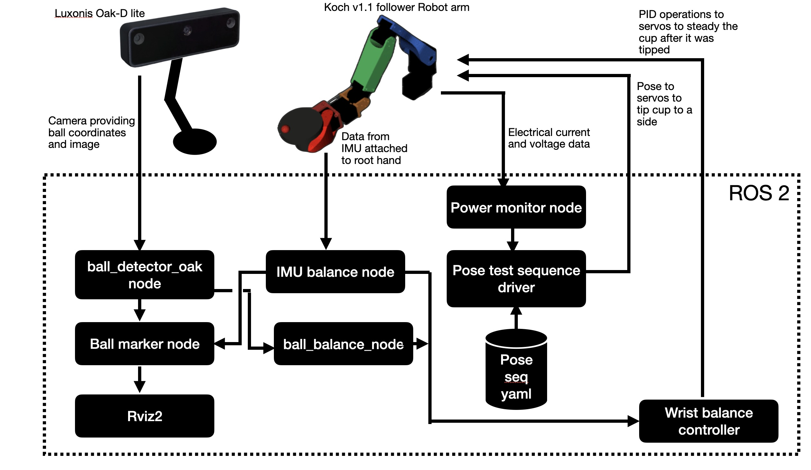

# Balancing a cup with the robot arm
**DRAFT ... UNDER CONSTRUCTION**

In this section we describe the project to balance a cup using the koch v1.1 robotic arm. This high-level ROS2-based architecture is shown below. We highlight some of the differentiating nodes, clients, and controllers.
We have enhanced the koch v1.1 follower robot with an [IMU sensor](https://en.wikipedia.org/wiki/Proportional%E2%80%93integral%E2%80%93derivative_controller) and a [Luxonis OAK-D lite 3D inferencing camera](https://www.luxonis.com/). A shallow cup has been 3D printed and 
attached to the arm end-effector along with a ball bearing that will roll into the center of the cup 
when it is balanced. The image and IMU sensor provide input to a special purpose [PID controller](https://en.wikipedia.org/wiki/Proportional%E2%80%93integral%E2%80%93derivative_controller) that makes fine motor adjustments for two of the six Dynamixel servos in the arm (the wrist_flex and wrist_roll joints). The PID input kicks in after the current pose has been set (using the the [pose test driver](./pose_test.md)). The poses, defined in the [balance_v1.yaml](../writing_robot_description/config/balance_v1.yaml) file as input to the [pose_test utility](./pose_test.md), essentially tip the cup and ball to different sides. Once a step is completed then the PID controller (in this case [wrist_balance_controller](./balance_pid_controller.md)) will make fine-level adjustments to try to bring the cup level and the ball into its center. The PID adjustments are based on the ball position and on the IMU feedback. The PID controller times out  after 5+ seconds and ceases tryng to achieve balance (in order to prevent hardware burnout).

  
  

The key camera interface is the [ball_detector_oak.py](../balance/balance/ball_detector_oak.py) or [ball_detector_nvidia.py](../balance/balance/ball_detector_nvidia.py). The former node pulls the ball and cup coordinates infered by the 640x640 YOLOv8n ML model running on the camera as well as a lower resolution debug image stream. The latter is used to have the nvidia orin nano do the inferencing instead. Both are driven by a  model that was trained on ~1500 pictures of the cup+ball (and cup-only and no-cup or ball). The debug image stream is annotated by these nodes to draw the inferred bounding boxes and this is displayed in rviz.

This sub-project builds upon the earlier work to accurately measure the input current and voltage. The importance of gathering 
those measurements becomes clearer as fine adjustments and error correction could lead to undesiable current spikes (and voltage drops).  

The video below shows the rviz output for a portion of the test (as of 04/24/2026). Currrently the ball never makes it to the center but tuning is underway.

  
  

The rest of this page provides more detail or links to more detail on this sub-project

## Sections
- [Hardware](./hardware_for_balance.md)
- [Software](#software)
- [Vision Model training and building](#vision-model-training-and-building)
- [Ball detection tuning](#ball-detection-tuning)
- [Dynamixel PID controller tuning](./dynamixel_pid_controller_tuning.md)
- [Balacing PID controller](./ball_balance_pid_documentation.md) 
- [Current status and next steps](#current-status-and-next-steps) 
- [FAQ](#faq)

## Software
- draw software architecture and highlight the new ros2 components needed for this project
- outline each of the new components and their purpose
- describe the hybrid jazzy / humble approach
- Describe the software/hardware approaches for ball inference

## Vision Model training and building
This section outlines the steps and services used in training and building the cup and ball detection and tracking model. 
### Model building for camera inferencing
The workflow for building the model to run on the Luxonis camera is outlined below. 

  

The detailed steps are provided in the [model training workflow steps](./retraining_workflow.md#ball-detector-training-and-retraining-workflow).

### Model building for Nvidia Orin Nano inferencing with Torch
The workflow for building the model to run on the Luxonis camera is outlined below. 

  

The detailed steps are provided in TBD.

## Current Status and Next Steps
- TBD

## FAQ
TBD

