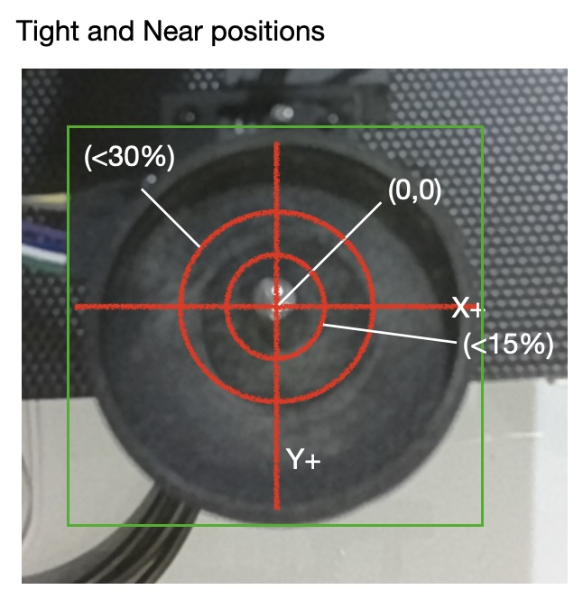
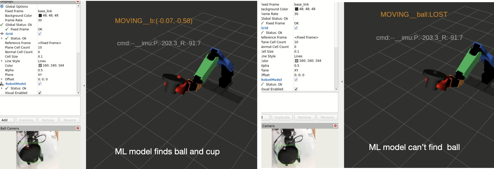

# Balancing Metrics 
## Introduction
In this section we cover metrics for the balance effort. We are motivated to have many different metrics because there are a number of critical areas that if not working optimally will impair the ability of the robot to balance the cup. We are constantly tweaking with these metrics and their utility might vary depending on how far we are in the project. 

## Sections

## Primary metrics
There are a number of primary metrics, as noted earlier: metrics that are super useful for tuning or are just critical for the task success. 

### The number of Ball Center events
This is the most important metric relative to task completion: how many poses reached a situation in which the ball was at the center for 2 consecutive seconds. Seems straight forward, but what defines the center? (0,0) on the virtual coordinate system on the cup? Not exactly, we consider the ball at center if it is somewhere within 15% around the (0,0) point. 

As noted earlier this position topic is published by the ball_detector_nvidia.py at a rate of 30 HZ (or ball_detector_oak.py at a rate of 12 Hz) and this metric is computed by ball_balance_node.py. This shows up in the ball_balance_node log as:

```
[INFO] [1778622300.315666024] [ball_balance_node]: Ball centered — held within stable_thresh=0.15 for 2.0s  

```
<p align="center">
  
</p> 

### Percentage of Center transits and Near center transits
That is, even if the ball is not stable at the center, if we are increasing the number of transits then the system is getting better. This is also tallied by the ball_balance_node.py and written to the log at the end of PID run.

```
[INFO] [1778622299.717761102] [ball_balance_node]: PID_SUMMARY | frames=29/29  near(30%)=29(100%)  tight(15%)=29(100%) 

```
Now the near center represents ball coordinates that were within 30% of less of (0,0). This is also a sign of progress.

### Ball Lost Events
One key component of the system is the ML model to locate the ball and cup. Turns out that the cup is found 100% of the time, but the ball is not. If the model can't find the ball. then the whole system is running blind. Hence, keeping this number as low as possible is critical for task success.

<p align="center">
  
</p> 

### Ratio of Actual to Targetted servo position
This was discussed earlier in our [I term logic](./ball_balance_pid_documentation.md#22-robot-joint-frame-and-understanding-past-errors). In that example we showed how knowing that the servo is unable to achieve the position goal drives the values of the Intergral compoent of the PID to adjust. If this ratio is really low then this I component should grow so that the servo can make a much larger adustment.

### 

## Secondary metrics

## Tools for Summarizing metrics

### balance_analysis.py

### corr_analysis.py


## Evolution of metrics


