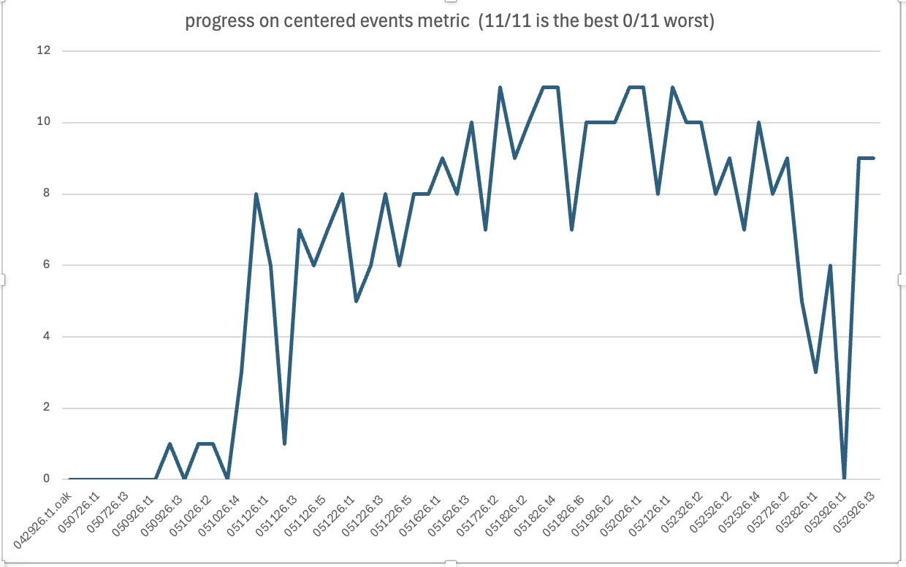
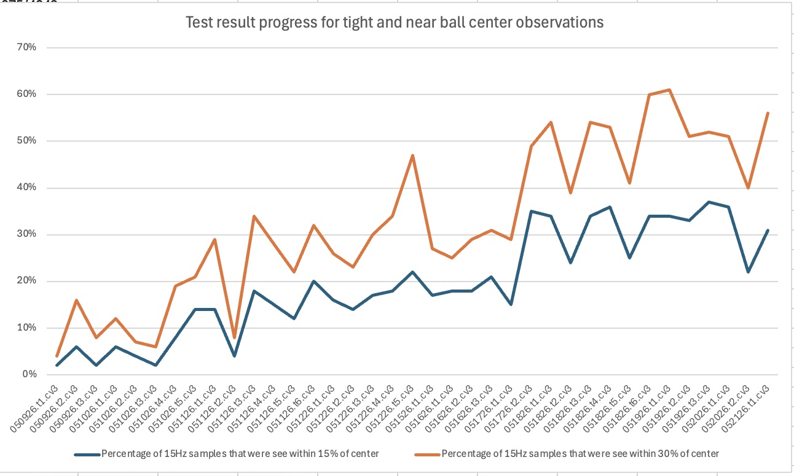
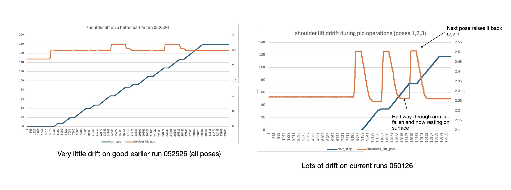

# Balance Test Results
## Sections
## Balance Test results v1
### Summary
The following notes outline the test results so far and provide links to the details for each. 

The main metric for success in the V1 of the balancing effort is a "centered event". This is measured as 2 consecutive seconds in which the ball is within 15% of the center (pos < 0.15 on the unit circle). This event can happen only once for each pose as the test moves on to the next pose once it has been achieved. The following graph below charts the progress over the tests. 

<p align="center">
  
</p> 

This particular metric is the most important at the moment, but doesn't tell the whole story. It has been possible to center the ball in all 11 poses, but achieving this is not consistent. Essentially, there is in general too much jitter in the movement cup and this causes the ball to fall out of the center once its there. The current effort is to reduce this jitter and this leads to experimentation that exposes bugs and otherwise unsuccessful tuning attempts. Hence, at times progress is much worse.

Another interesting metric to track is the percentage of ball coordinate samples that fall within the tight range (pos<15%) or the near range (pos<30%). This is a useful metric to know if one is making incremental progress even if the ball centered metric does not increase or stays the same. 

<p align="center">
  
</p> 

### Detailed Test Result Conventions
There are several reporting conventions covered the results.
1. Each report file is tagged by date and test-number-of-the-day. We use YYMMDD.tN, where YY=2 digit year, MM = month, DD = day, and N = the test number of that day.
2. The raw test results are stored in a file with a naming convention: `test.results.YYMMDD.tN.cv3.txt`. Inside this file are the concatenated log output for (1) the `pose_test.py` utility, (2) the `wrist_balance_controller.py` node, (3) the `ball_balance_node.py`, (4) the `ball_detector_oak.py` or the `ball_detector_nvidia.py` (whichever was used in the test), and (5) the output from `system_watchdog.py`. In addition, some summary notes as to what was the main change from this test vs. the previous one are also provided.
3. The summary analysis is stored in a file with the naming convention: `test.analysis.YYMMDD.tN.cv3.txt`. This is created by running the `test_analysis.py` on the raw test results. This summarizes the entire test and also summarizes and ranks how each pose did.
4. Some corr (or correction) analysis is stored in a file with the naming convention: `test.corr.YYMMDD.tN.cv3.txt`. This provides a detailed analysis on how each correction did for a particular pose. Useful to spot the details of servo issues and to tune the PID values.
5. A  video of the rviz2 output is stored in a file with the naming convention: `test.video.YYMMDD.tN.cv3.txt`. 
6. Power logging output is stored in a file named `power_log_YYYYMMDD_NNNNNN.csv` this is a csv log output of the voltage, current, and temperature for the servos.

More details on the actual metric definitions can be found [here](./balance_metrics.md).

### Detailed Results by Date
#### 06-04-2026
- Summary:  There were three main changes to the code and environment today. 
 1. The jiggle logic was tweaked to make it happen sooner and ensure that it was not conflicting with the last pid command. In addition, I boosted the rad step to make the jiggle more pronounced. 
 2. the heuristic logic around ball and cup resizing was changed to reduce the number of false negatives. I'm every so often shifting the camera position and lighting. This puts stress on the ball detector code and ML model. The latest changes were to make them more robust.
 3. Some backgrounding lighting was added. I ran somne experiments and found that the model did worse if the light was shining directly on the cup and ball. Indirect lighting was better.

  -t1: Changed position of camera. neutralize last command when jiggle starts and increase rad for jiggle (to 0.05) and reduce the time before the jiggle is kicked off to 1s from 2s:  -p jiggle_start_delay:=1.0 -p jiggle_amplitude :=0.05
  -t2: Added some background light. the light points to the wall next to the robot (vs. shining directly on it....the latter reduced the detection confidence). The results of this test showed that some of the heuristic logic to deal with the ball resizing failed to work well. This could be seen in the ball_detector_oak output:
  ```
  [INFO] [1780609725.940261277] [ball_detector_oak]: Cup  bbox: 174x166px  conf=0.888
[INFO] [1780609726.276870288] [ball_detector_oak]: Ball bbox: 25x27px  conf=0.716
[INFO] [1780609726.943048081] [ball_detector_oak]: Cup  bbox: 174x167px  conf=0.895
[INFO] [1780609727.278684645] [ball_detector_oak]: Ball bbox: 25x28px  conf=0.720
[WARN] [1780609727.861333661] [ball_detector_oak]: Cup  size jump 47% -- rejected (det=192x252px conf=0.804 prev=188x171px)
[WARN] [1780609727.869730031] [ball_detector_oak]: Ball (conf=0.733) found but NO CUP
[INFO] [1780609727.944465241] [ball_detector_oak]: Cup  bbox: 189x179px  conf=0.827
[INFO] [1780609728.037485079] [ball_detector_oak]: [publish] proc=8.9ms  budget=83.3ms  OK
[INFO] [1780609728.281429976] [ball_detector_oak]: Ball bbox: 28x33px  conf=0.747
[WARN] [1780609728.792159683] [ball_detector_oak]: Ball size jump 63% -- rejected
[WARN] [1780609728.794800026] [ball_detector_oak]: No detections
[WARN] [1780609728.861737284] [ball_detector_oak]: Cup  size jump 56% -- rejected (det=280x164px conf=0.533 prev=179x183px)
[WARN] [1780609729.865171246] [ball_detector_oak]: Cup  size jump 56% -- rejected (det=280x163px conf=0.558 prev=179x183px)
[WARN] [1780609729.866666527] [ball_detector_oak]: Ball size jump 64% -- rejected
[WARN] [1780609729.949579924] [ball_detector_oak]: Cup rejected by ROI: cx=0.58 cy=0.25
[WARN] [1780609730.867158314] [ball_detector_oak]: Cup  size jump 56% -- rejected (det=280x164px conf=0.456 prev=179x183px)
[WARN] [1780609730.868813984] [ball_detector_oak]: No detections
[WARN] [1780609730.953893979] [ball_detector_oak]: Ball size jump 58% -- rejected
[WARN] [1780609731.950955862] [ball_detector_oak]: Cup  size jump 56% -- rejected (det=280x164px conf=0.494 prev=179x183px)
[WARN] [1780609732.033131954] [ball_detector_oak]: Ball size jump 63% -- rejected
[WARN] [1780609732.034281304] [ball_detector_oak]: Cup rejected by ROI: cx=0.53 cy=0.23
[WARN] [1780609732.956211676] [ball_detector_oak]: No detections
[WARN] [1780609733.035989130] [ball_detector_oak]: Ball size jump 60% -- rejected
[WARN] [1780609733.038049518] [ball_detector_oak]: Cup  size jump 57% -- rejected (det=280x164px conf=0.517 prev=179x183px)
[INFO] [1780609733.728210463] [ball_detector_oak]: Arm SETTLED — ball/cup size reference reset
[INFO] [1780609733.787434670] [ball_detector_oak]: Cup  bbox: 278x164px  conf=0.574
[WARN] [1780609733.789367949] [ball_detector_oak]: Cup (conf=0.574) found but NO BALL
[INFO] [1780609733.871361412] [ball_detector_oak]: Ball bbox: 20x16px  conf=0.413
[INFO] [1780609733.872748913] [ball_detector_oak]: Warmup (2/10): containment check bypassed

  ```
  -t3: Made the heuristic more robust. However, calls into question the resizing heurstic anyway now that we have a containment heurstic in play (i.e., ball is always within the cup...the ML model doesn't use this fact in its calculations)

- Best run: 11 out of 11
- Raw test results: [here](https://drive.google.com/drive/folders/1Cqwexwd-s7kCWslHpN-VQlZsz4dfavEb)

#### 06-03-2026
- Summary: The run from yesterday exposed some weaknesses in the jiggle algorithm. This kicks in during the pid phase if the ball becomes missing for 2 seconds. The new algorithm will rotate in each direction to try to get the ball noticed by the AI model...but we simultaneously dialed back on the rad ... which caused each "jiggle" to be too slight. In addition they were applied with lots of delay leading to the following behavior below. This is a tilt left, so the roll needs to start decreasing ... but instead the jiggle logic is slowly cycling through and it isn't until 8 seconds later that the ball is noticed. 
```
================================================================================
  POSE : pose 3 - tilt cup left
  Start: flex=2.6691 rad  roll=1.8975 rad
  Duration: 19.5s    CORR steps: 19
================================================================================
  step  ── FLEX ──────────────────────────────────────  ── ROLL ──────────────────────────────────────      cumul(f,r)    intv
            from       to   tgt_deg  act_deg  ratio%      from       to   tgt_deg  act_deg  ratio%
  --------------------------------------------------------------------------------------------------------------------------------
     1  flex:   2.6691→  2.6691 tgt= +0.000 act= -0.527     N/A  roll:   1.8975→  1.9000 tgt= +0.140 act= +0.000     +0%  
     2  flex:   2.6599→  2.6399 tgt= -1.146 act= -1.495   +130%  roll:   1.8975→  1.8975 tgt= +0.000 act= -0.086     N/A 
     3  flex:   2.6338→  2.6338 tgt= +0.000 act= -0.613     N/A  roll:   1.8960→  1.8760 tgt= -1.150 act= -1.318   +115% 
     4  flex:   2.6231→  2.6431 tgt= +1.146 act= +0.086     +8%  roll:   1.8730→  1.8730 tgt= +0.000 act= -0.086     N/A  
     5  flex:   2.6246→  2.6246 tgt= +0.000 act= -0.172     N/A  roll:   1.8715→  1.8915 tgt= +1.150 act= +1.054    +92%  
     6  flex:   2.6216→  2.6016 tgt= -1.146 act= -1.409   +123%  roll:   1.8899→  1.8899 tgt= +0.000 act= +0.000     N/A  
     7  flex:   2.5970→  2.5970 tgt= +0.000 act= -0.699     N/A  roll:   1.8899→  1.8699 tgt= -1.150 act= -1.232   +107%  
     8  flex:   2.5848→  2.5640 tgt= -1.192 act= -1.673   +140%  roll:   1.8684→  1.7884 tgt= -4.580 act= -4.658   +102% 
     9  flex:   2.5556→  2.5357 tgt= -1.140 act= -1.404   +123%  roll:   1.7871→  1.7071 tgt= -4.580 act= -4.658   +102% 
    10  flex:   2.5311→  2.5128 tgt= -1.049 act= -1.232   +117%  roll:   1.7058→  1.6258 tgt= -4.580 act= -4.481    +98%  

```
See the output from the `ball_balance_node` for more insight on the jiggle logic:
```
INFO] [1780518630.235783385] [ball_balance_node]: PID active — ball balancing started.
[WARN] [1780518630.237707821] [ball_balance_node]: Ball lost for 6.2s (>1.0s) — suspending PID.
[INFO] [1780518630.239231866] [ball_balance_node]: JIGGLE | lost=6.2s flex=+0.000 roll=+0.020 (phase=1/4)
[INFO] [1780518630.569876434] [ball_balance_node]: PID_SUMMARY | frames=0/3  near(30%)=0(0%)  tight(15%)=0(0%)  min=nan  mean=nan  ball=(-0.592,-0.159)
[INFO] [1780518631.237597290] [ball_balance_node]: JIGGLE | lost=7.2s flex=-0.020 roll=+0.000 (phase=2/4)
[WARN] [1780518631.302362104] [ball_balance_node]: Ball lost for 7.2s (>1.0s) — suspending PID.
[INFO] [1780518631.569677829] [ball_balance_node]: PID_SUMMARY | frames=0/12  near(30%)=0(0%)  tight(15%)=0(0%)  min=nan  mean=nan  ball=(-0.592,-0.159)
[INFO] [1780518632.238128707] [ball_balance_node]: JIGGLE | lost=8.2s flex=+0.000 roll=-0.020 (phase=3/4)
[WARN] [1780518632.302614871] [ball_balance_node]: Ball lost for 8.2s (>1.0s) — suspending PID.
[INFO] [1780518632.569652224] [ball_balance_node]: PID_SUMMARY | frames=0/12  near(30%)=0(0%)  tight(15%)=0(0%)  min=nan  mean=nan  ball=(-0.592,-0.159)
[INFO] [1780518633.304062941] [ball_balance_node]: JIGGLE | lost=9.2s flex=+0.020 roll=+0.000 (phase=0/4)
[WARN] [1780518633.369163942] [ball_balance_node]: Ball lost for 9.3s (>1.0s) — suspending PID.
[INFO] [1780518633.569665305] [ball_balance_node]: PID_SUMMARY | frames=0/12  near(30%)=0(0%)  tight(15%)=0(0%)  min=nan  mean=nan  ball=(-0.592,-0.159)
[INFO] [1780518634.370647457] [ball_balance_node]: JIGGLE | lost=10.3s flex=+0.000 roll=+0.020 (phase=1/4)
[WARN] [1780518634.436073311] [ball_balance_node]: Ball lost for 10.4s (>1.0s) — suspending PID.
[INFO] [1780518634.569999147] [ball_balance_node]: PID_SUMMARY | frames=0/12  near(30%)=0(0%)  tight(15%)=0(0%)  min=nan  mean=nan  ball=(-0.592,-0.159)
[WARN] [1780518635.436208226] [ball_balance_node]: Ball lost for 11.4s (>1.0s) — suspending PID.
[INFO] [1780518635.438830444] [ball_balance_node]: JIGGLE | lost=11.4s flex=-0.020 roll=+0.000 (phase=2/4)
[INFO] [1780518635.569633559] [ball_balance_node]: PID_SUMMARY | frames=0/12  near(30%)=0(0%)  tight(15%)=0(0%)  min=nan  mean=nan  ball=(-0.592,-0.159)
[WARN] [1780518636.504604288] [ball_balance_node]: Ball lost for 12.4s (>1.0s) — suspending PID.
[INFO] [1780518636.506492706] [ball_balance_node]: JIGGLE | lost=12.4s flex=+0.000 roll=-0.020 (phase=3/4)
[INFO] [1780518636.570784998] [ball_balance_node]: PID_SUMMARY | frames=0/12  near(30%)=0(0%)  tight(15%)=0(0%)  min=nan  mean=nan  ball=(-0.592,-0.159)
[WARN] [1780518637.569079422] [ball_balance_node]: Ball lost for 13.5s (>1.0s) — suspending PID.
[INFO] [1780518637.571047025] [ball_balance_node]: JIGGLE | lost=13.5s flex=+0.020 roll=+0.000 (phase=0/4)
[INFO] [1780518637.573350630] [ball_balance_node]: PID_SUMMARY | frames=0/12  near(30%)=0(0%)  tight(15%)=0(0%)  min=nan  mean=nan  ball=(-0.592,-0.159)
[INFO] [1780518637.704017652] [ball_balance_node]: CMD | ball=(-0.582,-0.112) Pflex=-0.0168 Proll=-0.0873 Dflex=-0.0000 Droll=-0.0000 → flex=-0.0196 roll=-0.0870 d_src=joints flex_rate=+0.0000rad/s roll_rate=+0.0000rad/s ach_flex=0.88 ach_roll=0.55 i_flex=-0.0139 i_roll=+0.0046 ki_mode=servo stable=False hold=--
[INF
```
The next step for tomorrow is to:
  1. try an improved camera angle
  2. improve the lighting
  3. increase the rad displacement per jiggle.

- Best run: X out of 11
- Raw test results: [here](https://drive.google.com/drive/folders/1WA9LMy54XejF2JSjdkdwshkppXqY-kUk)

#### 06-02-2026
- Summary: Rewired the current sensors today to get rid of the INA219's in favor or INA226's. Although the wiring is likely going to stay I might swap out these current sensors because they have a limit to the amount of current they can measure ( ~800 mA). The servo's don't draw more than that on either rail but the 5V can get close. The only run in the day was to test that all of this worked and the sagging I noticed yesterday is gone now. 

  -t1: However, this exposed some weaknesses in the current jiggle logic. This logic is used to move the test along when some random placement of the camera to the scene increases the ball lost scenarios.

- Best run: X out of 11
- Raw test results: [here](https://drive.google.com/drive/folders/13c0EM7T6yLeo7l8810AU4jfCrHldAIPe)

#### 06-01-2026
- Summary: Lots of basic issues. The flex portions of the arm are losing steam and can't hold up. Even the XL430's were having trouble. I think this is power related and will rewire on 06-02.
<p align="center">
  
</p> 

Next step: rewire to simplify and replace the INA219 sensors (currently not working) with INA226's.
- Best run: X out of 11
- Raw test results: [here](https://drive.google.com/drive/folders/1TimDMd6rem7nxbwhNGYvp0gClrepPWb9)

#### 05-29-2026
- Summary: fixed the jiggle hammering bug. basically dialed back the number of gjiggle corrections to match the standard corrections (1 Hz). The D-term is still not working as desired leading to lower scores.
  - t1: duplicated issue from previous day
  - t2: jiggle logic fix tested. success!
  - t3: repeat of this fix

- Best run: 9 out of 11
- Raw test results: [here](https://drive.google.com/drive/folders/1wSghBDd543bUKWQG9RnK3jbwVvqRSKE1)

#### 05-28-2026
- Summary: Continued with ball detection and d-term issues.
  - t1: The jiggle logic that was in the ball_detector_nvidia (used to move the test forward if the ball was lost 
   by the ai model) was ported to the ball_detector_oak. This had a bug and it started to hammer the the servos with corrections causing a big dip in the ball centered events.
  - t2: same parameters but ball_detector_oak also updated to have the same containment heuristic added that ball_detector_nvidia had. still did poorly because the jiggle hammering issue was still present.
  
- Best run: 6 out of 11

- Raw test results: [here](https://drive.google.com/drive/folders/10qBUlCMGZYeKDe79L3tgGdXgbY-VFf6b)
#### 05-27-2026
- Summary: working through issues with ball detection and the new D-term approach.
   - t1: Redo of the imu for the Dterm due to the bug in the other approach antiwindup_decay:=0.2  and kd=0.07
Camera not setup well. Lots of ball and cup missing.
   - t2: Camera not setup well. Lots of ball and cup missing....repositioned the cup but it still needs to be higher.
   - t3: repositioned the cup but it still needs to be higher.
   
- Best run: 9 out of 11
- Raw test results: [here](https://drive.google.com/drive/folders/15OMOpQnW5coZrSKTk-wGhg9X7tkWkngf)

#### 05-25-2026
- Summary: 
  - t1: same parameters as previous last run. testing pid logger v5. end result: not feeling good about imu velocity values. they are too static. and the theory is that this is due to sampling of the imu values.
  - t2: New approach for D-term: defined by the dwrist_flex_dt (joint trajectory approach) vs. the imu. now supporting d_term_source:=joints (and imu --> legacy)
  - t3: same as a above tweaked the kd parameters
  - t4: same as a above and introduce some additional logic to handle the ball quickly passing the center.  antiwindup_decay:=0.2  and kd=0.05 
- Best run: 10 out of 11
- Raw test results: [here](https://drive.google.com/drive/folders/137WMwzBV4Gz3MZBRj6hqDPUynfYLXZxf)
#### 05-23-2026
- Summary: Introduced a new approach for the D-term instead of using the IMU now using the joint state data to compute the velocity of the servos. The imu values were really static.

- Best run: 10 out of 11 poses balanced

- Raw test results: [here](https://drive.google.com/drive/folders/137WMwzBV4Gz3MZBRj6hqDPUynfYLXZxf)

#### 05-23-2026
- Summary: No parameter changes from the last run on the previous day. created a new logger that is logging the pid output so I can study the sensors and their impact on the pid.

- Best run: 10 out of 11 poses balanced

- Raw test results: [here](https://drive.google.com/drive/folders/1NK0KE4UHPHZIe5EuDD7gsrXKRxyBEQ2-)

#### 05-21-2026
- Summary: No parameter changes from the last run on the previous day. The all 11 poses reached balance state. The system watchdog was moved from the Nvidia Nano to the PI in order to get an accurate inter-system latency measurement. In addition, the oscillation metric has been modified to take into  account the distance of the overshoot. The previous days data has not been updated with the new metric.
- Best run: 11 out of 11 poses balanced

- Raw test results: [here](https://drive.google.com/drive/folders/1SAEAZFQ_NCvkkLrv5R3Z77Q2QiYPSyYZ)

#### 05-20-2026
- Summary: Two tests all with the same parameters as the previous day's best run. These were redo of the last runs on the previous day (using Oak-D camera). Chief change was moving the inferencing from the Nvidia Nano / torch back to the Oak-D camera. This was attempted to get around spikes in the latency due to transient issues on topic serialization between the humble-based container (for Nvidia/torch) and the rest of the system which used Jazzy containers. This experiment was a success as the system performed well and the errors and latency spikes disappeared.
- Best run: 11 out of 11 poses balanced
- Raw test results: [here](https://drive.google.com/drive/folders/1u0LKf98-EEiZf1zsIMm8q5eSyl1Q2h1t)

#### 05-19-2026
- Summary: Tuning of the D-term: First change: slightly increasing the D-term's from beyond yesterday's best run. But chief change was moving the inferencing from the Nvidia Nano / torch back to the Oak-D camera. This was attempted to get around spikes in the latency due to transient issues on topic serialization between the humble-based container (for Nvidia/torch) and the rest of the system which used Jazzy containers. This experiment was a success as the system performed well and the errors and latency spikes disappeared.

  - t1 : -p kd_flex:=0.05 -p kd_roll:=0.05 
  - t2 : -p kd_flex:=0.07 -p kd_roll:=0.07
  - t3 : -p kd_flex:=0.07 -p kd_roll:=0.07
- Best run: 11 out of 11 poses balanced
- Raw test results: [here](https://drive.google.com/drive/folders/12SIIar26ajCId2KxenKoLBnx-08IAtp2)

#### 05-18-2026
- Summary: Tuning of the D-terms. Motivated by the larger step (max_step_rad) causing ball to overshoot. 
0.02 was too little. 0.10 caused too much dampening (especially for pose 5). and 0.05 seemed the best so far.
  - t3: -p kd_flex:=0.02 -p kd_roll:=0.02  
  - t4: -p kd_flex:=0.05 -p kd_roll:=0.05
  - t5: -p kd_flex:=0.10 -p kd_roll:=0.10
  - t6: -p kd_flex:=0.05 -p kd_roll:=0.05
- Best run: 11 out of 11 poses balanced
- Raw test results: [here](https://drive.google.com/drive/folders/1FO7Z4PCcVphPn5sKU4akMhfAkKErRM3L)

#### 05-17-2026
- Summary: Disabled stall logic, to leverage I-term boost only. The stall logic was redundant. Increased the max_step_rad to 0.10 radians. This allows the servo to make bigger steps by default. This allowed pose 5 to work consistently. All 11 poses made it to the balance state.
- Best run: 11 out of 11 poses balanced
- Raw test results: [here](https://drive.google.com/drive/folders/1U4U-UoIMLNvcXACQfkVrv6aOotJpbh8c)

#### 05-16-2026
- Summary: Continued trying to solve pose 5 challenges (servo stalling on the small incremental targets). Found a bug in how the I-term pipeline that I thought was working before ... now realized that the stall logic was redundant.
- Best run: 10 out of 11 poses balanced

- Raw test results: [here](https://drive.google.com/drive/folders/1z1cPCYoLNKp98mv9OenhTXR3bl00UrI5)

#### 05-15-2026
- Summary: Continued to try to solve pose 5 balance scenario. Tuning of logic to boost when stalled.
- Best run: 8 out of 11 poses balanced
- Raw test results: [here](https://drive.google.com/drive/folders/1glJg0WX8Qt_W_OdkAh3VcJ9vlDBaO7M6)

#### 05-12-2026
- Summary: Derived some new logic to attempt to solve pose 5 challenge: servo stalling and unable to make small increments.
- Best run: 8 out of 11 poses balanced
- Raw test results: [here](https://drive.google.com/drive/folders/1_dgta9bZiPBLN-hbbgFrYAv4Kcrw6cu0)

#### 05-11-2026
- Summary: 
- Best run: 8 out of 11 poses balanced
- Raw test results: [here](https://drive.google.com/drive/folders/1mLVPdBu6hI8HkZgBizKYOD7f58EED1n5)

#### 05-10-2026
- Summary: big progress with testing and tuning. 
  - t1:  -p max_step_rad:=0.02
  - t2: first attempt at D-term (calibrated IMU) -p kd_flex:=0.02 -p kd_roll:=0.02
  - t3: 2nd attempt ... arm shook too much total fail
  - t4: -p correction_hz:=2.0 ... reduced correction rate from once every 200ms to once every 500 ms .. still shaking
  - t5: -p correction_hz:=1.0 <--- this was the big win!  to get rid of shakes

- Best run: 8 out of 11 poses balanced (t5)
- Raw test results: [here](https://drive.google.com/drive/folders/1Aw71SPTRNM2B8XkhZjr-hQcE9Nj0HguZ)

#### 05-09-2026
- Summary: Initial use of anaysis metrics. Only P-term is being used. cup version 3 is being used.
- Best run: 1 out of 11 poses balanced
- Raw test results: [here](https://drive.google.com/drive/folders/1wS2cby8JCwtBqDidsu8bunQUOJk2VjV8)

#### 05-08-2026
- Summary:
- Best Run: 0 out of 11
- Raw test results: [here](https://drive.google.com/drive/folders/185mo2L-VGnIdWO9HgOUCZFh2qUUFjhYf)

#### 05-07-2026
- Summary:
- Best Run: 0 out of 11
- Raw test results: [here](https://drive.google.com/drive/folders/1N0kzlyP1XtdEWTQaDBJjzfdu7e6nE75E)

#### 04-29-2026
- Summary:
- Best Run: 0 out of 11
- Raw test results: [here](https://drive.google.com/drive/folders/1ONip-Px7ZV83DV2gUOei6lk9gwigBbRP)
