# Koch v1.1 Ball Balancing System — PID Control Documentation

The following notes represent a deeper dive into the PID controller logic and operation for the 
robot. This section has several goals that include explaining in detail using details from an example test:
- How do we turn ball movements in the cup into servo adjustments in the robot?
- What are the ros2 topics and what is their timing?
- How do we interpret the log and rviz output?


Some of the log output might change, so this section is not guaranteed to be 100% matching with the code. 
The examples are taken from a test run with the inferencing happening using the Nvidia Orin Nano (as oppose to happening 
on the camera): 

**Test run:** 042926 t2 torch  
**Date:** April 29, 2026  
**Configuration:** kp_flex=0.25, kp_roll=0.25, kd=0, ki=0, correction_hz=5Hz, move_duration=0.1s, max_step_rad=0.05, max_total_rad=0.5

---

## 1. System Architecture

The ball balancing system consists of five nodes working in a pipeline:
<p align="center">
  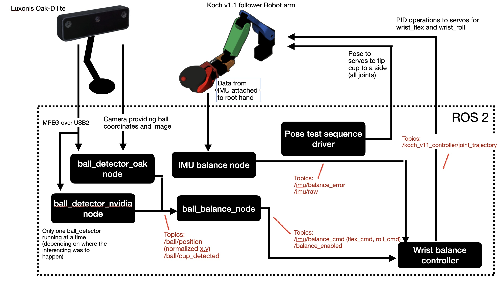
</p> 

1. The camera interfaces either with `ball_detector_oak.py` or `ball_detector_nvidia.py` depending on whether cup and ball inferencing is happening on the camera or the nvidia orin nano. These nodes publish the same topics, however, which consist of the ball coordinates within the image and whether a ball was detected or not (along with some debug information).

2. The `ball_balance_node.py` then uses this information to work out the ball's coordinates within the cup. Then it formulates the Proportional adjustment portion of the PID command and publishes this as the topic `/imu/balance_cmd`. Note this is labeled as the node `/imu` due to originally all I had was the imu and not the camera. Need to clean this up. Also, note that the ball balance node doesn't know the position of the servos. So the pid command still needs to be translated into servo radian positions by the `wrist_balance_controller`.

3. The IMU (BNO085/MPU-6050 on ESP32, mounted on wrist) publishes `/imu/balance_error` 
and `/imu/raw` for monitoring and optional Derivative or D-term feedforward, but in this test run 
D-term gains were zero so it contributed no corrections.

4. The `wrist_balance_controller` takes in the input from the camera (now formulated as a PID command), tge servo positions, and the IMU and does the last bit of PID operation by translating this into servo radian targets. It publishes these to make this happen.


---

## 2. Visual Coordinate Conventions

The ML model returns coordinates on the image, not within the cup. It has no concept of the cup at all — it just returns bounding boxes for whatever objects it detects that meet the confidence threshold. For each detection it outputs four numbers: the pixel coordinates of the top-left and bottom-right corners of the bounding box (xmin, ymin, xmax, ymax), along with a class label (0=ball, 1=cup) and a confidence score. The model was trained to recognize both objects but it treats them as completely independent detections — it doesn't know or care that the ball should be inside the cup.

 The next challenge in translating ball position into servo commands is establishing a shared coordinate system that makes the math simple and the control logic intuitive.   The approach here is to express the ball's position relative to the cup center — not in pixels, but as a normalized offset divided by the cup radius. This gives a coordinate space where (0,0) always means "ball is centered" regardless of how large the cup appears in the camera frame, and where the rim of the cup is at magnitude 1.0 in any direction. 
 
 The translation into normalized cup-relative coordinates happens entirely in `ball_detector_nvidia.py` (or `ball_detector_oak.py`) in the `_process_and_publish()` method. It uses the bounding boxes to come up with a cup and ball center and then calculates the position of the ball wrt to the cup. 
 
 The X axis runs left-right across the cup as seen from the camera, with X+ to the right. The Y axis runs toward/away from the robot base, with Y+ away from the robot (lower in the camera image). These four quadrants map directly onto the four directions the cup can tilt: a ball at positive X needs a roll correction, a ball at positive Y needs a flex correction, and a ball anywhere off-center needs some combination of both applied simultaneously. The attentive reader will note that some of the other joint positions could be used to impact the ball position (e.g. elbow_flex and shoulder_lift), but if we fix those then (post pose step completion) then the PID controller can operate with a more simple model involving only the wrist_flex and wrist_roll.
 
 Critically, the coordinate origin (0,0) is the goal state — it is the point at which both PID error terms are zero and no correction is commanded. The radian positions of wrist_flex and wrist_roll must be physically aligned to this coordinate system so that a positive X error drives the roll servo in the direction that actually moves the ball toward X=0, and a positive Y error drives the flex servo in the direction that moves the ball toward Y=0. This alignment was verified experimentally across all four quadrants in the test run described below, and the sign chain was confirmed correct in all cases.

### 2.1 Camera Frame → Ball Position

The OAK-D Lite camera is mounted looking **down** at the cup from above. The detector
publishes `/ball/position` as a normalized offset of the ball center from the cup center,
divided by the cup radius:

```
ball.x  positive = ball is to the RIGHT in the camera image
ball.x  negative = ball is to the LEFT in the camera image
ball.y  positive = ball is TOWARD the robot (lower in image, near side of cup)
ball.y  negative = ball is AWAY from robot (upper in image, far side of cup)
ball.z  = 0.0 when both ball and cup detected, -1.0 when not detected
```

A value of (0.0, 0.0) means the ball is perfectly centered in the cup.
A value of (±1.0, 0.0) means the ball is at the cup rim on the roll axis.

<p align="center">
  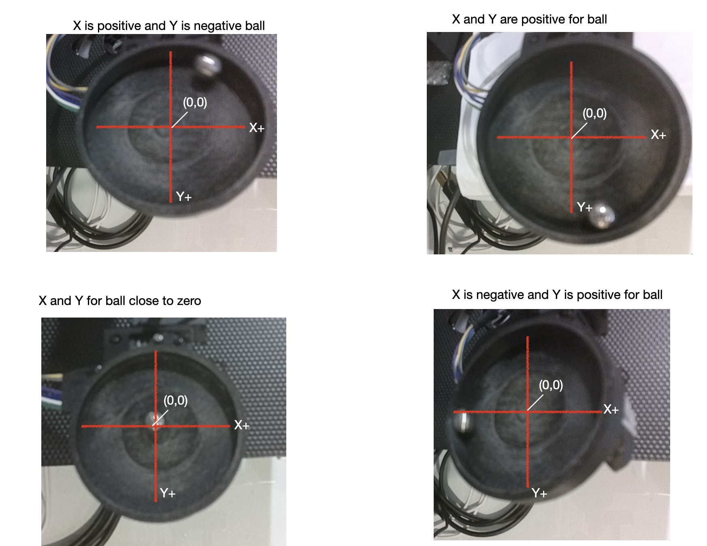
</p> 

### 2.2 Robot Joint Frame and Understanding Past Errors

As noted above, the Koch v1.1 wrist has two joints we focus on for balancing:

- **wrist_flex**: used to tilt the cup forward/backward (toward/away from robot base)
- **wrist_roll**: used to tilt the cup left/right

This robot goes through a series of moves or poses which are defined ahead of time (in the pose sequence yaml, for example [here](../writing_robot_description/config/balance_v1.yaml))and deterministic. AFter each such step, it then transitions into a balancing phase controlled by the PID controller and whose goal is to get the ball to return the center. The pose step phase can impact all servos, but the PID phase only impacts the wrist flex and wrist roll.

Joint positions are in radians. The operating range for these two joints are defined in the [urdf file](../writing_robot_description/urdf/koch_v11_arm_real_for_balance.urdf) as:
- `wrist_flex`: 0.297 to 2.700 rad  
- `wrist_roll`: -1.448 to 1.900 rad

But for this application we don't have these joints operate over that full range for some practical reasons:
- the wrist roll if moved too far in either direction will spill out the ball bearing from the cup,
- if the wrist flex is too low, then the cup will hit the ground, and
- In certain high positions it seemed as if the servos (like the elbow flex) were drawing too much current and having a hard time maintaining position while holding the cup.

The positions from which the PID must operate to balance are defined in the [pose test balance seqeunce](../writing_robot_description/config/balance_v1.yaml). The limited movement for these two joints is illustrated below.

<p align="center">
  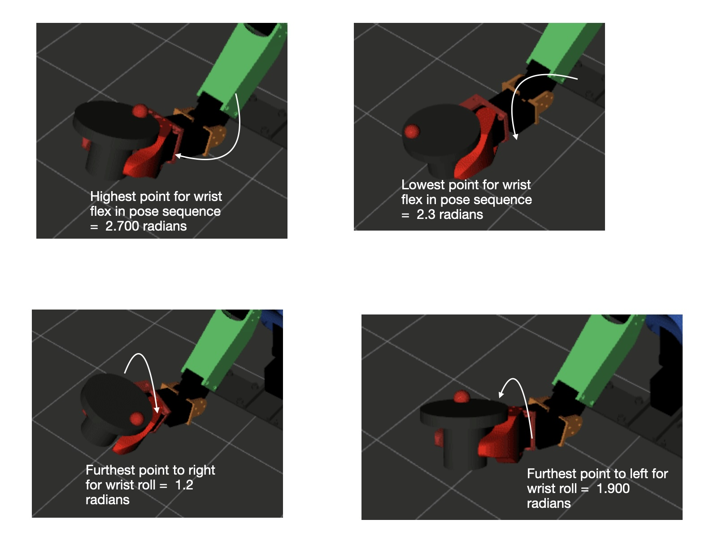
</p> 


*The standard characterization of I-term** is "accumulates past error over time to eliminate steady-state offset." The classic example: a thermostat with only P-term will hold temperature slightly below the setpoint because the proportional correction weakens as the error shrinks — eventually the small remaining error produces just enough heating to balance heat loss, but never quite reaches the target. The I-term accumulates that persistent small error and keeps increasing the command until the offset is eliminated.

Currently, we are using the error in the servo's commanded vs. actual position to define the I-term error. That is, after each pose is set each servo 's wheel has been moved to some position. When the PID algorithm kicks in it will start to set new incremental targets for the wrist_flex and wrist_roll in order to move the ball into the center. How well the servo does to reach that position defines the error. It can either do really well, fail misreably, or fall somewhere in between. In all cases we can get that information because the servo reports its position. 

Lets look at an actual scenario for one of the difficult scenarios in our test: pose 5. In this one, the arm tips the cup forward in a manner that puts significant strain on the wrist and elbow flex joints (essentially Servos 3 and 4). That is, it starts close to the wrist-flex-low pose shown in the figure above (position =  2.3 radians). Gravity makes it hard to do small moves. It can move in a single pose from there to the wrist-flex-high (position = 2.7 radians), but doing small incremental ones is more difficult for the XL-330's as is illustrated in this sequence below. The table output comes from the [corr_analysis.py](../balance/scripts/corr_analysis.py) script which analyzes the raw correction log output from the [wrist_balance_controller.py](../writing_robot_control/writing_robot_control/wrist_balance_controller.py). In this output it evaluates how well the two joints did in the sequence while the PID was operating. For each step the wrist flex is being commanded to move 1.719 radians but it is unable to make much headway. 

For example, at step 1 it is being commanded to move from 2.2918 rad to 2.318 rad, but one can see that by the time step 2 fires it had only moved to 2.2933 (see the from in step 2). now the difference between the ending (2.2933 rad) and the start (2.2918 rad) is 0.0015 rad or 0.086 degrees. The flex servo was commanded to achieve 1.719 degrees, but only managed 0.086, that is 5% of goal. On the otherhand, the wrist_roll on the same steps did far better, achieving 92% of what it was targetted to do. In this case, it was much easier to move side-to-side than forward to back. But the main point is that error in achievement by the wrist_flex joint needs to be fed back into the controller, else the outcome will remain the same: the proportional movement will stay fixed (a command to 1.719 degrees) without success. Since we know that larger steps are easier than smaller ones for the servo to achieve, the I contribution should grow 1.719 degrees into something larger. This wasn't being done in the case below, but has now been implemented.


```
================================================================================
  POSE : pose 5 - forward
  Start: flex=2.2918 rad  roll=1.5999 rad
  Duration: 19.5s    CORR steps: 17
================================================================================
  step  ── FLEX ──────────────────────────────────────  ── ROLL ──────────────────────────────────────      
            from       to   tgt_deg  act_deg  ratio%      from       to   tgt_deg  act_deg  ratio%
  --------------------------------------------------------------------------------------------------------------------------------
     1  flex:   2.2918→  2.3218 tgt= +1.719 act= +0.086     +5%  roll:   1.5999→  1.5699 tgt= -1.720 act= -1.581    +92%  
     2  flex:   2.2933→  2.3233 tgt= +1.719 act= +0.178    +10%  roll:   1.5723→  1.5423 tgt= -1.720 act= -1.667    +97%  
     3  flex:   2.2964→  2.3264 tgt= +1.719 act= +0.172    +10%  roll:   1.5432→  1.5432 tgt= +0.000 act= +0.000     N/A  
     4  flex:   2.2994→  2.3294 tgt= +1.719 act= +0.264    +15%  roll:   1.5432→  1.5187 tgt= -1.400 act= -1.232    +88%  
     5  flex:   2.3040→  2.3340 tgt= +1.719 act= +0.000     +0%  roll:   1.5217→  1.5081 tgt= -0.780 act= -0.613    +79%  
     6  flex:   2.3040→  2.3340 tgt= +1.719 act= +0.178    +10%  roll:   1.5110→  1.5110 tgt= +0.000 act= +0.000     N/A  
     7  flex:   2.3071→  2.3371 tgt= +1.719 act= +0.178    +10%  roll:   1.5110→  1.4922 tgt= -1.070 act= -1.054    +98%  
     8  flex:   2.3102→  2.3402 tgt= +1.719 act= +0.000     +0%  roll:   1.4926→  1.4834 tgt= -0.530 act= -0.441    +84%  
     9  flex:   2.3102→  2.3402 tgt= +1.719 act= +0.086     +5%  roll:   1.4849→  1.4849 tgt= +0.000 act= +0.000     N/A  
    10  flex:   2.3117→  2.3417 tgt= +1.719 act= +0.000     +0%  roll:   1.4849→  1.4933 tgt= +0.480 act= +0.350    +73%  
    11  flex:   2.3117→  2.3417 tgt= +1.719 act= +0.000     +0%  roll:   1.4910→  1.5012 tgt= +0.580 act= +0.441    +75%  
    ---

```

The error of the servo accumulates `commanded_delta - achieved_delta` — the gap between what was asked and what was delivered. This is conceptually the same thing but measured at a different layer. Notice that we are not asking:  "how long has the ball been off-center?", but rather "how much have I asked the servo to do that it hasn't done yet?" The accumulated undelivered displacement represents a debt that the controller owes to the system.


**The one place where the characterization slightly diverges** from classic I-term: traditional integral is about error *persistence in the output space* (the ball hasn't moved enough). Our servo integral is about error *persistence in the input space* (the actuator hasn't responded). These are related but not identical — it's possible for the servo to underdeliver while the ball is actually moving (if gravity is doing some of the work), in which case our logic would accumulate less than logic based solely on the ball movement would. We will see how that plays out as more tuning continues.


### 2.3 IMU feedback and the prediction of future error

The D in PID stands for Derivative and is often described as the part of the logic that predicts future errors. This isn't quite correct, I think in particular for this implementation. What D-term actually does is respond to the rate of change of the error, not a prediction. The formula is `D = -kd × d(error)/dt`. If the ball is at position 0.7 in the cup (far from center) but moving toward center rapidly, the D-term reduces the correction command — because the error is already improving fast and a full P-term correction would overshoot. If the ball is at 0.7 and moving away from center, D-term adds to the correction. It's damping (TODO: define), not making a prediction. The "predicts future error" framing is an informal way of saying "if error is decreasing fast now, the future error will be smaller, so act accordingly."

Why are we using the IMU and not the camera for the D-term?  That is, if we used the camera computing `d(ball.y)/dt` from consecutive `/ball/position` topic readings seems reasonable at first: (ball.x, ball.y) move to (ball.x1, ball.y1) in time t. But it has a couple of problems. First, the camera runs at 35Hz with ~30ms latency (TODO: check), so by the time we compute the rate the cup has already moved. Second, the ball's position in the cup is an *effect* of cup tilt — by the time the ball has moved, the cup has already been tilted for some time. We'd be reacting to a lagging indicator.

Why IMU-based D-term is better: The IMU measures angular_velocity of the cup directly — the cause of ball movement rather than the effect. When the wrist_flex servo moves the cup, the IMU detects the tilt rate within milliseconds at 50Hz (every 20 ms), well before the ball has had time to roll significantly. So `d(flex) = -kd × imu_pitch_rate` is saying: "the cup is currently tilting forward at X rad/s — reduce the flex command so it doesn't tilt too far and cause the ball to overshoot center." 

The concrete scenario where this should help our system: During pose 1 (initial), the ball starts at y=-0.73 (far side). The P-term commands a strong negative flex correction. The cup starts tilting, the ball rolls toward center. Without D-term, the P-term stays large until the ball reaches 0.0 — but by then the cup has built up angular momentum and the ball overshoots to +0.7 on the other side. With IMU D-term: as the cup tilts at increasing pitch rate, imu_pitch_rate grows negative, `-kd × negative_rate` adds a positive contribution to flex_cmd, partially canceling the P-term. The cup decelerates before the ball reaches center. The ball arrives at center with less momentum. This is the damping behavior we need to stop the oscillation.
The "prediction" framing applied properly: The IMU is sensing the cup's angular velocity right now. Since the ball's future position is determined by current cup tilt rate (a ball on a tilting surface accelerates proportionally to tilt angle), the IMU rate is a leading indicator of where the ball will be in 200-500ms. In that sense the D-term from the IMU is genuinely predictive — it acts on cup motion before the ball has moved, rather than reacting after the ball has already overshot.

This is the theory at least, as of 05-13-2026 we don't have it working. ;-)

### 2.4 Summary of PID logic
**this section needs and update**
The full sign chain from ball position to joint correction:

```
error_x = ball.x   (positive = ball right  → need to roll left  → positive wrist_roll)
error_y = ball.y   (positive = ball near   → need to flex back  → positive wrist_flex)

Pflex = +kp_flex × error_y        computed in ball_balance_node
Proll = +kp_roll × error_x        computed in ball_balance_node

flex_cmd = Pflex + Dflex           (Dflex=0 in this run)
roll_cmd = Proll + Droll           (Droll=0 in this run)

  → published to /imu/balance_cmd at ~15Hz

flex_delta = flex_cmd × flex_scale × dt    computed in wrist_balance_controller
roll_delta = roll_cmd × roll_scale × dt    dt = 1/correction_hz = 0.2s at 5Hz

flex_delta = clamp(flex_delta, -max_step_rad, +max_step_rad)
roll_delta = clamp(roll_delta, -max_step_rad, +max_step_rad)

new_wrist_flex = current_wrist_flex + flex_delta
new_wrist_roll = current_wrist_roll + roll_delta

  → published to /koch_v11_controller/joint_trajectory
```

`current_wrist_flex` and `current_wrist_roll` are the **actual measured joint positions
in radians** read from `/joint_states` at the moment the correction fires — the real
servo positions as reported by the Dynamixel hardware interface via ros2_control. They
reflect where the joint physically is, not where it was last commanded to be.

`new_wrist_flex` is the **target position** published in a `JointTrajectory` message
with `time_from_start = move_duration = 0.1s` (in this run). This tells the trajectory
controller to reach the target in 100ms. The servo may not fully reach it before the
next correction fires 200ms later (at 5Hz), but this is by design — the next correction
reads the actual position again and computes a fresh target from there.

The servo falling behind its target is visible in consecutive CORR lines:
```
CORR | flex 2.6691→2.6327 (Δ-2.09deg)   ← correction 1: targets 2.6327
CORR | flex 2.6185→2.5821 (Δ-2.09deg)   ← correction 2: actual was 2.6185, not 2.6327
```
The servo traveled from 2.6691 to 2.6185 = 0.0506 rad in 100ms — it overshot its
0.0364 rad target slightly (servo was still decelerating). The next correction computes
from 2.6185, not from the commanded 2.6327. This self-correcting behavior is correct:
by always reading actual position the controller accumulates no tracking error.

We verified the  sign chain was correct across all four test poses — increasing
wrist_flex tilts the cup toward the robot (raising the far side), rolling a ball on the
far side (negative ball.y) back toward center. The positive gain with positive error
is the corrective direction.

### 2.4 Topic Flow and Timing

Three nodes participate in the correction pipeline, each running on its own independent
timer. They are **not synchronized** to each other:

```
ball_detector_nvidia     publishes /ball/position     ~35fps   (28ms intervals)
ball_balance_node        publishes /imu/balance_cmd   ~15Hz    (67ms intervals)  
wrist_balance_controller executes corrections         1Hz      (1000ms intervals)
```

`ball_balance_node` runs a control loop at 15Hz. Each cycle it reads the latest
`/ball/position` value (which may be up to 67ms old), computes P×error, and publishes
to `/imu/balance_cmd`. The CMD log line is **throttled to 1Hz** in the logger, so the
log shows only 1 CMD line per second even though the topic updates 15 times per second.

`wrist_balance_controller` runs its correction timer at 5Hz independently. Each cycle
it reads whatever the latest `/imu/balance_cmd` value is at that moment — it does not
wait for a fresh one. The CMD it acts on may be up to 1000ms old. In the log, CORR
lines appear approximately every 1000ms. 

Now, 1000 ms between corrections is a long time. This was chosen due to issues with the 
servo motors at less than 1000ms (see [test results and analysis for more details](./balance_test_results.md)).

The practical consequence is that **CMD and CORR lines in the log are not paired**.
A CORR at time T is acting on the CMD that happened to be the most recent one when T
fired. The CMD logged just before a CORR is typically acted on by the **next** CORR
cycle, not the immediately following one. This offset-by-one relationship means you
should not expect the math from a given CMD line to exactly produce the delta in the
immediately following CORR line.

To find which CMD drove a given CORR, look for the most recent CMD line **before**
that CORR and compute: was the CORR's actual delta consistent with that CMD's flex/roll
values? Example from the test log:

```
t=1777491882.766  CMD  ball=(-0.183,-0.722)  flex=-0.1804  roll=-0.0456
t=1777491882.940  CORR flex 2.3608→2.3322 (Δ-1.64deg)  roll 1.5478→1.5368 (Δ-0.63deg)
```

Checking: flex_delta = -0.1804 × 1.0 × 0.2 = -0.0361 rad → clamped at -0.05 → 
actual step = 2.3322 - 2.3608 = -0.0286 rad = -1.64° ✓ (servo not fully reaching
target, consistent with still moving from prior correction).

### 2.5 Reading the Log Output

**CMD line** — published by `ball_balance_node` at 15Hz, logged at 1Hz:
```
CMD | ball=(-0.166,-0.728) Pflex=-0.1820 Proll=-0.0415 Dflex=+0.0000 Droll=-0.0000 
    → flex=-0.1820 roll=-0.0415 imu_pitch=-3.539 imu_roll=-1.598 stable=False
```

| Field | Meaning | Example calculation |
|-------|---------|-------------------|
| `ball=(x,y)` | Normalized ball offset from cup center | — |
| `Pflex` | kp_flex × ball.y | 0.25 × (-0.728) = **-0.1820** |
| `Proll` | kp_roll × ball.x | 0.25 × (-0.166) = **-0.0415** |
| `Dflex`, `Droll` | D-term contributions | 0.0 in this run (kd=0) |
| `flex`, `roll` | Final command = P + D | same as Pflex, Proll here |
| `imu_pitch`, `imu_roll` | Corrected IMU tilt in radians | used for D-term input |
| `stable` | True when error < deadband for N frames | False = ball not centered |

**CORR line** — published by `wrist_balance_controller` at 5Hz, logged every cycle:
```
CORR | flex 2.6691→2.6327 (Δ-2.09deg)  roll 1.5984→1.5901 (Δ-0.48deg)
      cumul: flex=-2.1deg roll=-0.5deg
```

| Field | Meaning |
|-------|---------|
| `flex A→B` | wrist_flex actual position before → commanded target (radians) |
| `(Δ±X.XXdeg)` | Step size = B-A, shown in degrees for readability |
| `cumul` | Total accumulated displacement from balance session start pose |

The step size calculation: `flex_cmd × dt` = `-0.182 × 0.2` = `-0.0364 rad`, clamped
to `max_step_rad=0.05`. Since -0.0364 is within the limit, no clamping — target =
2.6691 + (-0.0364) = **2.6327** ✓. In degrees: -0.0364 × 57.3 = **-2.09°** ✓.

For the roll axis: `roll_cmd × dt` = `-0.0415 × 0.2` = `-0.0083 rad` → target =
1.5984 + (-0.0083) = **1.5901** ✓. In degrees: -0.0083 × 57.3 = **-0.48°** ✓.

Note the important distinction: the `A` value (e.g., 2.6691) is the **actual measured
servo position** read from `/joint_states` at correction time. The `B` value (e.g.,
2.6327) is the **commanded target** sent to the trajectory controller. The servo will
attempt to reach B within `move_duration=0.1s` but may not fully get there before the
next correction fires. The next CORR's `A` value reveals how far it actually got.

---

## 3. RViz Display Interpretation

The RViz display shows two text annotation rows:

**Row A (top, green when PID active, orange when MOVING):**
```
PID_ON__b:(+0.14,+0.71)
```
- State: `PID_ON`, `MOVING`, or `SETTLED`
- `b:(x,y)` — current ball position (same as `ball=(x,y)` in log)

**Row B (bottom, dim):**
```
f:+0.174_r:+0.042__imu:P:-185.5_R:-87.5
```
- `f:` — flex_cmd in radians (the PID output sent to wrist controller)
- `r:` — roll_cmd in radians
- `imu:P:` — IMU pitch converted to degrees (raw × 57.3)
- `imu:R:` — IMU roll converted to degrees

**Note on IMU display values:** The displayed IMU values (e.g., -185°, -90°) are the
raw IMU readings in degrees. The ESP32 outputs radians; the marker node converts to
degrees for display. The large magnitude (~-185° pitch, ~-90° roll) reflects the physical
mounting orientation of the IMU on the wrist — it is mounted at approximately a 180°
offset from horizontal on the pitch axis and 90° on the roll axis. These are raw
uncalibrated values; the corrected tilt error (used in control) is much smaller (~3° 
pitch, ~1.5° roll in this run).

The **blue arrow** visible on the 3D cup model shows the current correction vector
direction and magnitude.

---

## 4. Test Poses

The test script ([pose_test.py](../writing_robot_control/writing_robot_control/pose_test.py)) cycles through four directional tilt poses followed
by a center pose, designed to place the ball at a known offset in each cardinal
direction. This exercises all four sign combinations of the control logic.

| Pose | wrist_flex | wrist_roll | Expected ball.y | Expected ball.x |
|------|-----------|-----------|----------------|----------------|
| 1 — initial (tilt backward) | 2.700 (max) | 1.598 (neutral) | negative (far) | near zero |
| 2 — tilt right | 2.700 | 1.900 (max) | near zero | positive |
| 3 — tilt left | 2.700 | 1.600 | near zero | negative |
| 4 — tilt forward | 2.700 | 1.600 | varies | varies |

After each pose, the arm transitions MOVING → SETTLED, the PID activates, and the
wrist controller runs for up to 10 seconds before the pose_test timeout advances
to the next pose.

---

## 5. Pose-by-Pose Analysis

The following provides an example of some of the PID operations that happen after each of the initial poses occur. In it we also reference the clock (t) which are expressed in Unix timestamps in seconds since epoch. The decimal part is fractional seconds — so an increment of 0.01 means 10 milliseconds.

### 5.1 Pose 1 — Initial (t ≈ 1777491881)

**Starting condition:** See `1881_07.jpg`  
State: MOVING, ball=(-0.17,-0.73). The cup is tilted with wrist_flex at its maximum 
(2.700 rad), placing the ball at the far side of the cup (large negative Y).

<p align="center">
  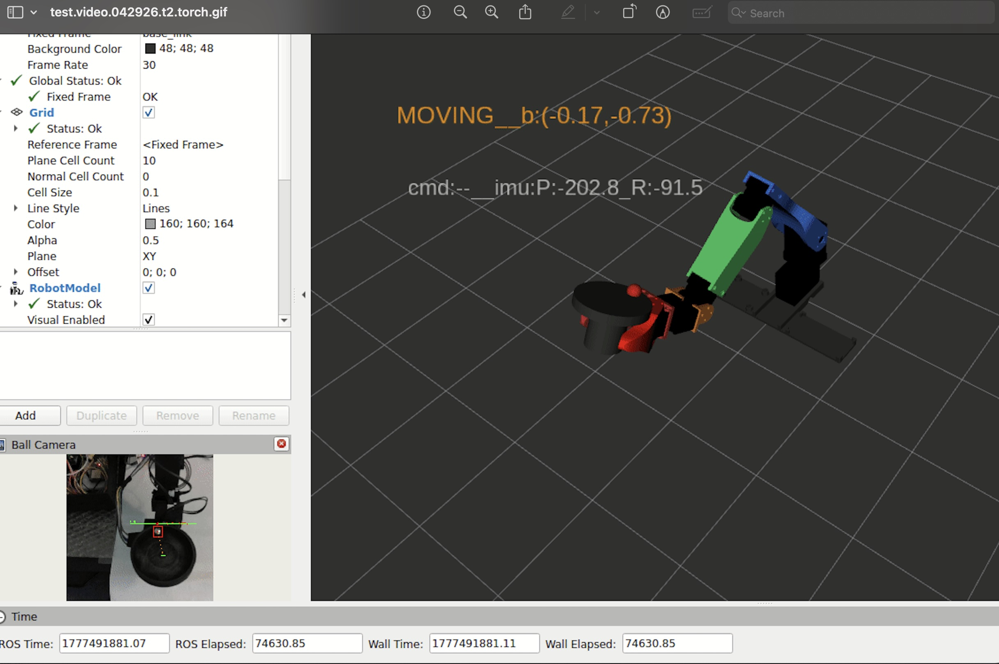
</p>


**First PID correction (t=1777491881.80):**  
```
[1777491881.700] [wrist_balance_controller]: Start pose: flex=2.6691  roll=1.5984
[INFO] [1777491881.700] [ball_balance_node]: CMD | ball=(-0.166,-0.728) Pflex=-0.1820 Proll=-0.0415 
   Dflex=+0.0000 Droll=-0.0000 → flex=-0.1820 roll=-0.0415 imu_pitch=-3.539 imu_roll=-1.598 stable=False
[INFO] [1777491881.740] [wrist_balance_controller]: CORR | flex 2.6691→2.6327 (Δ-2.09deg)  roll 1.5984→1.5901 (Δ-0.48deg)  
   cumul: flex=-2.1deg roll=-0.5deg
```
The large negative ball.y drives a negative flex_cmd, causing wrist_flex to decrease
(cup starts to tilt away from robot). 


<p align="center">
  
</p>

**Mid-correction (t≈1777491883.65):**   
```
ball=(+0.14,+0.71) f:+0.174 r:+0.042
CORR cumul: flex=-8.4deg
```
1.85 seconds after the initial PID command there as been a number of commands issued (~10 adjustments). Ball.y has **flipped sign** from -0.73 to +0.71. The ball has rolled through center
and overshot to the near side. The PID has correctly reversed: flex_cmd is now positive,
so wrist_flex starts increasing again. The cumulative displacement is -8.4° from start —
the cup has been tilted significantly but the ball has already passed through center,
indicating the correction rate is too slow to stop the ball before it overshoots.

<p align="center">
  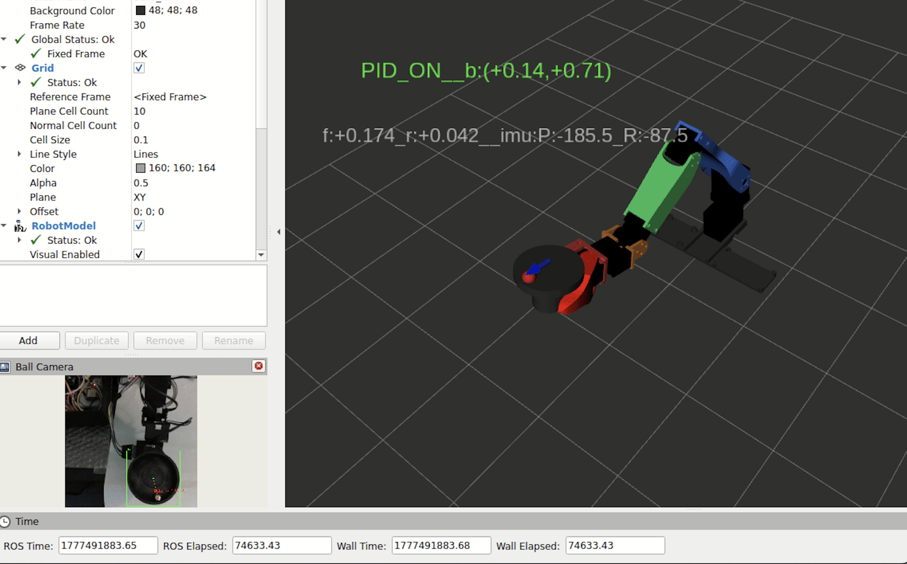
</p>


**Late correction (t≈1777491891.17):**  
```
ball=(-0.62,+0.43) f:+0.108 r:-0.156
```
Ball.y has reduced from +0.71 to +0.43 — trending toward zero, showing the reversal
is working. Ball.x has gone to -0.62, indicating the ball has also drifted significantly
on the roll axis. The PID is now commanding both axes simultaneously.

**Outcome:** Stability timeout reached at 10s. wrist_flex final position: 2.419 rad
(started at 2.700 rad, net decrease of 0.281 rad = 16.1°). The ball did not converge
to center within the 10s window.

<p align="center">
  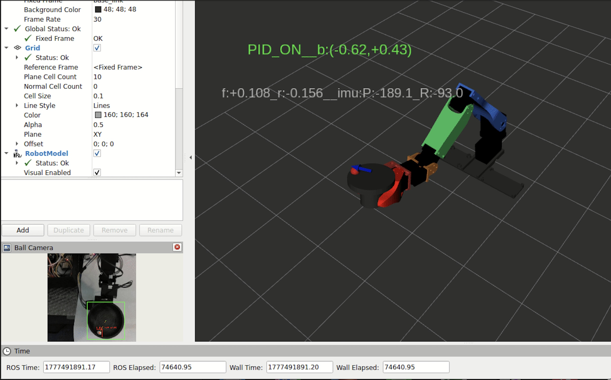
</p>


---

### 5.2 Pose 2 — Tilt Right (t ≈ 1777491901)

**Starting condition:** 

<p align="center">
  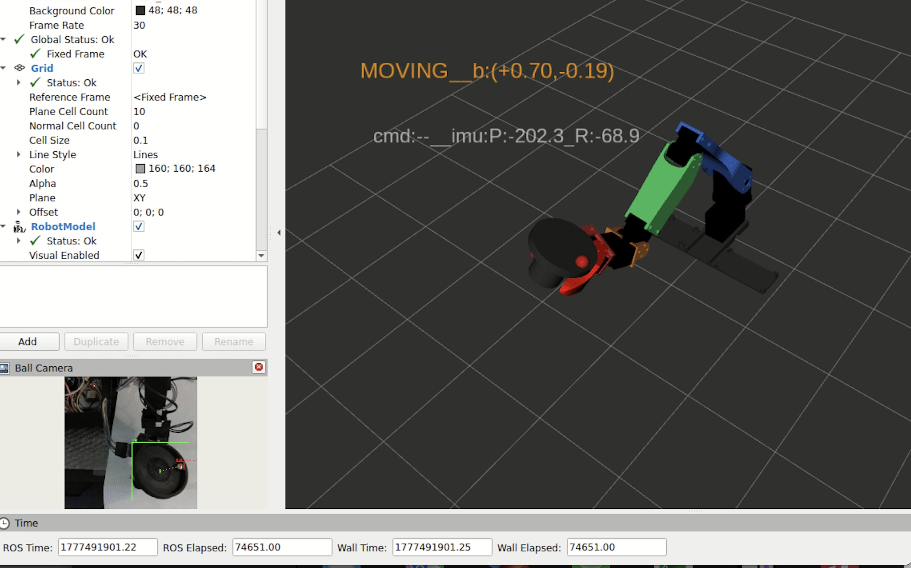
</p>


State: MOVING, ball=(+0.70,-0.19). The cup is tilted to place the ball toward the right
side (large positive X) and slightly toward the far side (small negative Y).

**First PID correction (t=1777491901.80):`  
<p align="center">
  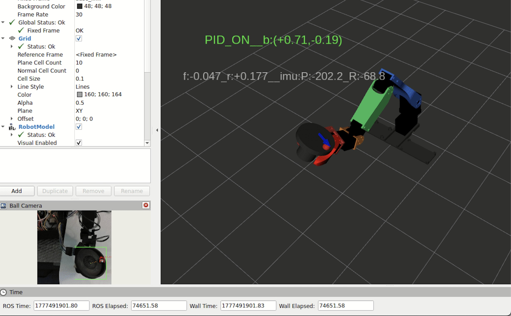
</p>

```
ball=(+0.71,-0.19) f:-0.047 r:+0.177
```
Large positive ball.x drives a large positive roll_cmd (+0.177), tilting the cup to
roll the ball left toward center. Small negative ball.y drives a small negative
flex_cmd (-0.047). Both signs correct.

**Mid-correction (t≈1777491904.27):**  
<p align="center">
  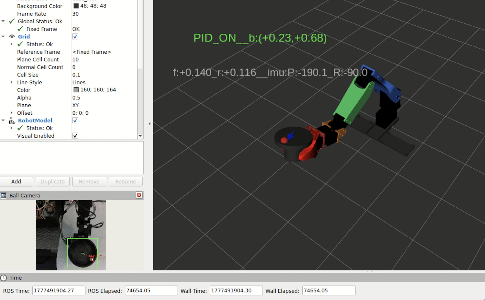
</p> 

```
ball=(+0.23,+0.68) f:+0.140 r:+0.116
```
Ball.x has reduced from +0.71 to +0.23 — good convergence on the roll axis.
However ball.y has swung to +0.68 (near side), suggesting the small flex corrections
combined with cup tilt caused the ball to roll toward the robot. The PID is now
commanding both axes to compensate.

**Late correction (t≈1777491911.28):** See `1911_28.jpg`
<p align="center">
  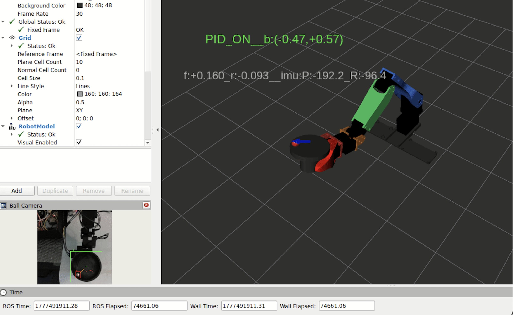
</p>   

```
ball=(-0.47,+0.57) f:+0.160 r:-0.093
```
Ball.x has gone negative (-0.47) — overshot past center on the roll axis. Ball.y
remains positive (+0.57). The oscillation pattern is consistent with Pose 1.

---

### 5.3 Pose 3 — Tilt Left (t ≈ 1777491921)

**Starting condition:** See `1921_29.jpg` 
<p align="center">
  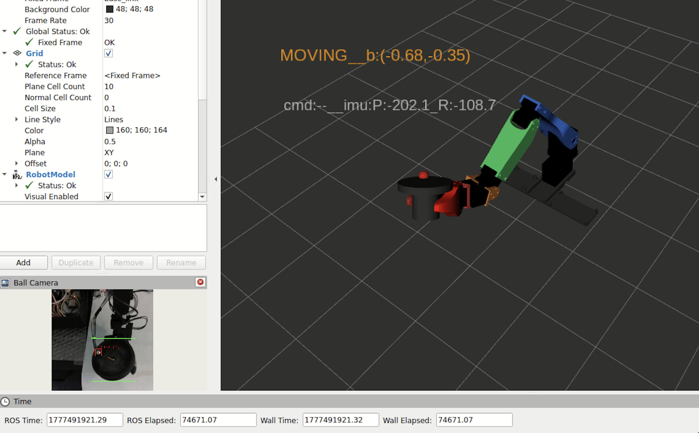
</p>  

State: MOVING, ball=(-0.68,-0.35). Ball at left side (negative X) and far side
(negative Y).

**First PID correction (t=1777491922.05):** See `1922_05.jpg` 
<p align="center">
  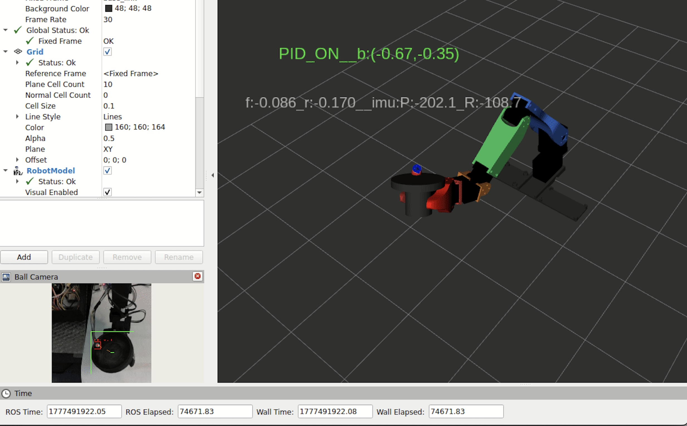
</p>  

```
ball=(-0.67,-0.35) f:-0.086 r:-0.170
```
Negative ball.x → negative roll_cmd (-0.170): cup tilts to roll ball right toward
center. Negative ball.y → negative flex_cmd (-0.086): cup tilts to roll ball from
far side toward center. Both signs correct and acting simultaneously.

**Mid-correction (t≈1777491924.80):** See `1924_80.jpg` 
<p align="center">
  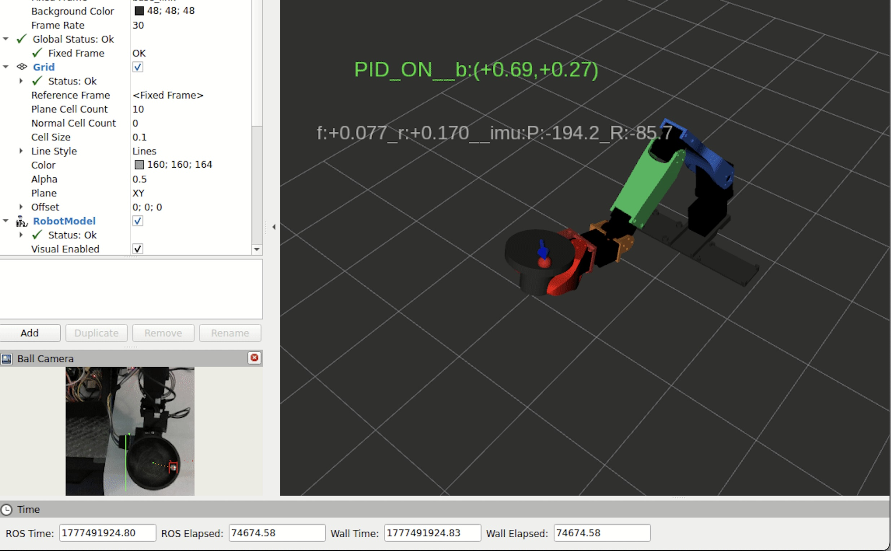
</p>  

```
ball=(+0.69,+0.27) f:+0.077 r:+0.170
```
Both axes have overshot — ball.x flipped from -0.67 to +0.69, ball.y from -0.35
to +0.27. The PID correctly reverses both commands. This is the clearest
demonstration of the underdamped oscillation: the correction loop cannot stop the ball before it crosses center on both axes simultaneously.

**Late correction (t≈1777491931.27):** See `1931_27.jpg` 
<p align="center">
  
</p>

```
ball=(-0.79,-0.04) f:+0.037 r:-0.185
```
Ball.x has swung back to -0.79 (overshot again on roll axis). Ball.y is nearly zero
(-0.04) — the flex axis is converging. This shows the axes respond at different rates.

**Outcome:** Flex axis converging (ball.y → 0), roll axis still oscillating at ±0.7
amplitude. Wrist controller hit flex total limit (+28.6°) and clamped.

---

### 5.4 Pose 4 — Center (t ≈ 1777491941)

**Starting condition:** 
<p align="center">
  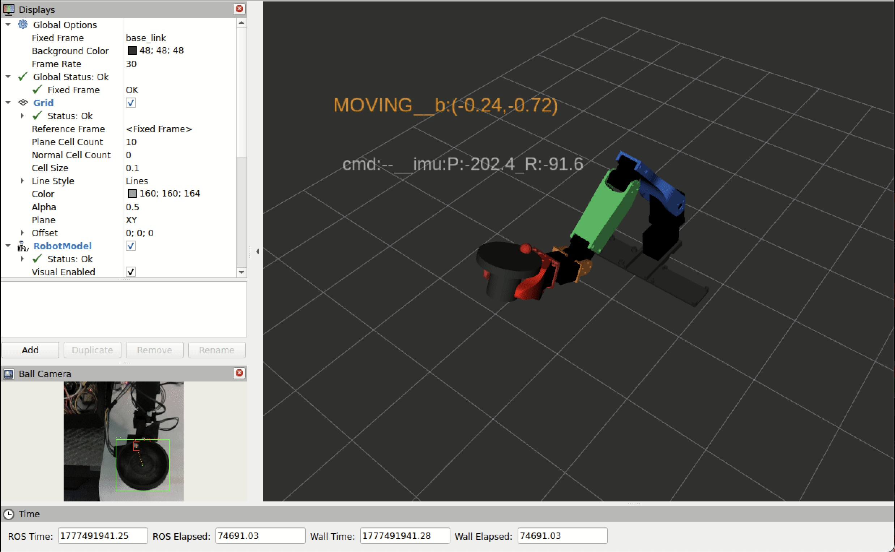
</p>  
State: MOVING, ball=(-0.24,-0.72). Despite being the "center" pose, the ball starts
significantly offset on the Y axis (far side), indicating the starting wrist position
still has a natural tilt.

**First PID correction (t=1777491941.94):**  
<p align="center">
  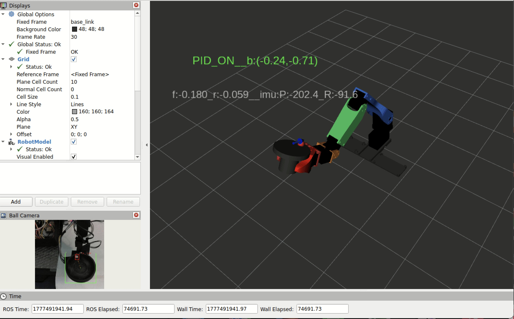
</p>  

```
ball=(-0.24,-0.71) f:-0.180 r:-0.059
CORR: flex 2.6691→2.6338 (Δ-2.02deg) cumul: flex=-2.0deg
```
Large negative ball.y drives strong negative flex_cmd. Cup tilting to bring ball from
far side toward center.

**Mid-correction (t≈1777491944.78):** 

<p align="center">
  
</p> 

```
ball=(+0.03,+0.71) f:+0.176 r:-0.013
```
Ball has again overshot — Y flipped from -0.71 to +0.71. The overshooting pattern
repeats identically across all four poses, confirming it is a systematic timing issue
rather than a pose-specific problem.

**Late correction (t≈1777491951.25):** 

<p align="center">
  
</p>  

```
ball=(+0.00,+0.72) f:+0.186 r:-0.028
```
Ball.x is nearly zero (roll axis converging) but ball.y remains at +0.72. The ball
is stuck in a limit cycle on the flex axis — consistently overshooting to ±0.7
magnitude regardless of direction.

---

## 6. Observed Behavior Summary

### 6.1 What is working correctly

- **Sign chain verified correct** across all four poses and all four directions.
  Decreasing wrist_flex rolls ball from far side toward robot; increasing rolls it
  away. Positive roll_cmd tilts cup to move ball from right to left. All four
  combinations confirmed by visual inspection of RViz images correlated with log.

- **Simultaneous dual-axis correction** works — both flex and roll are corrected
  in every CMD cycle, with magnitudes proportional to their respective errors.

- **Detector performance** — ball detected consistently at 0.62-0.73 confidence,
  cup at 0.90-0.94, at ~35fps camera rate with ~28ms TRT inference. The ball size
  filter removal eliminated false negatives during pose transitions.

- **State transitions** — MOVING→SETTLED correctly resets the cup size reference
  and activates the PID within ~500ms of arm reaching position.

- **Topic rates** — all three pipeline nodes running at their intended rates:
  ball position at 35fps, CMD at 15Hz, CORR at 5Hz.

### 6.2 Root cause of non-convergence

The system is **underdamped** — the ball oscillates around center rather than
converging. The measured oscillation amplitude is ±0.7 (70% of cup radius) with
a period of approximately 2-4 seconds.

The cause is a timing mismatch between correction execution and ball dynamics. A
6mm steel ball on a 29mm radius cup can roll from rim to center in approximately
300-500ms. The total pipeline delay from "ball detected at position X" to "cup
physically reaches corrected tilt" is:

```
TRT inference latency          13-29ms   (normal), 50-60ms (during spikes)
ROS2 publish/subscribe          5-10ms   (DDS transport across containers)
CMD timer jitter               0-67ms    (ball_balance_node at 15Hz)
CORR timer jitter              0-200ms   (wrist_balance_controller at 5Hz)
servo move_duration              100ms   (joint trajectory execution)
──────────────────────────────────────
typical total                ~120-400ms
worst case (with spike)      ~400-860ms
```

At the typical 120-400ms total lag, by the time the cup reaches its corrected
position the ball has already rolled past center to the opposite side. The PID
then correctly reverses direction, but the ball overshoots again. This produces
the ±0.7 limit cycle visible across all four poses.

A key observation from the log: the CMD log line appears only once per second
(throttled), which initially suggested 1Hz CMD updates. In fact CMDs publish at
15Hz — the throttle is a logging artifact. However, 10 consecutive CORR steps
were observed acting on the same CMD value in one window, each producing nearly
identical -2.09° flex steps. This occurred because a pipeline spike blocked new
ball detections for ~1 second, causing the CORR loop to consume stale CMD data
for 5 consecutive cycles before a fresh ball position arrived.

### 6.3 Pipeline latency spikes

PIPELINE SPIKE warnings of 200-430ms were observed throughout the run at
`[system_watchdog]`. These occur when TRT inference spikes to 50-60ms (vs the
normal 13-28ms), causing MJPEG frames to queue behind the slow inference call.
The watchdog measures the timestamp delta between frame capture and when the
resulting `/ball/position` is consumed downstream.

The inference spikes are caused by GPU clock throttling on the Orin Nano under
sustained thermal load. During a spike, ball position updates effectively stop
for 400-860ms, and the CORR loop runs 2-4 extra steps on stale CMD data before
a fresh detection arrives. This significantly worsens overshoot.

Fix: run `sudo nvpmodel -m 0 && sudo jetson_clocks` before each test session to
lock GPU clocks at maximum frequency and prevent throttling.

---

## 7. Parameter Changes and Next Steps

The actual parameters used in this test run were:

```bash
# ball_balance_node
-p kp_flex:=0.25 -p kp_roll:=0.25

# wrist_balance_controller  
-p correction_hz:=5.0 -p move_duration:=0.1 -p max_total_rad:=0.5
```

Note that `correction_hz` was already 5Hz (not 2Hz) in this run, giving 200ms
correction intervals. The `max_step_rad` default of 0.05 rad was in effect.

Based on the analysis, the following parameter changes are recommended for the next run:

| Parameter | Node | This run | Proposed | Rationale |
|-----------|------|----------|----------|-----------|
| `kp_flex` | ball_balance_node | 0.25 | 0.10 | Reduce overshoot amplitude |
| `kp_roll` | ball_balance_node | 0.25 | 0.10 | Reduce overshoot amplitude |
| `max_step_rad` | wrist_balance_controller | 0.05 | 0.02 | Finer steps, same max rate |
| `move_duration` | wrist_balance_controller | 0.1 | 0.08 | Slightly faster servo response |
| `correction_hz` | wrist_balance_controller | 5.0 | 5.0 | Already at target rate |

The primary lever is reducing `kp_flex` and `kp_roll`. With kp=0.25 and a typical
ball error of 0.72, each CMD produces a flex command of 0.18 rad/s. Over two 200ms
CORR cycles at max_step_rad=0.05 the cup moves 0.10 rad = 5.7° — enough to send the
ball from one side of the cup to the other. Reducing to kp=0.10 halves the command
magnitude to 0.072 rad/s, giving the ball less momentum and making overshooting
less likely.

A physical cup with higher concavity (currently being designed/printed) will also
help significantly — a deeper bowl naturally limits ball speed and gives the controller
more time to respond before the ball reaches the rim.

---

## 8. Inference Performance Notes

| Metric | Value |
|--------|-------|
| Normal inference | 13-29ms |
| Spike inference | 50-60ms |
| Camera rate | 35fps (IMX378 cap at 720P) |
| Pipeline spikes | 200-430ms (during inference spikes) |
| Ball confidence | 0.62-0.73 |
| Cup confidence | 0.90-0.94 |
| Frame drops | 69 accumulated over ~60s run |
| Inference drops | 0 |

The inference spikes are caused by GPU clock throttling on the Orin Nano under
sustained load. Running `sudo nvpmodel -m 0 && sudo jetson_clocks` before the
test will lock GPU clocks at maximum and eliminate the spikes.

---


