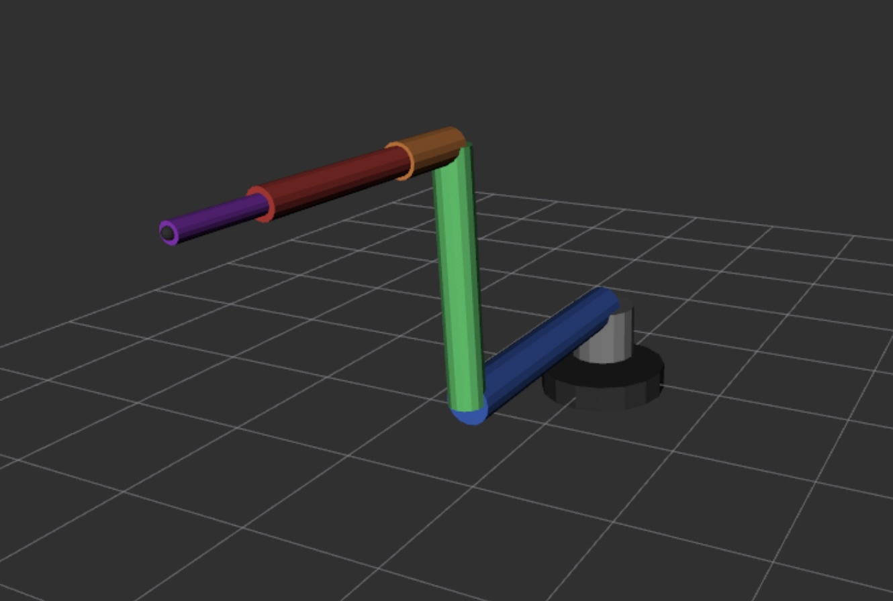

# Creating a High-Fidelity Digital Twin for Robot Arms

> A guide to building accurate visual and kinematic representations of robot arms in URDF using actual 3D-printed mesh files

## 📋 Table of Contents

- [Goals](#goals)
- [Scope and Limitations](#scope-and-limitations)
- [FAQs](#faqs)
  - [Why can't we just reference STL files directly?](#why-cant-we-just-reference-stl-files-directly-in-the-urdf)
  - [Where can I get the STL files?](#where-can-i-get-the-stl-files-for-this-exercise)
  - [What is the alignment algorithm?](#what-is-the-high-level-algorithm-for-aligning-parts-in-cad)
  - [How do I export from FreeCAD?](#how-do-i-export-link-and-joint-definitions-from-freecad)
- [Best Practices](#recommendations-and-best-practices)
- [Summary](#summary)

---

## Goals

Most URDF definitions use simplified geometric primitives (boxes, cylinders, spheres) to represent robot links. While functional for motion planning and basic visualization, these simple representations create an unintuitive experience in RViz2—the simulated robot bears little visual resemblance to the physical hardware. 

For example, a basic translation of the Koch v1.1 follower arm's links and joints into URDF produces a digital representation that is only abstractly related to the actual robot. This disconnect makes it difficult to:

- ✅ Visually verify robot configurations and trajectories
- ✅ Debug mechanical interference issues
- ✅ Communicate designs to stakeholders
- ✅ Develop intuition about robot behavior

**This guide documents the process of creating a high-fidelity digital twin** that looks and moves like the physical robot, using the actual 3D-printed STL meshes in the URDF definition.
For example, although our robot arm looks as follows, most developers work with a digital representation that is looks vastly different:
<p align="center">
  
  
</p>
and our goal is to create something that represents reality more faithfully.
<p align="center">
  
</p>

## Scope and Limitations

A high-fidelity digital twin, as defined here, focuses on accurate **visual representation and kinematic behavior**. It does not currently include:

- ❌ Torque limits and dynamics modeling
- ❌ Current draw characteristics  
- ❌ Thermal behavior
- ❌ Compliance and flexibility in links
- ❌ Backlash and mechanical tolerances

These additional physical properties could be incorporated in future iterations for more comprehensive simulation fidelity.

---

## FAQs

### Why can't we just reference STL files directly in the URDF?

While URDF supports mesh files in the `<visual>` and `<collision>` elements, simply pointing to STL files is insufficient. The challenge lies in **coordinate frame alignment**.

Each link in a URDF has an implicit reference frame. For correct kinematic behavior:

1. **The joint's axis of rotation must pass through the link's coordinate origin** (or be properly offset)
2. **The link's orientation must align with its connected joints** to avoid unexpected rotations
3. **Visual meshes must be positioned relative to this frame** to render correctly

The STL files exported from CAD software have arbitrary origins based on how they were modeled. Without proper alignment in a CAD assembly first, the robot will appear disjointed or rotate incorrectly when joints move.

### Where can I get the STL files for this exercise?

The original Koch v1.1 follower arm STL files are available in ASCII format. However, FreeCAD and most modern CAD tools prefer the more compact STL binary format.

**📦 Binary STL files are available at:**  
[github.com/bueche/ros2_robot_arm/.../meshes](https://github.com/bueche/ros2_robot_arm/tree/main/writing_robot_description/meshes)

These files, however, need further processing in the CAD tool (orientation and placement) to support the correct kinematic behavior. 

### What is the high-level algorithm for aligning parts in CAD?

Before diving into the algorithm, it's helpful to establish terminology mapping between FreeCAD and URDF:

| FreeCAD Concept | URDF Equivalent | Notes |
|:----------------|:----------------|:------|
| **Part** | **Link** | Except for the end effector (pen_link), each link consists of a 3D-printed bracket plus an attached servo motor |
| **Assembly** | **Robot definition** | The complete set of links and joints defining the robot |

> **💡 Important conceptual note:** A link rotates about the joint that *connects it to its parent*, not about its own attached servo. The servo attached to a link will be the rotation point for the *child* link.

#### Step-by-Step Process in FreeCAD:

**1. Create a new Part** to define each link

**2. Import the bracket/structural component**
   - **For base_link:** Translate so the base is flush with the floor (z = 0)
   - **For other links:** 
     - Rotate the bracket so its attachment point aligns with the parent link's servo shaft axis
     - Center the part so the rotation axis passes through the coordinate origin
     - Orient so zero rotation in the joint frame means zero rotation of the mesh

**3. Import and attach the servo motor**
   - Position and orient the servo to match its physical mounting on the bracket
   - The servo's output shaft should point in the direction the child link will rotate

**4. Add the Part to the Assembly**
   - Copy the completed Part into the assembly containing previously defined links
   - If aligned correctly in step 2, you should only need to **translate** (not rotate) to position it
   - The attachment point should align with the parent link's servo shaft

**5. Repeat for all links** in the kinematic chain

**6. Export link and joint definitions** using the FreeCAD Python scripts (see below)

**7. Format the output** as URDF XML

**8. Replace the existing URDF definitions** with the exported data

### How do I export link and joint definitions from FreeCAD?

Two Python scripts are provided for extracting URDF data from a FreeCAD assembly:

**📜 Scripts location:**  
[github.com/bueche/ros2_robot_arm/.../scripts](https://github.com/bueche/ros2_robot_arm/tree/main/writing_robot_description/meshes/scripts)

- **`extract_links.py`**: Exports `<link>` definitions with visual mesh references and their transforms
- **`extract_joints.py`**: Exports `<joint>` definitions with parent-child relationships, origins, axes, and limits

#### Running the scripts:

1. Open your assembly in FreeCAD
2. Open the Python console (`View` → `Panels` → `Python console`)
3. Execute the link extraction:
   ```python
   exec(open('/path/to/extract_links.py').read())
   ```
4. Execute the joint extraction:
   ```python
   exec(open('/path/to/extract_joints.py').read())
   ```
5. Copy the console output into your URDF file

#### Key technical details in the extraction scripts:

##### `extract_joints.py` critical features:
- ✨ Transforms global coordinate differences into the parent link's reference frame (essential for correct URDF behavior)
- ✨ Computes relative rotations between parent and child links
- ✨ Extracts joint axis directions in global frame (typically aligned with servo shaft)
- ✨ Converts FreeCAD's mm to URDF's meters
- ✨ Converts FreeCAD Euler angles (Yaw, Pitch, Roll) to ROS RPY convention (Roll, Pitch, Yaw)

Example output:
```xml
<joint name="shoulder_pan" type="revolute">
  <parent link="base_link"/>
  <child link="shoulder_link"/>
  <origin xyz="0.000000 0.000000 0.058500"
          rpy="0.000000 0.000000 0.000000"/>
  <axis xyz="0.000000 0.000000 1.000000"/>
  <limit lower="-2.5" upper="2.5" effort="2.0" velocity="3.14"/>
</joint>
```

##### `extract_links.py` critical features:
- ✨ Iterates through all mesh objects in each Part
- ✨ Extracts individual mesh placements relative to the Part origin
- ✨ Generates visual elements with proper transforms
- ✨ Includes placeholder material definitions

Example output:
```xml
<link name="shoulder_link">
  <visual name="shoulder_bracket_visual">
    <origin xyz="0.025000 0.015000 0.010000" rpy="0.000000 0.000000 1.570796"/>
    <geometry>
      <mesh filename="package://writing_robot_description/meshes/shoulder_bracket.stl"/>
    </geometry>
    <material name="grey">
      <color rgba="0.5 0.5 0.5 1.0"/>
    </material>
  </visual>
</link>
```

---

## Recommendations and Best Practices

### ✓ Verification Steps

After generating your URDF:

1. **Check joint origins:** Connection points between links should be at or very near (0, 0, 0) in the child link's frame
2. **Verify servo placement:** Servos should be offset forward/outward from their link's origin
3. **Test in RViz2:** Use the Joint State Publisher GUI to verify each joint rotates as expected
4. **Check for collisions:** Ensure links don't interpenetrate at joint limits

### ⚠️ Common Pitfalls

| Issue | Description |
|:------|:------------|
| **Unit conversion** | FreeCAD uses millimeters; URDF uses meters |
| **Euler angle confusion** | FreeCAD and ROS use different conventions (YPR vs RPY) |
| **Transform reference frames** | Joint origins must be expressed in the parent link's frame, not global coordinates |
| **Axis direction errors** | Joint axes must be carefully verified, especially for servos mounted at angles |

### 🚀 Future Enhancements

Consider extending the digital twin with:

- [ ] Accurate inertial properties calculated from STL meshes
- [ ] Collision geometry (simplified meshes for faster computation)
- [ ] Joint effort and velocity limits based on servo specifications
- [ ] Transmission ratios if using gearboxes
- [ ] Gravity compensation parameters

---

## Summary

Creating a high-fidelity digital twin transforms the robot visualization experience, making it dramatically easier to:

- 🎯 Understand robot configurations intuitively
- 🐛 Debug kinematic issues
- ✅ Validate trajectory plans
- 📊 Present your work professionally

The process requires careful CAD assembly work upfront but pays dividends in improved simulation fidelity and reduced debugging time. The provided extraction scripts automate the tedious coordinate transformation work, making URDF generation more reliable and repeatable.

---

## Contributing

Found an issue or have suggestions? Please open an issue or submit a pull request!

## License

This guide is part of the [ros2_robot_arm](https://github.com/bueche/ros2_robot_arm) project.
