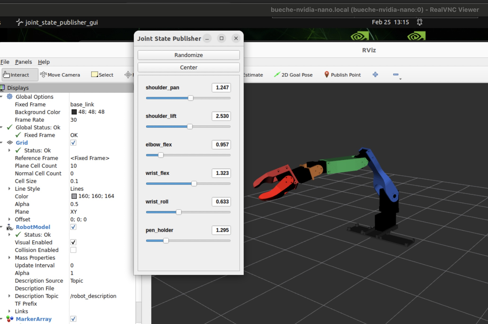

# Launching the rviz2 digital twin robot 

There are two ways to run the digital twin. The first is the display-only version and the second is when the twin mirrors the actual robot's movmenets.

## Display only digital twin

```
$ cd ~/robot_ws
$ colcon build --symlink-install
$ ros2 launch writing_robot_description display_launch.py

```
This will launch rviz with a display only version of the robot that can be controlled with the joint_state_publisher gui. Again, the hardware does not have to be wired to have this working. 
This is essentially a simple visual simulation.

<p align="center">
  
</p>

## Digital twin mirroring real robot

On the nvidia Nano within the container run:
```
$ cd ~/robot_ws
$ colcon build --symlink-install
$ ros2 run rviz2 rvi2

```
Then start the real robot as described [here](./launching_physical.md).
