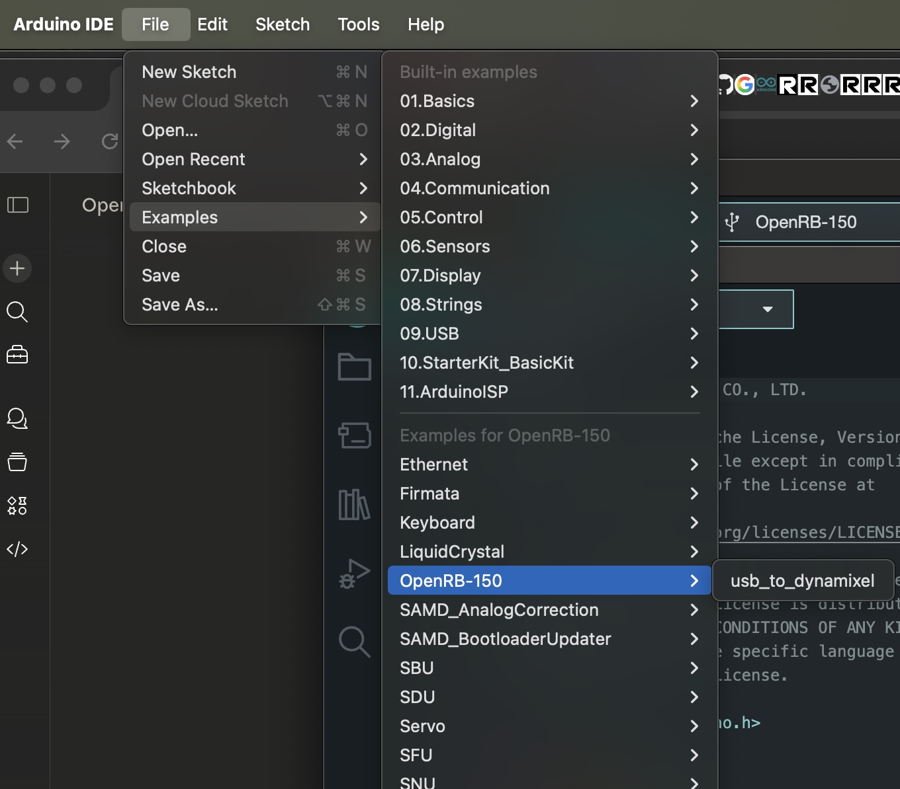
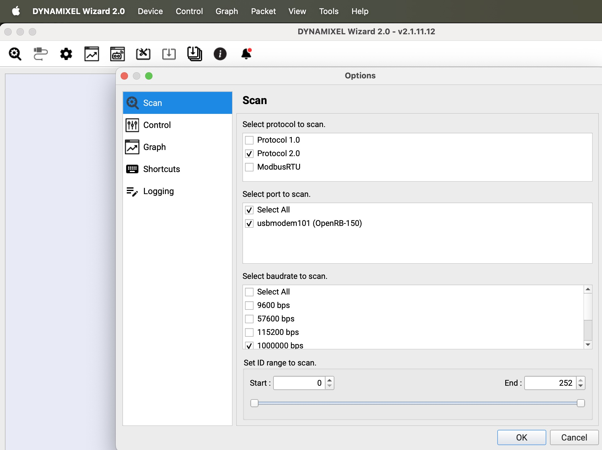
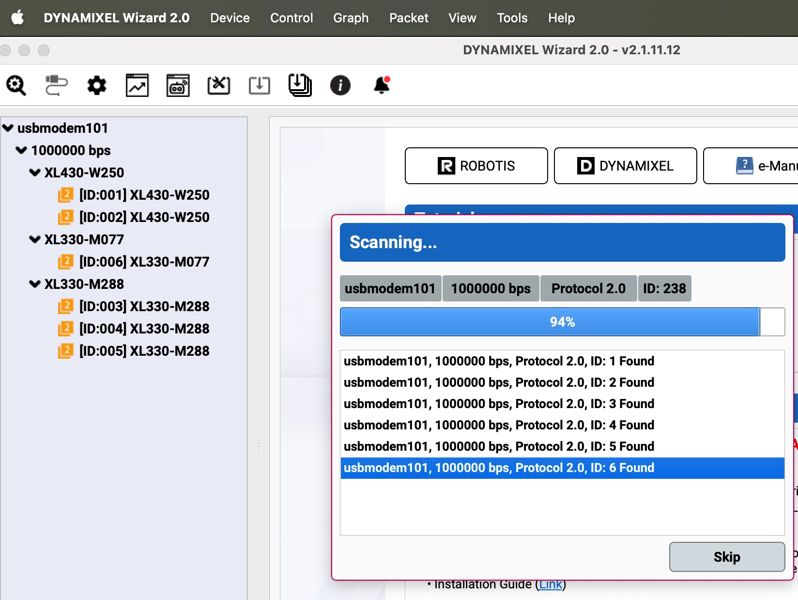
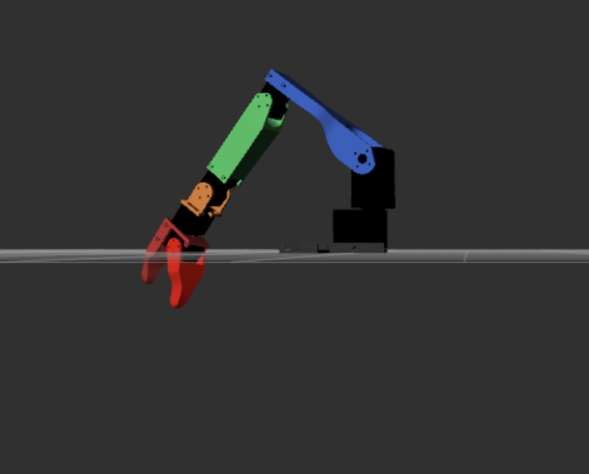
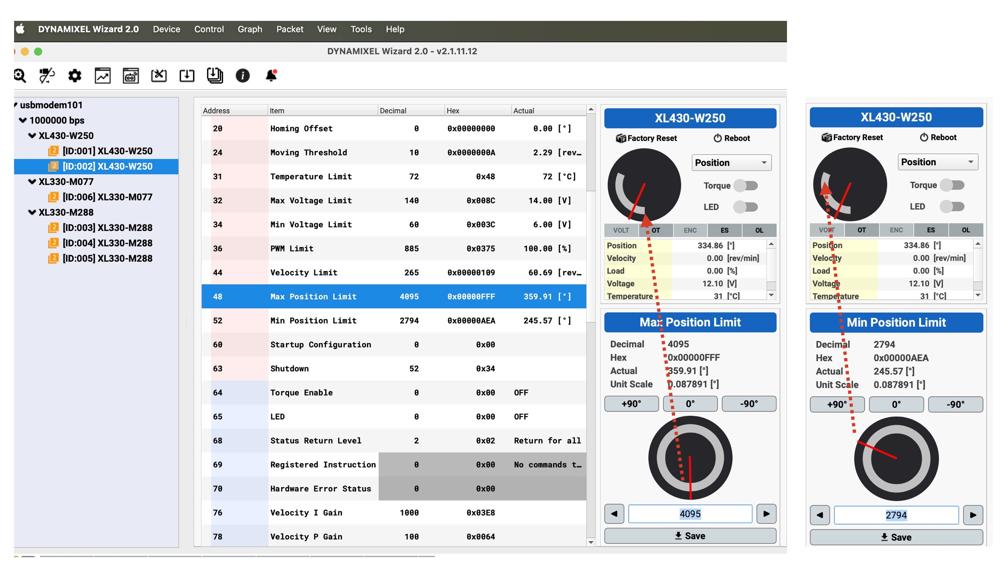
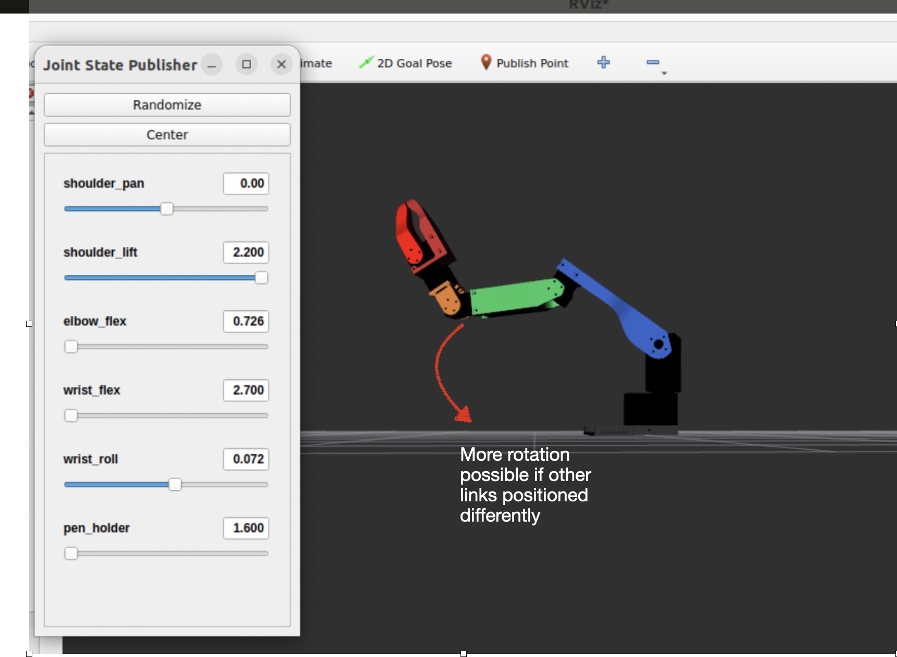
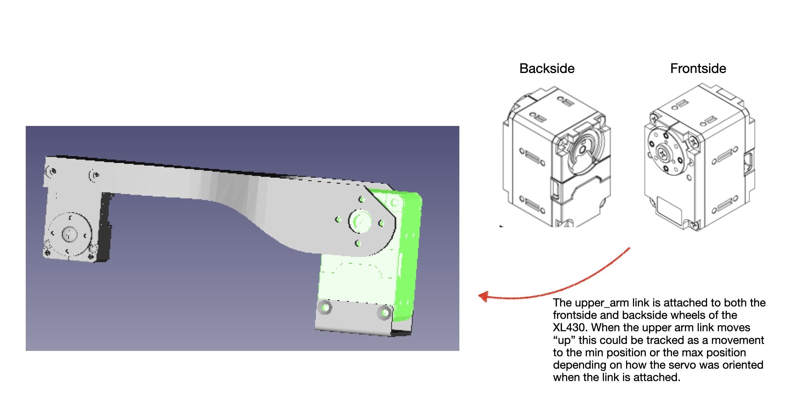
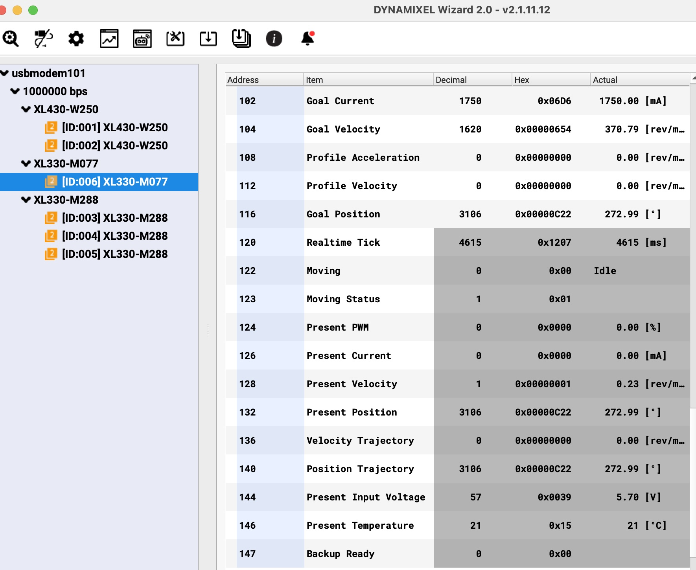
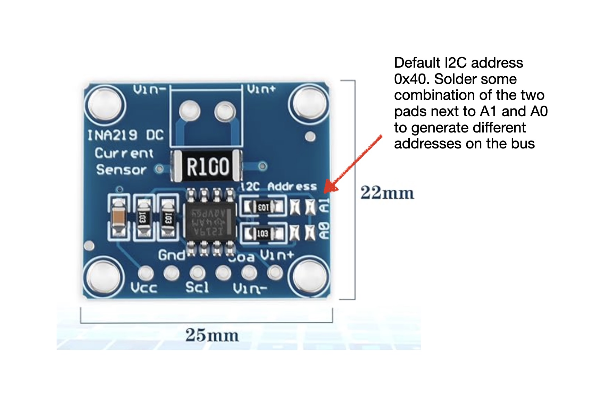

# Firmware setup and configuration

This section provides installation and configuration notes for the firmware for various components: the Dynamixel servos, the openRB 150 controller, the INA219 sensors, and the ESP32 controller (used for the sensors). 

## Sections
- [OpenRB 150](./firmware.md#openrb_150)
- [Dynamixel servos](./firmware.md#Dynamixel_servo)
- [ESP32 and Current Sensors](./firmware.md#esp32_and_current_sensors)

## OpenRB 150
- The software environment setup for the OpenRB 150 controller is detailed nicely in the Robotis documentation. See: https://emanual.robotis.com/docs/en/parts/controller/openrb-150/
- One subtlety is that the `usb_to_dynamixel` sketch is packaged with the openRB 150 board manager package, not the `Dynamixel2Arduino` library.
   
<p align="center">
  
</p>

## Dynamixel servos
Each Dynamixel servo needs to be initialized properly. Again, the documentation for the Dynamixel Wizard provides that information. Aside from updating the firmware, we applied three different configurations:
- The servo ID was set from the factor default of 1 to relect the order defined in the URDF file.
- The communication rate for the servo was changed from the default of 56K to 1M (1000000).
- The max and min position were tuned in an effort to provide safe guards for the moving arm. Although driven by sound motivations, this turned out to be not as useful as desired as we will discuss below.

When all of the servo id's have been properly setup then the Dynamixel wizard will show that they are all found during a scan and each can be examined separately. A successful scan is illustrated below.

<p align="center">
  
  
</p>

Why bother trying to restrict the motion? The motivation was to attempt to prevent the servo from moving in such a way that the arm could be damaged when no collision detection was being enforced. That is, the degrees of freedom of the robot could lead to situations in which the arm was positioned in a way that clearly would not work. An example of this is shown in the display digital twin as the hand is positioned to be below the surface. This could be avoided by restricting the rotation of the `shoulder_lift` joint (which joins the `upper_arm_link` and the `shoulder_link`). 

<p align="center">
  
</p>

This restriction can be enforced using the Max Position Limit and Min Position Limit in the servo as shown below.

<p align="center">
  
</p>

But was this helpful? In the end, we judge this sort of safeguard as only partially helpful for the following reasons:
1. *Safe movement depends partially on the position of the other joints/links, so this mechanism is perhaps too primitive and limited*. For example, if the `wrist_flex` joint points up then the `shoulder_lift` can rotate more. This is illustrated below. I'm expecting to get more sophistication from [MoveIt2](https://moveit.picknik.ai/main/index.html) ... stay tuned.

<p align="center">
  
</p>

2. *The behavior of the robot when hitting these underlying limits in ros2 was unpredictable.* It was far more deterministric to use the limits defined in the URDF file as shown below. 

```
<!-- Joint 2: shoulder_lift -->
  <joint name="shoulder_lift">
    <command_interface name="position">
      <param name="min">2.8857</param>  <!-- highest physical position -->
      <param name="max">2.2000</param>   <!-- lowest physical position -->
    </command_interface>
    <state_interface name="position"/>
    <state_interface name="velocity"/>
    <state_interface name="effort"/>
  </joint>
```

The main difficulty in using these limits were that they had to be manually determined by manually positioning each arm and querying their ROS2 radian-based positions and then working out whether max was the lowest position or the highest position.  

**Note** I believe it is possible that the reader might attach the servos such that this order is reversed. This means that using the URDF I've provided might require additional testing to ensure its calibrated to the choices you made.  That is, note in the previous diagram that Max and Min boundaries seem a little unintuitive as the Max seems to restrict physically lower movement and the Min restricts the upper movement. This happens because clock-wise (CW) movement of the frontside wheel is considered movement in the negative direction and the counter clock wise movement (CCW) is considered positive (by default). So depending on how you oriented the servo and when attaching the brackets, the movement of the arm being "up" will be considered positive or negative. This is illustrated below.

<p align="center">
  
</p>


Finally, note that the Dynamixel Wizard allows the user to query telemetry values like the input current, temperature, voltage, and load, but only for one servo at a time. See the example below. So part of our motivation for enhancing the pull of these in the ros2 environment was to collect that data under regular use and when multiple servos were in action.


<p align="center">
  
</p>

And related to our discussion above, both the load or the current values reported by the Dynamixel servo can be negative or positive. In this context "negative current" just means that the input current is used to rotate the wheel in the CW or negative direction. It is disconnected from the concept of an alternating current direction.  This is similarly applied to the load metric of the XL430s. So, later in the [documenation on the `pose_test.py` utility](https://github.com/bueche/ros2_robot_arm/blob/main/documentation/pose_test.md) the output which shows negative current or negative load is just showing which direction the wheel was turning. This is why we consider the total current draw from the servo's to be be the sum of the absolute value of each current draw.

```
INFO] [1770595614.927827338] [pose_test_node]: → Sent: pose 1 - poised to work
[INFO] [1770595618.934589703] [pose_test_node]:   📊 Joint States:
[INFO] [1770595618.935407226] [pose_test_node]:   📊 shoulder_pan    [XL430] Pos:  1.557rad Load:  0.00% Volt:12.1V Temp: 32.0°C
[INFO] [1770595618.936180933] [pose_test_node]:   📊 shoulder_lift   [XL430] Pos:  2.839rad Load: 14.00% Volt:12.1V Temp: 34.0°C
[INFO] [1770595618.937008160] [pose_test_node]:   📊 elbow_flex      [XL330] Pos:  2.303rad Curr: -109mA Volt: 5.5V Temp: 21.0°C
[INFO] [1770595618.937838905] [pose_test_node]:   📊 wrist_flex      [XL330] Pos:  2.276rad Curr:   13mA Volt: 5.4V Temp: 21.0°C
[INFO] [1770595618.938645446] [pose_test_node]:   📊 wrist_roll      [XL330] Pos:  1.186rad Curr:  -12mA Volt: 5.5V Temp: 22.0°C
[INFO] [1770595618.939474062] [pose_test_node]:   📊 pen_holder      [XL330] Pos:  1.621rad Curr:  -21mA Volt: 5.4V Temp: 22.0°C
[INFO] [1770595618.940354344] [pose_test_node]:   ⚡ Power Analysis for "pose 1 - poised to work":
[INFO] [1770595618.941070959] [pose_test_node]:      Peak 5V current (INA219):    0.199A
[INFO] [1770595618.941883204] [pose_test_node]:      Peak motor sum (XL330s):     0.162A
[INFO] [1770595618.942663431] [pose_test_node]:      5V voltage: 5.66V (min) / 5.78V (max)
```


## ESP32 and Current Sensors
Now while the openRB 150 communicates via its dynamixel protocol with the servos, when working with the current sensors and the ESP32 a different communication bus and protocol are used ([I2C](https://en.wikipedia.org/wiki/I2C)). The wiring of this is shown in the hardware section of this project. We are using multiple INA219 sensors and two different I2C busses: one for the INA219 sensors and one for the INA226 sensor. 

Since there are multiple devices on the same bus, one must ensure that they all have different addresses (similar to the servo id on the dynamixel servos ... they must all have different ids). I found that there were at least two approaches to achieve this when buying set of sensors:
1. All could have the default address (typically 0x40) and its necessary to solder some pads on the sensor to change the address, or
2. They might be pre-programed to have different addresses. If so, then its necessary to probe the bus to see which address the sensor responds to.
   
The picture below shows where I needed to solder to get one of the INA219 sensors to respond to a different I2C address.

<p align="center">
  
</p>

This information then needs to be reflected into the ESP32 sketch (either [read_ina219_ina226.ino](https://github.com/bueche/ros2_robot_arm/blob/main/power_monitor/sketch/read_ina219_ina226.ino) or [read_ina219.ino](https://github.com/bueche/ros2_robot_arm/blob/main/power_monitor/sketch/read_ina219.ino)) as noted below. Notice the two I2C buses and the initialization of the sensors and their addresses. 

```
// ---------- I2C Bus 0 pins (INA219 sensors) ----------
#define I2C0_SDA 1
#define I2C0_SCL 2

// ---------- I2C Bus 1 pins (INA226 sensor) ----------
// ESP32-S3 - INA226 is connected to these pins
// Exact brand: ESP32-S3 N16R8 (Lonely Binary) found on Amazon
#define I2C1_SDA 21
#define I2C1_SCL 47

// Create second I2C bus object
TwoWire I2C_Bus1 = TwoWire(1);

// ---------- INA219 sensors on Bus 0 ----------
// 12V rail on address 0x40 (default)
Adafruit_INA219 ina219_12v(0x40);
// 5V rail on address 0x41 (second module, address jumper set!)
Adafruit_INA219 ina219_5v(0x41);

// ---------- INA226 sensor on Bus 1 ----------
// Can use address 0x44 or 0x40(found by I2C scanner.. but varies per INA226 sensor)
// The MECCANIXITY INA226 (sold on Amazon) sensors are preset with different addresses
// when purchased as a group of sensors. You can't assume a default.
INA226 ina226_5v(0x44, &I2C_Bus1);

```

