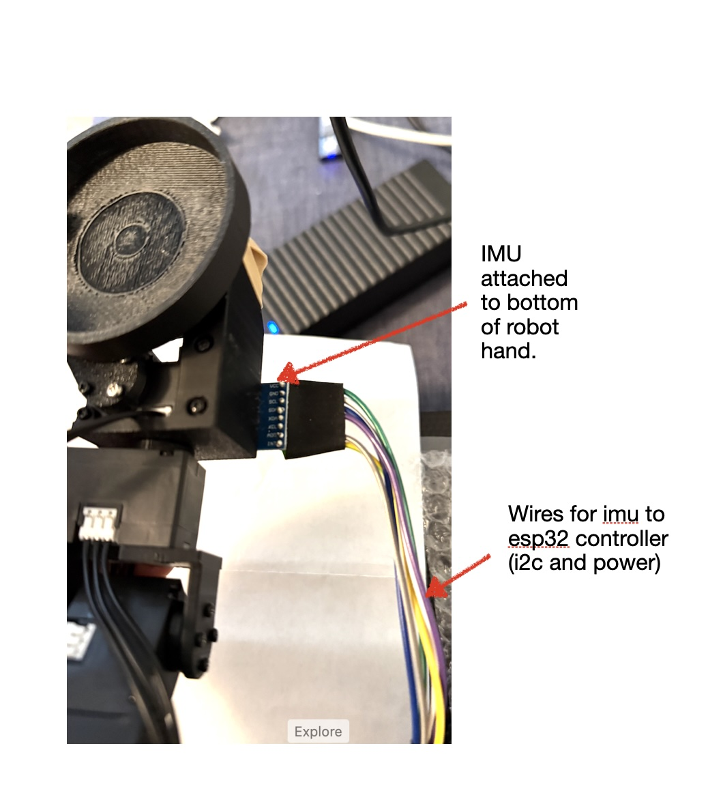

# Hardware for Cup Balancing Project

The additional hardware for this cup balancing portion of the project is identified in the [hardware section](./hardware_setup.md#balance-related-hardware). In this section we describe some key aspects of the two main additional components: the Luxonis Oak D camera and the IMU. 

## Camera: Luxonis OAK-D lite
In this section we discuss some points related to camera's and this application. 
- Introduction: As noted earlier the basic function of the camera is to track the movement and coordiates of the ball within the cup. It does this using hardware and software built into the camera. The camera is actually able to run a special trained ML model that has been built to recognize the cup and the ball moving in the robot environment. The goal is to get the ball to the middle of the cup and the ball is typically on the perimeter of the cup. Its current coordinates need to determined accurately and with low latency. 

<p align="center">
  
</p>

- Inferencing camera vs. basic USB camera: 
  - *Why use an inferencing camera?* The basic flow requires that images are fed to a model which detects the cup and ball and provides the coordinates of the ball within the cup. The theoretically benefit of the inferencing camera is its ability to avoid having the transport those images in a high frame rate to the inferencing software running on a different host / processor. Instead the inferencing camera can do the detection locally and only report coordinates. It is ideal if all you have is a Raspberry Pi, but since we also have access to an Nvidia Orin Nano we have other options. We will implement the approach of using the Nvidia Orin Nano for inferencing, but have not done so as of yet. 
  
  Still, using the Nano as the camera attachmentWe did find that some additional tuning is required due to the fact that the Orin Nano (at least this version) only exposes USB-2 ports.
  ```
  nvidia-nano:~/robot_ws/src$ lsusb -t
   /:  Bus 02.Port 1: Dev 1, Class=root_hub, Driver=tegra-xusb/4p, 10000M
          |__ Port 1: Dev 2, If 0, Class=Hub, Driver=hub/4p, 10000M
   /:  Bus 01.Port 1: Dev 1, Class=root_hub, Driver=tegra-xusb/4p, 480M
          |__ Port 1: Dev 54, If 0, Class=Vendor Specific Class, Driver=, 480M <---- dev 54 at 480Mbps
          |__ Port 2: Dev 2, If 0, Class=Hub, Driver=hub/4p, 480M
          |__ Port 3: Dev 3, If 0, Class=Wireless, Driver=rtk_btusb, 12M
          |__ Port 3: Dev 3, If 1, Class=Wireless, Driver=rtk_btusb, 12M
  nvidia-nano:~/robot_ws/src$ lsusb
  Bus 002 Device 002: ID 0bda:0489 Realtek Semiconductor Corp. 4-Port USB 3.0 Hub
  Bus 002 Device 001: ID 1d6b:0003 Linux Foundation 3.0 root hub
  Bus 001 Device 003: ID 13d3:3549 IMC Networks Bluetooth Radio
  Bus 001 Device 002: ID 0bda:5489 Realtek Semiconductor Corp. 4-Port USB 2.0 Hub
  Bus 001 Device 054: ID 03e7:2485 Intel Movidius MyriadX <---------------- Luxonis Oak-D lite device 54
  Bus 001 Device 001: ID 1d6b:0002 Linux Foundation 2.0 root hub
  ```

  - *What is the USB-2 vs USB-3 bandwidth?*
    | Standard | Theoretical| Practical (60-70%) | 
    |----------|------------|--------------------|
    | USB 2.0 High Speed | 480 Mbps | ~300 Mbps | 
    | USB 3.0 SuperSpeed | 5000 Mbps | ~3000 Mbps |

  - *But is USB-2 a bottleneck?* With raw frames it will be.  
  - *What is an alternative approach to Camera inferencing?* Alternatively, 
  
  - We are motivated to reduce the image transport bandwidth partly because of Nvidia Orin Nano's USB-2 limitation. 
  - *Why does USB-2 have insufficient bandwidth for streaming video for this application?* The raw image bandwidth formula can be put as follows:
  ```
  bandwidth = image_width × image_height × channels × bytes_per_channel × frames_per_sec x jpeg_compression_factor
  ```
  - where:
    - image_width x image_height define the pixels/frame.
    - Ideally, we could process at least 30 frames per sec to ensure smooth/fluid movement as perceived by our eyes, but this rate has a signficant impact on bandwidth.
    - there are 3 channels of  ....
    - the compression factor is 1/15
  - USB bandwidth:
    | Standard | Theoretical| Practical (60-70%) | 
    |----------|------------|--------------------|
    | USB 2.0 High Speed | 480 Mbps | ~300 Mbps | 
    | USB 3.0 SuperSpeed | 5000 Mbps | ~3000 Mbps |

- Camera inferencing vs. Nvidia inferencing
  - Now we have been able to achieve 12 frames per sec cup/ball inferencing using the Luxonis OAK-D lite and a 640x640 YOLOv8n ML model. This is pretty close to with  [benchmark results for this device](https://docs.luxonis.com/hardware/platform/rvc/rvc2/) which reached 14.3 frames per sec inferencing. 
  - The reported inference latency in that Luxonis benchmark was 120 msec. We expect to get significantly better latency using Nvidia as long as the USB-2 pipe doesn't become a bottleneck when we leverage the  H.264 or H.265 codecs.
  
- 3D camera vs. 2D camera
  - The Luxonis OAK-D lite is also a 3D camera. We have turned off that capability due to the processing needs of inferencing, but will re-enable it when inferencing shifts to the Nvidia Orin Nano.

## IMU
Some discussion points on IMU:
- IMU level vs. ball level
- IMU calibration challenges
- IMU wiring impact on servo accuracy and mobility 
- also reference the Dynamixel servo tuning section

<p align="center">
  
</p>

Discussion on the Koch v1.1 and:
- its ability to hold a cup steady
- its ability to hold a cup + ball + IMU + wires for IMU