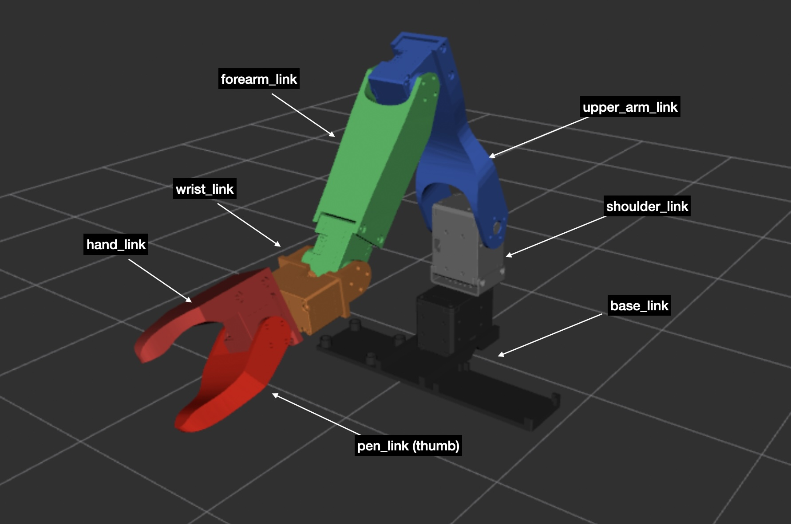
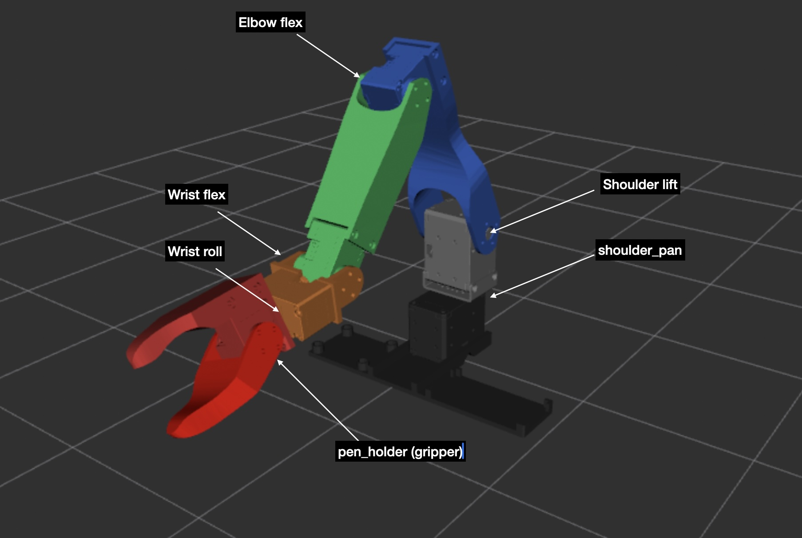
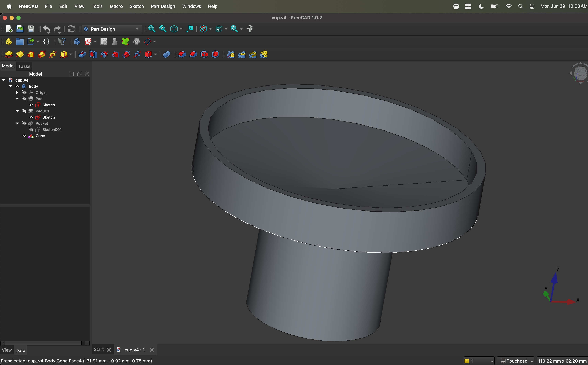
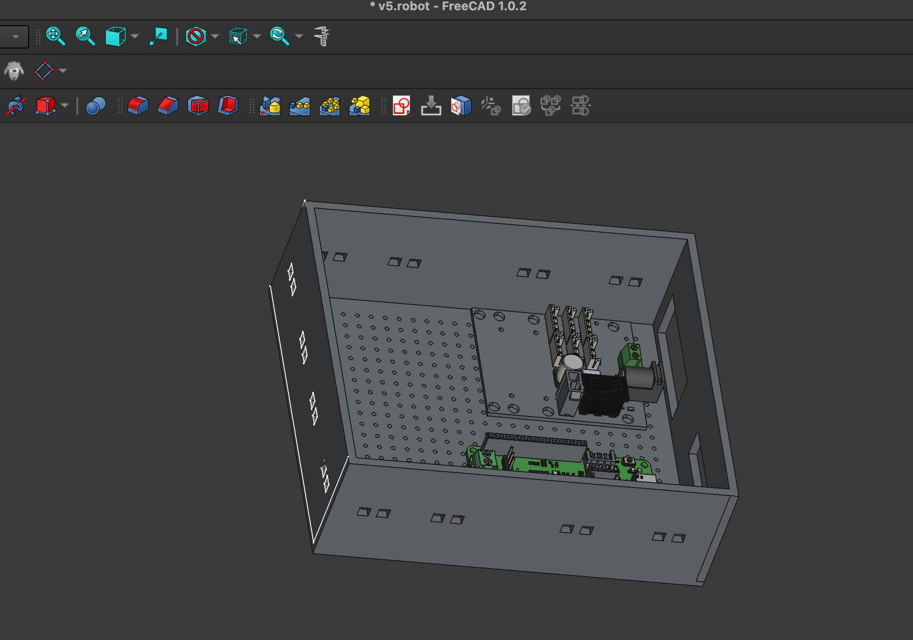
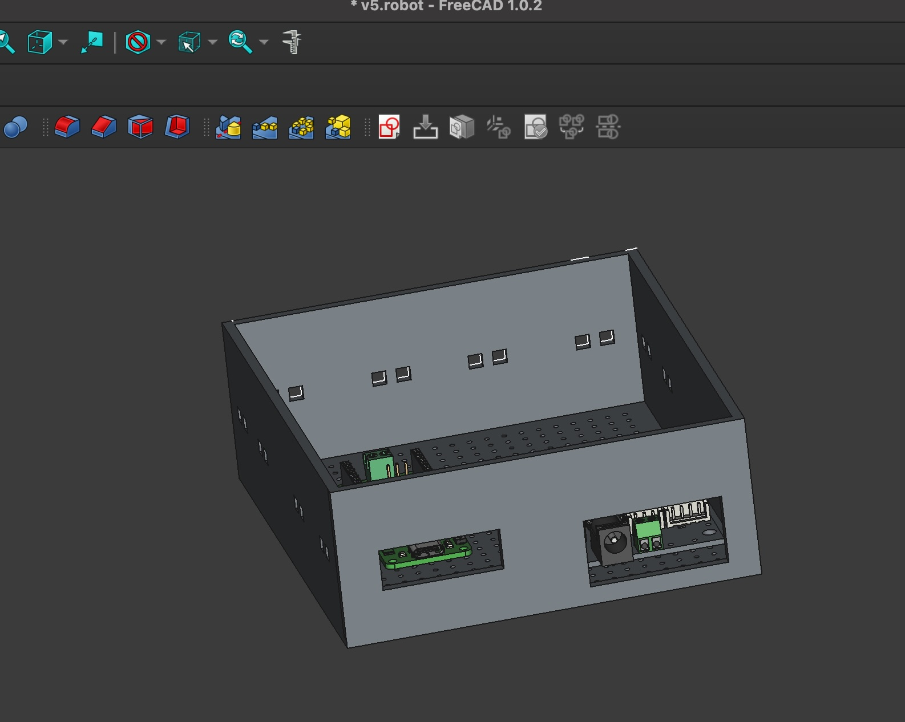
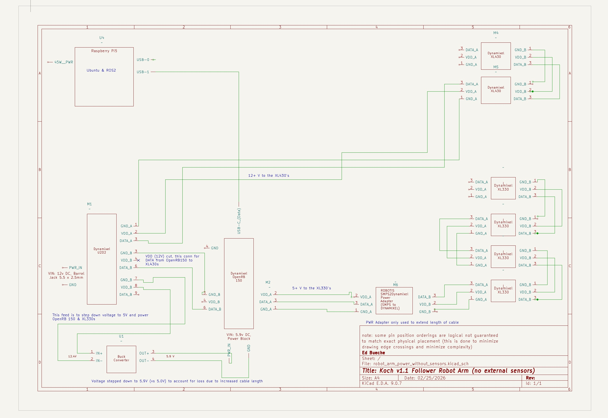
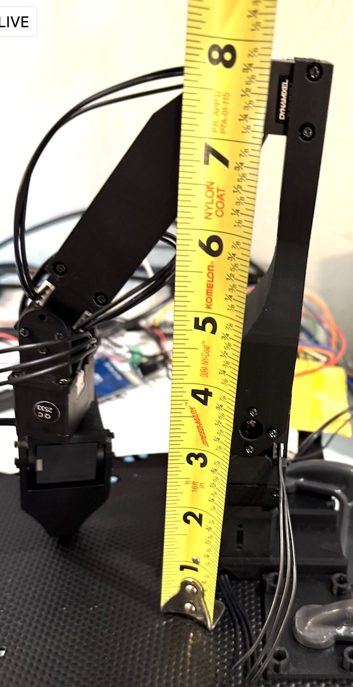

# Hardware Setup
This section describes the hardware setup including a detailed electrical layout.

## Sections
- [Hardware Overview](#hardware-overview): Outlines the hardware setup.
- [Bill of Materials](#bill-of-materials): What was purchased, motivation, and alternatives.
- [3D printing of robot parts](#3d-print-of-hardware): How to print the pieces.
- [Assembly of robot](#assembly-of-robot): how to assemble the robot.
- [Electrical Notes](#electrical-notes): Exactly how this robot was wired with additional notes.
- [Learnings and Next Steps](#learnings-and-next-steps): What did we learning in assemblying this robot and areas of improvement.

## Hardware Overview
The Koch v1.1 follower arm is a 6-degrees of robotic arm with the links illustrated as illustrated below. It is powered by four Dynamixel [XL330](https://en.robotis.com/shop_en/item.php?it_id=902-0163-000)'s and two Dynamixel [XL430](https://emanual.robotis.com/docs/en/dxl/x/xl430-w250/) servos. The controlling hardware is a combination of an [OpenRB 150](https://emanual.robotis.com/docs/en/parts/controller/openrb-150/) and a [Raspberry Pi 5](https://www.raspberrypi.com/products/raspberry-pi-5/). The two types of servos operate at different voltages so in addition to a [Robotis U2D2](https://en.robotis.com/shop_en/item.php?it_id=902-0145-001) we also are leveraging a Buck converter to step down the 12V to 5v+ for the XL330s. This project also includes sensors to measure the input electrical current. To that end, we are using IN219 and INA226 current sensors. The measurement of current is optional to the environment, but some of the analysis is greatly enhanced with it.

  

The joints of the robot are shown in the following diagram.

  

## Bill of Materials
Koch v1.1 6-DOF Robotic Arm — Bill of Materials

> **Note:** Prices are approximate and subject to change. Spares are recommended for sensors and buck converters due to sensitivity during assembly and testing.

## Core Computing

| Qty | Component | Description | Link | Unit Price | Total |
|-----|-----------|-------------|------|-----------|-------|
| 1 | 8GB Raspberry Pi 5 | main compute for robot arm | [Amazon B0CVR1LP7G](https://www.amazon.com/dp/B0CVR1LP7G) | $180 | $180 |
| 1 | Raspberry Pi 256GB SD Card | Storage for Raspberry Pi OS and ROS2 workspace | [Amazon B09X7CRKRZ](https://www.amazon.com/dp/B09X7CRKRZ) | ~$25 | ~$25 |
| 1 | NVIDIA Jetson Orin Nano Super Developer Kit | Optional: replaces Raspberry Pi; required for RViz visualization | [Amazon B0BZJTQ5YP](https://www.amazon.com/dp/B0BZJTQ5YP) | $245 | $245 |
| 1 | Case for NVIDIA Jetson Orin Nano | Protective enclosure for Jetson | [Amazon B0CG38BS5S](https://www.amazon.com/dp/B0CG38BS5S) | $22 | $22 |

## Dynamixel Servos and controller

| Qty | Component | Description | Link | Unit Price | Total |
|-----|-----------|-------------|------|-----------|-------|
| 1 | OpenRB 150 | controller for servos | [Robotis](https://robotis.us/openrb-150) | $30 | $30 | 
| 4 | XL330-M288-T | Wrist, shoulder, hand and gripper servos | [Robotis](https://en.robotis.com/shop_en/item.php?it_id=902-0163-000) | $24 | $96 |
| 1 | XL330-M077-T | Substitute for XL330-M288-T if out of stock (not for elbow lift) | [Robotis](https://en.robotis.com/shop_en/item.php?it_id=902-0162-000) | $24 | $24 |
| 2 | XL430-W250-T | Higher-torque servos for base rotation and elbow lift | [Robotis](https://en.robotis.com/shop_en/item.php?it_id=902-0135-000) | $24 | $48 |

## Dynamixel Interface & Cabling

| Qty | Component | Description | Link | Unit Price | Total |
|-----|-----------|-------------|------|-----------|-------|
| 1 | U2D2 PHB Set | USB-to-Dynamixel interface board set | [Robotis](https://en.robotis.com/shop_en/item.php?it_id=902-0145-001) | $20 | $20 |
| 1 | Robot Cable-X3P 180mm (Pack of 10) | Servo daisy-chain cables | [Robotis](https://en.robotis.com/shop_en/item.php?it_id=903-0249-000) | $20 | $20 |
| 1 | Robot Cable-X3P 180mm (Convertable) (Pack of 10) | used with to extend reach of cables with SMPS2Dynamixel apdapter | [ROBOTIS](https://en.robotis.com/shop_en/item.php?it_id=903-0251-000) | $20 | $20 | 
| 1 | ROBOTIS SMPS2Dynamixel Power Adapter| for extending reach of Robotis cables | https://www.robotshop.com/products/robotis-smps2dynamixel-power-adapter-smps-to-dynamixel | $10 | $10 |

## Power

| Qty | Component | Description | Link | Unit Price | Total |
|-----|-----------|-------------|------|-----------|-------|
| 1 | 12V Power Supply 10A | Main power supply for OpenRB150, XL330s, XL430 servos | [Amazon B07MXXXBV8](https://www.amazon.com/dp/B07MXXXBV8) | ~$20 | ~$20 |
| 1+ | Buck Converter (DC-DC Step-Down) | Steps 12V down to 5V for XL330 servos and logic; buy several for spares | [Amazon B085T73CSD](https://www.amazon.com/Converter-1-25-36V-Voltage-Regulator-Display/dp/B085T73CSD) | $15 (multi-pack) | $15 |

## Telemetry / Current Sensing

| Qty | Component | Description | Link | Unit Price | Total |
|-----|-----------|-------------|------|-----------|-------|
| 2 | INA219 Current Sensor | I²C current/voltage monitoring; spares recommended | [Amazon B0FKBDX2R2](https://www.amazon.com/dp/B0FKBDX2R2) | $10 (pack) | $10 |
| 2 | INA226 Current Sensor R100| Higher-precision I²C power monitor; spares recommended | [Amazon B0FC656459](https://www.amazon.com/dp/B0FC656459) | $16 | $32 |
| 2 | INA226 Voltage Current Monitor 0-36V 20A Tester I2C IIC Power Monitoring Sensor Module | [Amazon B0DRNG1VKM](https://www.amazon.com/dp/B0DRNG1VKM) | $13 | $26 |
| 1 | ESP32 Dev Kit | Microcontroller for telemetry and sensor aggregation | [Amazon B0FNQVZJ6D](https://www.amazon.com/dp/B0FNQVZJ6D) | $20 | $20 |

## Prototyping & Wiring

| Qty | Component | Description | Link | Unit Price | Total |
|-----|-----------|-------------|------|-----------|-------|
| 1 | Solderless Breadboard Kit | Full-size breadboard for circuit prototyping | [Amazon B08Y59P6D1](https://www.amazon.com/dp/B08Y59P6D1) | $10 | $10 |
| 1 | Mini Breadboard Kit | Small breadboards for compact sensor wiring | [Amazon B01KKE602W](https://www.amazon.com/dp/B01KKE602W) | $8 | $8 |
| 1 | 23AWG Breadboard Jumper Ribbon Cables Kit | Jumper wires for breadboard connections | — | $10 | $10 |

## Mechanical Mounting

| Qty | Component | Description | Link | Unit Price | Total |
|-----|-----------|-------------|------|-----------|-------|
| 2 | C-Clamps | Secure robot base to work surface; size depends on your table | Local hardware store | ~$10 | ~$10 |

## Balance Related Hardware
The following are the components added to support the cup balancing effort.
| Qty | Component | Description | Link | Unit Price | Total |
|-----|-----------|-------------|------|-----------|-------|
| 1 | IMU sensor | HiLetgo 3pcs GY-521 MPU-6050 MPU6050 3 Axis Accelerometer Gyroscope Module 6 DOF 6-axis Accelerometer Gyroscope Sensor Module 16 Bit AD Converter Data Output IIC I2C for Arduino | Amazon | ~$10 | ~$10 |
| 1 | ESP32 controller | HiLetgo ESP-WROOM-32 ESP32 ESP-32S Development Board 2.4GHz Dual-Mode WiFi + Bluetooth Dual Cores Microcontroller Processor Integrated with Antenna RF AMP Filter AP STA | Amazon | ~$10 | ~$10 |
| 1 | USB hub with external power | Atolla 4-Port USB 3.0 Hub with 4 Data Ports, 1 Smart Charging Port, Individual On/Off Switches and 5V/3A Adapter | Amazon | ~$20 | ~$20 |
| 1 | Luxonis Oak-D lite | 3d camera with inferencing capability | https://shop.luxonis.com/products/oak-d-lite-1 | https://www.luxonis.com | $150 | $150 |
| 1 | camera stand  | SMALLRIG 22" Magic Arm Clamp, Overhead Phone Mount Holder Stand, Flexible Desk Camera Mount, Articulating Friction Boom Arm, for POV Shot, Filming, Light, Webcam, Action Camera | Amazon | ~$10 | ~$10 |

---

## 3D Print of Hardware
There are a number of ways to print the various custom pieces of the robot arm. We have both printed pieces via a local 3D print and used the [Craftcloud](https://craftcloud3d.com/) service. The meshes used in this print are located [here](../writing_robot_description/meshes). These are derived as binary representations of the ones located in the original [koch v1.1](https://github.com/jess-moss/koch-v1-1/tree/main/hardware/follower/STL) version.

The Balance PID controller exercise requires an additional 3D printed cup. This is shown below. This is the third version of the cup which improved upon the other two designs by being more smoothly concave. Indeed cup v1 had a flat bottom which made it impossible for a robot (or a human) to balance the ball bearing.

  

The STL and Free cad files for this version of the cup found as:
1. [cup.v3.FCStd](../writing_robot_description/meshes/cup.v3.FCStd),
2. [cup.v3-Body.stl](../writing_robot_description/meshes/cup.v3-Body.stl)

Note that the koch v1.1 hand is incapable of holding the cup without it rocking as the pitch changes. This is partly due to the design of the hand (or more accurately: the claw). Adding tape around the claw was unsuccessful in solving the issue. We respeted to tieing the base of the cup to the hand with a rubber band. 

## Assembly of Robot
- **Arm Assembly**: The basic assembly of the koch v1.1 robot is outlined in detail in the [Jess Moss Youtube video](https://www.youtube.com/watch?v=8nQIg9BwwTk) (follower assembly starts around 8:22 min into the video). The key divergence from this work is the shoulder link. In this version the XL430 servo is positioned upright (vs. horizontal) and we use a standard Robotis bracket (see BOM) instead of the one defined by Jess.
- **Anchoring of arm**: TBD
- **Electronic board enclosure**: The enclosure for the electronics is under development.
  

  
  

- **Electrical wiring**: See below

## Electrical Notes

The following is an electrical schematic of the robot with the external current sensors. Note that although you can use the INA219 or the INA226 sensors we recommend the INA226 sensors with R002 resistors (vs either with R100 resistors). This ensures that the reading of the sensor can be larger than 1 amp (otherwise as the current gets that large the sensor maxes out on its reading).

  

Those sensors are really optional for the running of the robot and are meant to provide deeper electrical insight. The following is a wiriing setup without those sensors.

  

Some additional notes:
- **For the Balance project a USB hub with external power is required**: I still need to update the electrical diagrams to reflect this. The PI does not have enough juice to power the openRB150, the ESP32 for the power sensors, and the ESP32 for the IMU. Its possible to perhaps work with a single board (openRB150) but for simplicity of the sketches I didn't do that. This is left as an exercise to the reader.
 
- **Operating 12V and 5V servos on the same robot**: The XL430's are 12V and the XL330's operate on 5V. There are a number of ways to power these servo's and we decided to use a 12V power supply into the U2D2 and then feed some of that into a buck converter for the XL330's and openRB150. The OpenRB will feed data, VCC, and GND into the XL330 path but only Data and GND into the XL430 path. There is a connection from the U2D2 to the OpenRB that has the VCC line physically cut for this. This allows the U2D2-2-XL430 path to carry power, data, and gnd to the XL430's.
  
- **Cable Length issues - part 1 "range of motion"**: A single 180mm X3P cable from the OpenRB150 to the first XL330 isn't quite long enough to allow the joint with that XL330 to have adequate range of motion (see picture below). 7.75 inches ~= 200 mm, which is beyond the max size cable that (I think) Robotis supports. So we looped in a light weight SMPS2Dynamixel power adapter that allows two 180mm X3P convertable cables to be used effectively doubling the length. Although that power adapter can accept external power it also can be powered just by the incoming cables. There are other ways to extend the reach of these cables (higher guage cable). 

  

- **Cable Length issues - part 2 "splicing in VIN+/-"**: We used two different ways of splicing in the IN219 VIN+/- connection. In one case we physically cut the power cable and terminated the ends with ferrules and fed these into the power block for the IN219s. But the range of motion and/or circuit board placement becomes an issue and a longer set of wires is needed. So, in the other we used the female end of a breadboard jumper cable into the IN219 but male end into the X3P connector. If the jumper cables were not at least 23AWG then there would be issues with powering the servos. The longer the cable the more power is lost especially when more current is needed for certain poses. The 23AWG guage cables help but we also upped the voltage out of the buck converter to 5.9V ensure all XL330's would see 5+ volts and not error out due to lack of voltage. Theoretically, this will lead to higher temperatures when running the Servo's but I haven't measured anything significant on this front.
  
- **Shared ground**: The ESP32 (used for current monitoring), the openRB150, and the servo's all share GND.
  
- **The 12V input to the U2D2 can provide up to 10 amps**. This should support the peak possible current pull from all of the components but I'm far off of that at the current moment.
  
## Learnings and next steps
There are numerous learnings and next steps:
- **The Koch v1.1 base link is not appropriate for the hardware chosen**: Its the wrong size and is not flexible to handle change over time. It was designbed for different controllers and other hardware. At the moment we are keeping it and designing a separate electronics enclosure (shown above).

