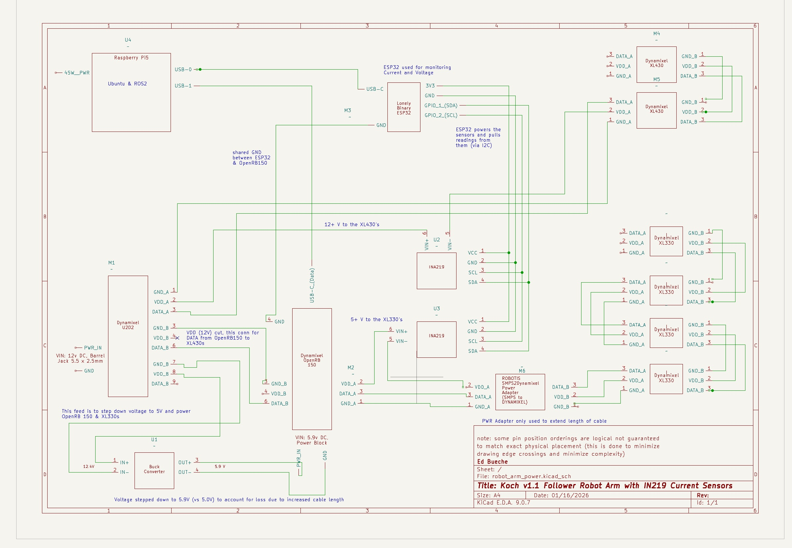

# Hardware Setup
This section describes the hardware setup including a detailed electrical layout.

## Sections
- [Hardware Overview](#hardware_overview): Outlines the hardware setup.
- [Bill of Materials](#bill_of_materials): What was purchased, motivation, and alternatives.
- [3D printing of robot parts](#3d_print_of_hardware): How to print the pieces.
- [Electrical Notes](#electrical_setup): Exactly how this robot was wired with additional notes.
- [Learnings and Next Steps](#learnings_and_next_steps): What did we learning in assemblying this robot and areas of improvement.

## Hardware Overview
TBD

## Bill of Materials
TBD

## 3D Print of Hardware
TBD

## Electrical Notes

The following is an electrical schematic of the robot.

  

Some additional notes:
- **Operating 12V and 5V servos on the same robot**: The XL430's are 12V and the XL330's operate on 5V. There are a number of ways to power these servo's and we decided to use a 12V power supply into the U2D2 and then feed some of that into a buck converter for the XL330's and openRB150. The OpenRB will feed data, VCC, and GND into the XL330 path but only Data and GND into the XL430 path. There is a connection from the U2D2 to the OpenRB that has the VCC line physically cut for this. This allows the U2D2-2-XL430 path to carry power, data, and gnd to the XL430's.
- **Cable Length issues - part 1 "range of motion"**: A single 180mm X3P cable from the OpenRB150 to the first XL330 isn't quite long enough to allow the joint with that XL330 to have adequate range of motion. So we looped in a light weight SMPS2Dynamixel power adapter that allows two 180mm X3P convertable cables to be used effectively doubling the length. Although that power adapter can accept external power it also can be powered just by the incoming cables. There are other ways to extend the reach of these cables.
- **Cable Length issues - part 2 "splicing in VIN+/-"**: We used two different ways of splicing in the IN219 VIN+/- connection. In one case we physically cut the power cable and terminated the ends with ferrules and fed these into the power block for the IN219s. But the range of motion and/or circuit board placement becomes an issue and a longer set of wires is needed. So, in the other we used the female end of a breadboard jumper cable into the IN219 but male end into the X3P connector. If the jumper cables were not at least 23AWG then there would be issues with powering the servos. The longer the cable the more power is lost especially when more current is needed for certain poses. The 23AWG guage cables help but we also upped the voltage out of the buck converter to 5.9V ensure all XL330's would see 5+ volts and not error out due to lack of voltage. Theoretically, this will lead to higher temperatures when running the Servo's but I haven't measured anything significant on this front.
- **Shared ground**: The ESP32 (used for current monitoring), the openRB150, and the servo's all share GND.
- **The 12V input to the U2D2 can provide up to 10 amps**. This should support the peak possible current pull from all of the components but I'm far off of that at the current moment.
  
## Learnings and next steps
TBD
