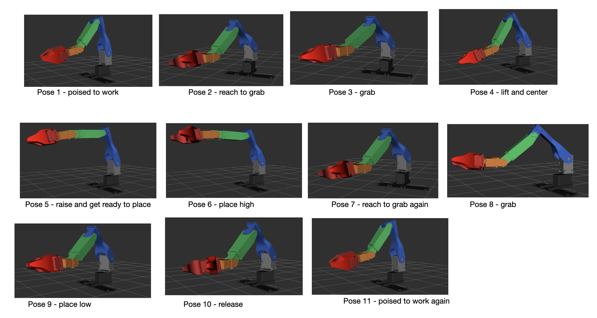

# Running the Pose Test utility

This ros2 utility does a number of tests that include:
1. running through a sequence of pre-defined poses
2. perform range of motion tests of defined joints in the robot system
3. measure various properties of the robot in the current pose (servo temperature, current, voltage, etc)
4. validate poses wrt to the bounds defined in the urdf file

## Table of contents
- [Parameters](#parameters)
- [Pose Sequence Example](#pose-sequence-example)
- [Servo Range of motion test example](#servo-range-of-motion-test-example)
- [Example of a validation error](#example-of-a-validation-error)
- [FAQ](#faq)


## Parameters

The parameters are:
| parameter name | default | description |
|----------------|---------|-------------|
|`poses_file`| |The argument should be the file path to a yaml formatted set of poses. See [example pose sequence yaml file](https://github.com/bueche/ros2_robot_arm/blob/main/writing_robot_description/config/delivery_poses.yaml) for more detail.|
| `program`|| This can have an argument value of calibration, sweep, stress, or default. Each represents a sequence of poses.|
| `servo_test`| False| if true then a servo range-of-motion test is run. Must be accompanied by the `servo_test_joint` parameter (see next).|
| `servo_test_joint`|| Specific joint to test and can have a value of shoulder_pan, shoulder_lift, elbow_flex, elbow_flex, wrist_roll, and pen_holder.|
| `safe_position_first`| `True`| should the arm position itself first in the safe pose?|
| `validate`| `True`| should the program check to ensure that the next pose is safe or not (within the bounds specified in the urdf)|
| `telemetry`| `False`| should the servo stats be sampled after each pose? the stats include temperature, current, voltage, etc.|
| `delay`|`2.0`| The time in seconds to delay between each pose.|
| `movement_time`| `2.0`| how much time should the arm have to complete the transition from the current pose to the next pose.|
| `urdf_file`| |Load URDF from file. (TODO: should have a default file to load)|
| `power_monitoring`| |Determines whether or not the power monitoring will take place during poses. See [power_monitor_node](./writing_robot_control/writing_robot_comtrol/power_monitor.py).
  

## Pose Sequence Example
An example run through a sequence of poses is as follows. In this test the robot will go through a short simulated package handling scenario. Each pose transition is to occur within one second and there will be a one second pause between each pose. The software will also validate the that each pose is allowed by the URDF definition and stop if it does not. 

The particular example illustrated is defined by [this pose sequence](../src/writing_robot_description/config/delivery_poses.yaml) and is illustrated in the story board below (which was an rviz2 reproduction of the actual physical robot movements). 

<p align="center">
  
</p>

Ouptut from the Pose Test utility is given below.

```bash
ubuntu@bueche-rpi5:~/robot_ws$ ros2 run writing_robot_control pose_test --ros-args -p poses_file:=src/writing_robot_description/config/delivery_poses.yaml -p validate:=true -p telemetry:=true -p urdf_file:=src/writing_robot_description/urdf/koch_v11_arm_real.urdf -p power_monitoring:=true -p delay:=2.0
POWER_MONITORING_AVAILABLEF: True
[INFO] [1770595611.286299681] [pose_test_node]: Loading URDF limits...
[INFO] [1770595611.288279858] [pose_test_node]: ✓ Loaded limits for 6 joints
[INFO] [1770595611.288832713] [pose_test_node]: Initializing telemetry...
[INFO] [1770595611.294631206] [pose_test_node]: ✓ Telemetry initialized (dual-topic mode)
[INFO] [1770595611.295322302] [pose_test_node]:   - Subscribing to /joint_states
[INFO] [1770595611.295852787] [pose_test_node]:   - Subscribing to /dxl_state
[INFO] [1770595611.296357660] [pose_test_node]:   - XL430 servos (IDs 1,2): Load only
[INFO] [1770595611.296849459] [pose_test_node]:   - XL330 servos (IDs 3-6): Current + Load
[INFO] [1770595612.885336866] [pose_test_node]: ✓ Telemetry active
[INFO] [1770595612.891349954] [pose_test_node]: ✓ Power monitoring enabled
[INFO] [1770595612.892337792] [pose_test_node]: ============================================================
[INFO] [1770595612.892954888] [pose_test_node]: POSE TEST NODE INITIALIZED
[INFO] [1770595612.893496724] [pose_test_node]: ============================================================
[INFO] [1770595612.894010523] [pose_test_node]: Joints: 6
[INFO] [1770595612.894527600] [pose_test_node]: Validation: True
[INFO] [1770595612.895140048] [pose_test_node]: Telemetry: True
[INFO] [1770595612.895788014] [pose_test_node]: Power Monitoring: Enabled
[INFO] [1770595612.896471610] [pose_test_node]: Movement time: 2.0s
[INFO] [1770595612.897053669] [pose_test_node]: Delay between poses: 2.0s
[INFO] [1770595612.897580061] [pose_test_node]: ============================================================
[INFO] [1770595612.898085119] [pose_test_node]: Waiting for joint trajectory controller...
[INFO] [1770595614.918960495] [pose_test_node]: ✓ Loaded 11 poses from src/writing_robot_description/config/delivery_poses.yaml
[INFO] [1770595614.919536684] [pose_test_node]: 
============================================================
[INFO] [1770595614.920086372] [pose_test_node]: POSE SEQUENCE TEST
[INFO] [1770595614.920945302] [pose_test_node]: ============================================================
[INFO] [1770595614.921602917] [pose_test_node]: Total poses: 11
[INFO] [1770595614.922170049] [pose_test_node]: Validation: True
[INFO] [1770595614.922684700] [pose_test_node]: Telemetry: True
[INFO] [1770595614.923166258] [pose_test_node]: ============================================================
[INFO] [1770595614.923662002] [pose_test_node]: 
[1/11] pose 1 - poised to work
[INFO] [1770595614.924154041] [pose_test_node]:   ✓ shoulder_pan: 1.558 rad (within [0.540, 2.044])
[INFO] [1770595614.924652303] [pose_test_node]:   ✓ shoulder_lift: 2.879 rad (within [2.200, 2.886])
[INFO] [1770595614.925128361] [pose_test_node]:   ✓ elbow_flex: 2.124 rad (within [0.726, 2.250])
[INFO] [1770595614.925638438] [pose_test_node]:   ✓ wrist_flex: 2.279 rad (within [0.297, 2.700])
[INFO] [1770595614.926148607] [pose_test_node]:   ✓ wrist_roll: 1.182 rad (within [-1.448, 1.900])
[INFO] [1770595614.926671777] [pose_test_node]:   ✓ pen_holder: 1.590 rad (within [0.190, 1.600])
[INFO] [1770595614.927827338] [pose_test_node]: → Sent: pose 1 - poised to work
[INFO] [1770595618.934589703] [pose_test_node]:   📊 Joint States:
[INFO] [1770595618.935407226] [pose_test_node]:   📊 shoulder_pan    [XL430] Pos:  1.557rad Load:  0.00% Volt:12.1V Temp: 32.0°C
[INFO] [1770595618.936180933] [pose_test_node]:   📊 shoulder_lift   [XL430] Pos:  2.839rad Load: 14.00% Volt:12.1V Temp: 34.0°C
[INFO] [1770595618.937008160] [pose_test_node]:   📊 elbow_flex      [XL330] Pos:  2.303rad Curr: -109mA Volt: 5.5V Temp: 21.0°C
[INFO] [1770595618.937838905] [pose_test_node]:   📊 wrist_flex      [XL330] Pos:  2.276rad Curr:   13mA Volt: 5.4V Temp: 21.0°C
[INFO] [1770595618.938645446] [pose_test_node]:   📊 wrist_roll      [XL330] Pos:  1.186rad Curr:  -12mA Volt: 5.5V Temp: 22.0°C
[INFO] [1770595618.939474062] [pose_test_node]:   📊 pen_holder      [XL330] Pos:  1.621rad Curr:  -21mA Volt: 5.4V Temp: 22.0°C
[INFO] [1770595618.940354344] [pose_test_node]:   ⚡ Power Analysis for "pose 1 - poised to work":
[INFO] [1770595618.941070959] [pose_test_node]:      Peak 5V current (INA219):    0.199A
[INFO] [1770595618.941883204] [pose_test_node]:      Peak motor sum (XL330s):     0.162A
[INFO] [1770595618.942663431] [pose_test_node]:      5V voltage: 5.66V (min) / 5.78V (max)
[INFO] [1770595618.943420453] [pose_test_node]:      Peak 12V current:            0.147A
[INFO] [1770595618.944070382] [pose_test_node]:      Peak total power:            2.70W
[INFO] [1770595618.944706071] [pose_test_node]:      Holding current comparison:
[INFO] [1770595618.945295500] [pose_test_node]:        Supply current (INA219):     0.197A
[INFO] [1770595618.945858670] [pose_test_node]:        Motor current sum (XL330s):  0.155A
[INFO] [1770595618.946427932] [pose_test_node]:        ✓ Supply within 50mA of  motor sum
[INFO] [1770595618.947019361] [pose_test_node]: 
[2/11] pose 2 - reach to grab
[INFO] [1770595618.947647864] [pose_test_node]:   ✓ shoulder_pan: 1.283 rad (within [0.540, 2.044])
[INFO] [1770595618.948243219] [pose_test_node]:   ✓ shoulder_lift: 2.314 rad (within [2.200, 2.886])
[INFO] [1770595618.948847352] [pose_test_node]:   ✓ elbow_flex: 1.320 rad (within [0.726, 2.250])
[INFO] [1770595618.949454281] [pose_test_node]:   ✓ wrist_flex: 2.279 rad (within [0.297, 2.700])
[INFO] [1770595618.949942839] [pose_test_node]:   ✓ wrist_roll: 1.871 rad (within [-1.448, 1.900])
[INFO] [1770595618.950446083] [pose_test_node]:   ✓ pen_holder: 0.982 rad (within [0.190, 1.600])
[INFO] [1770595618.951630145] [pose_test_node]: → Sent: pose 2 - reach to grab
[INFO] [1770595622.959307569] [pose_test_node]:   📊 Joint States:
[INFO] [1770595622.960186963] [pose_test_node]:   📊 shoulder_pan    [XL430] Pos:  1.282rad Load: -0.20% Volt:12.1V Temp: 32.0°C
[INFO] [1770595622.961265228] [pose_test_node]:   📊 shoulder_lift   [XL430] Pos:  2.293rad Load:  7.20% Volt:12.1V Temp: 34.0°C
[INFO] [1770595622.962400956] [pose_test_node]:   📊 elbow_flex      [XL330] Pos:  1.497rad Curr: -107mA Volt: 5.5V Temp: 21.0°C
[INFO] [1770595622.963309868] [pose_test_node]:   📊 wrist_flex      [XL330] Pos:  2.275rad Curr:   14mA Volt: 5.4V Temp: 21.0°C
[INFO] [1770595622.964102521] [pose_test_node]:   📊 wrist_roll      [XL330] Pos:  1.865rad Curr:   12mA Volt: 5.4V Temp: 21.0°C
[INFO] [1770595622.964913155] [pose_test_node]:   📊 pen_holder      [XL330] Pos:  1.031rad Curr:  -26mA Volt: 5.4V Temp: 22.0°C
[INFO] [1770595622.965831974] [pose_test_node]:   ⚡ Power Analysis for "pose 2 - reach to grab":
[INFO] [1770595622.966556515] [pose_test_node]:      Peak 5V current (INA219):    0.202A
[INFO] [1770595622.967254760] [pose_test_node]:      Peak motor sum (XL330s):     0.182A
[INFO] [1770595622.967983486] [pose_test_node]:      5V voltage: 5.66V (min) / 5.77V (max)
[INFO] [1770595622.968709193] [pose_test_node]:      Peak 12V current:            0.123A
[INFO] [1770595622.969415197] [pose_test_node]:      Peak total power:            2.63W
[INFO] [1770595622.970100089] [pose_test_node]:      Holding current comparison:
[INFO] [1770595622.970903131] [pose_test_node]:        Supply current (INA219):     0.200A
[INFO] [1770595622.971839136] [pose_test_node]:        Motor current sum (XL330s):  0.159A
[INFO] [1770595622.972448380] [pose_test_node]:        ✓ Supply within 50mA of  motor sum
[INFO] [1770595622.972988364] [pose_test_node]: 
[3/11] pose 3 - grab
[INFO] [1770595622.973529274] [pose_test_node]:   ✓ shoulder_pan: 1.329 rad (within [0.540, 2.044])
[INFO] [1770595622.974001740] [pose_test_node]:   ✓ shoulder_lift: 2.322 rad (within [2.200, 2.886])
[INFO] [1770595622.974470909] [pose_test_node]:   ✓ elbow_flex: 1.005 rad (within [0.726, 2.250])
[INFO] [1770595622.974955411] [pose_test_node]:   ✓ wrist_flex: 2.279 rad (within [0.297, 2.700])
[INFO] [1770595622.975449655] [pose_test_node]:   ✓ wrist_roll: 1.766 rad (within [-1.448, 1.900])
[INFO] [1770595622.975919916] [pose_test_node]:   ✓ pen_holder: 1.501 rad (within [0.190, 1.600])
[INFO] [1770595622.976991385] [pose_test_node]: → Sent: pose 3 - grab
[INFO] [1770595626.982988653] [pose_test_node]:   📊 Joint States:
[INFO] [1770595626.983824509] [pose_test_node]:   📊 shoulder_pan    [XL430] Pos:  1.321rad Load:  3.30% Volt:12.1V Temp: 32.0°C
[INFO] [1770595626.984632624] [pose_test_node]:   📊 shoulder_lift   [XL430] Pos:  2.279rad Load: 15.80% Volt:12.1V Temp: 34.0°C
[INFO] [1770595626.985436036] [pose_test_node]:   📊 elbow_flex      [XL330] Pos:  1.204rad Curr: -127mA Volt: 5.4V Temp: 21.0°C
[INFO] [1770595626.986250614] [pose_test_node]:   📊 wrist_flex      [XL330] Pos:  2.275rad Curr:   14mA Volt: 5.4V Temp: 21.0°C
[INFO] [1770595626.987051156] [pose_test_node]:   📊 wrist_roll      [XL330] Pos:  1.766rad Curr:    0mA Volt: 5.5V Temp: 21.0°C
[INFO] [1770595626.987946790] [pose_test_node]:   📊 pen_holder      [XL330] Pos:  1.470rad Curr:   19mA Volt: 5.5V Temp: 22.0°C
[INFO] [1770595626.988853813] [pose_test_node]:   ⚡ Power Analysis for "pose 3 - grab":
[INFO] [1770595626.989580132] [pose_test_node]:      Peak 5V current (INA219):    0.296A
[INFO] [1770595626.990292654] [pose_test_node]:      Peak motor sum (XL330s):     0.308A
[INFO] [1770595626.991077270] [pose_test_node]:      5V voltage: 5.57V (min) / 5.77V (max)
[INFO] [1770595626.991991034] [pose_test_node]:      Peak 12V current:            0.147A
[INFO] [1770595626.992792001] [pose_test_node]:      Peak total power:            3.29W
[INFO] [1770595626.993524486] [pose_test_node]:      Holding current comparison:
[INFO] [1770595626.994062063] [pose_test_node]:        Supply current (INA219):     0.207A
[INFO] [1770595626.994644640] [pose_test_node]:        Motor current sum (XL330s):  0.160A
[INFO] [1770595626.995276218] [pose_test_node]:        ✓ Supply within 50mA of  motor sum
[INFO] [1770595626.995846461] [pose_test_node]: 
[4/11] pose 4 - lift and center
[INFO] [1770595626.996459150] [pose_test_node]:   ✓ shoulder_pan: 1.576 rad (within [0.540, 2.044])
[INFO] [1770595626.997025116] [pose_test_node]:   ✓ shoulder_lift: 2.575 rad (within [2.200, 2.886])
[INFO] [1770595626.997575841] [pose_test_node]:   ✓ elbow_flex: 1.898 rad (within [0.726, 2.250])
[INFO] [1770595626.998075232] [pose_test_node]:   ✓ wrist_flex: 2.279 rad (within [0.297, 2.700])
[INFO] [1770595626.998567494] [pose_test_node]:   ✓ wrist_roll: 1.766 rad (within [-1.448, 1.900])
[INFO] [1770595626.999073015] [pose_test_node]:   ✓ pen_holder: 1.521 rad (within [0.190, 1.600])
[INFO] [1770595627.000152577] [pose_test_node]: → Sent: pose 4 - lift and center
[INFO] [1770595631.006279604] [pose_test_node]:   📊 Joint States:
[INFO] [1770595631.007101461] [pose_test_node]:   📊 shoulder_pan    [XL430] Pos:  1.571rad Load:  1.60% Volt:12.3V Temp: 32.0°C
[INFO] [1770595631.007950150] [pose_test_node]:   📊 shoulder_lift   [XL430] Pos:  2.528rad Load: 17.10% Volt:12.1V Temp: 35.0°C
[INFO] [1770595631.008715099] [pose_test_node]:   📊 elbow_flex      [XL330] Pos:  1.931rad Curr:  -15mA Volt: 5.7V Temp: 21.0°C
[INFO] [1770595631.009499862] [pose_test_node]:   📊 wrist_flex      [XL330] Pos:  2.275rad Curr:   14mA Volt: 5.6V Temp: 21.0°C
[INFO] [1770595631.010273662] [pose_test_node]:   📊 wrist_roll      [XL330] Pos:  1.766rad Curr:    0mA Volt: 5.7V Temp: 21.0°C
[INFO] [1770595631.011112445] [pose_test_node]:   📊 pen_holder      [XL330] Pos:  1.496rad Curr:   19mA Volt: 5.6V Temp: 22.0°C
[INFO] [1770595631.012230488] [pose_test_node]:   ⚡ Power Analysis for "pose 4 - lift and center":
[INFO] [1770595631.013348512] [pose_test_node]:      Peak 5V current (INA219):    0.207A
[INFO] [1770595631.014014682] [pose_test_node]:      Peak motor sum (XL330s):     0.170A
[INFO] [1770595631.014584630] [pose_test_node]:      5V voltage: 5.66V (min) / 5.78V (max)
[INFO] [1770595631.015131188] [pose_test_node]:      Peak 12V current:            0.226A
[INFO] [1770595631.015674673] [pose_test_node]:      Peak total power:            3.34W
[INFO] [1770595631.016219398] [pose_test_node]:      Holding current comparison:
[INFO] [1770595631.016789734] [pose_test_node]:        Supply current (INA219):     0.099A
[INFO] [1770595631.017449960] [pose_test_node]:        Motor current sum (XL330s):  0.048A
[WARN] [1770595631.018139148] [pose_test_node]:        ⚠ Supply higher than motor sum by 0.051A!
[INFO] [1770595631.018772189] [pose_test_node]: 
[5/11] pose 5 - raise and get ready to place
[INFO] [1770595631.019402896] [pose_test_node]:   ✓ shoulder_pan: 1.596 rad (within [0.540, 2.044])
[INFO] [1770595631.020014584] [pose_test_node]:   ✓ shoulder_lift: 2.795 rad (within [2.200, 2.886])
[INFO] [1770595631.020972386] [pose_test_node]:   ✓ elbow_flex: 0.970 rad (within [0.726, 2.250])
[INFO] [1770595631.021680371] [pose_test_node]:   ✓ wrist_flex: 1.473 rad (within [0.297, 2.700])
[INFO] [1770595631.022307226] [pose_test_node]:   ✓ wrist_roll: 1.762 rad (within [-1.448, 1.900])
[INFO] [1770595631.022878192] [pose_test_node]:   ✓ pen_holder: 1.521 rad (within [0.190, 1.600])
[INFO] [1770595631.024021291] [pose_test_node]: → Sent: pose 5 - raise and get ready to place
[INFO] [1770595635.029673131] [pose_test_node]:   📊 Joint States:
[INFO] [1770595635.030496857] [pose_test_node]:   📊 shoulder_pan    [XL430] Pos:  1.585rad Load:  4.40% Volt:12.1V Temp: 32.0°C
[INFO] [1770595635.031631659] [pose_test_node]:   📊 shoulder_lift   [XL430] Pos:  2.738rad Load: 19.50% Volt:12.1V Temp: 35.0°C
[INFO] [1770595635.032539072] [pose_test_node]:   📊 elbow_flex      [XL330] Pos:  1.197rad Curr: -157mA Volt: 5.4V Temp: 21.0°C
[INFO] [1770595635.033470965] [pose_test_node]:   📊 wrist_flex      [XL330] Pos:  1.465rad Curr:   14mA Volt: 5.4V Temp: 21.0°C
[INFO] [1770595635.034200914] [pose_test_node]:   📊 wrist_roll      [XL330] Pos:  1.761rad Curr:    0mA Volt: 5.4V Temp: 21.0°C
[INFO] [1770595635.034980973] [pose_test_node]:   📊 pen_holder      [XL330] Pos:  1.496rad Curr:   18mA Volt: 5.4V Temp: 22.0°C
[INFO] [1770595635.035845441] [pose_test_node]:   ⚡ Power Analysis for "pose 5 - raise and get ready to place":
[INFO] [1770595635.036509426] [pose_test_node]:      Peak 5V current (INA219):    0.263A
[INFO] [1770595635.037135207] [pose_test_node]:      Peak motor sum (XL330s):     0.242A
[INFO] [1770595635.037770544] [pose_test_node]:      5V voltage: 5.60V (min) / 5.77V (max)
[INFO] [1770595635.038420121] [pose_test_node]:      Peak 12V current:            0.204A
[INFO] [1770595635.039040439] [pose_test_node]:      Peak total power:            3.80W
[INFO] [1770595635.039636683] [pose_test_node]:      Holding current comparison:
[INFO] [1770595635.040205501] [pose_test_node]:        Supply current (INA219):     0.236A
[INFO] [1770595635.040792134] [pose_test_node]:        Motor current sum (XL330s):  0.189A
[INFO] [1770595635.041546582] [pose_test_node]:        ✓ Supply within 50mA of  motor sum
[INFO] [1770595635.042283327] [pose_test_node]: 
[6/11] pose 6 - place high
[INFO] [1770595635.042983497] [pose_test_node]:   ✓ shoulder_pan: 1.598 rad (within [0.540, 2.044])
[INFO] [1770595635.043636593] [pose_test_node]:   ✓ shoulder_lift: 2.655 rad (within [2.200, 2.886])
[INFO] [1770595635.044146226] [pose_test_node]:   ✓ elbow_flex: 0.806 rad (within [0.726, 2.250])
[INFO] [1770595635.044632858] [pose_test_node]:   ✓ wrist_flex: 1.473 rad (within [0.297, 2.700])
[INFO] [1770595635.045090619] [pose_test_node]:   ✓ wrist_roll: 1.762 rad (within [-1.448, 1.900])
[INFO] [1770595635.045583918] [pose_test_node]:   ✓ pen_holder: 0.655 rad (within [0.190, 1.600])
[INFO] [1770595635.046660480] [pose_test_node]: → Sent: pose 6 - place high
[INFO] [1770595639.054135903] [pose_test_node]:   📊 Joint States:
[INFO] [1770595639.054977241] [pose_test_node]:   📊 shoulder_pan    [XL430] Pos:  1.585rad Load:  5.00% Volt:12.1V Temp: 32.0°C
[INFO] [1770595639.055810875] [pose_test_node]:   📊 shoulder_lift   [XL430] Pos:  2.648rad Load:  2.20% Volt:12.1V Temp: 35.0°C
[INFO] [1770595639.057763997] [pose_test_node]:   📊 elbow_flex      [XL330] Pos:  1.051rad Curr: -176mA Volt: 5.3V Temp: 22.0°C
[INFO] [1770595639.059192430] [pose_test_node]:   📊 wrist_flex      [XL330] Pos:  1.463rad Curr:   14mA Volt: 5.4V Temp: 21.0°C
[INFO] [1770595639.060223361] [pose_test_node]:   📊 wrist_roll      [XL330] Pos:  1.759rad Curr:   11mA Volt: 5.4V Temp: 21.0°C
[INFO] [1770595639.061494553] [pose_test_node]:   📊 pen_holder      [XL330] Pos:  0.709rad Curr:  -28mA Volt: 5.3V Temp: 22.0°C
[INFO] [1770595639.062503299] [pose_test_node]:   ⚡ Power Analysis for "pose 6 - place high":
[INFO] [1770595639.063174507] [pose_test_node]:      Peak 5V current (INA219):    0.439A
[INFO] [1770595639.063763880] [pose_test_node]:      Peak motor sum (XL330s):     0.428A
[INFO] [1770595639.064322772] [pose_test_node]:      5V voltage: 5.43V (min) / 5.78V (max)
[INFO] [1770595639.064838441] [pose_test_node]:      Peak 12V current:            0.121A
[INFO] [1770595639.065348018] [pose_test_node]:      Peak total power:            3.79W
[INFO] [1770595639.065854076] [pose_test_node]:      Holding current comparison:
[INFO] [1770595639.066389135] [pose_test_node]:        Supply current (INA219):     0.269A
[INFO] [1770595639.066911786] [pose_test_node]:        Motor current sum (XL330s):  0.229A
[INFO] [1770595639.067454603] [pose_test_node]:        ✓ Supply within 50mA of  motor sum
[INFO] [1770595639.068010199] [pose_test_node]: 
[7/11] pose 7 - reach to grab again
[INFO] [1770595639.068575961] [pose_test_node]:   ✓ shoulder_pan: 1.283 rad (within [0.540, 2.044])
[INFO] [1770595639.069138760] [pose_test_node]:   ✓ shoulder_lift: 2.314 rad (within [2.200, 2.886])
[INFO] [1770595639.069684189] [pose_test_node]:   ✓ elbow_flex: 1.320 rad (within [0.726, 2.250])
[INFO] [1770595639.070254859] [pose_test_node]:   ✓ wrist_flex: 2.327 rad (within [0.297, 2.700])
[INFO] [1770595639.071165104] [pose_test_node]:   ✓ wrist_roll: 1.871 rad (within [-1.448, 1.900])
[INFO] [1770595639.071847867] [pose_test_node]:   ✓ pen_holder: 0.982 rad (within [0.190, 1.600])
[INFO] [1770595639.072937836] [pose_test_node]: → Sent: pose 7 - reach to grab again
[INFO] [1770595643.076834907] [pose_test_node]:   📊 Joint States:
[INFO] [1770595643.077880487] [pose_test_node]:   📊 shoulder_pan    [XL430] Pos:  1.282rad Load:  0.00% Volt:12.1V Temp: 32.0°C
[INFO] [1770595643.078745566] [pose_test_node]:   📊 shoulder_lift   [XL430] Pos:  2.293rad Load:  7.30% Volt:12.1V Temp: 35.0°C
[INFO] [1770595643.079595329] [pose_test_node]:   📊 elbow_flex      [XL330] Pos:  1.379rad Curr:  -25mA Volt: 5.6V Temp: 22.0°C
[INFO] [1770595643.080519205] [pose_test_node]:   📊 wrist_flex      [XL330] Pos:  2.269rad Curr:   29mA Volt: 5.6V Temp: 21.0°C
[INFO] [1770595643.081724822] [pose_test_node]:   📊 wrist_roll      [XL330] Pos:  1.865rad Curr:   11mA Volt: 5.6V Temp: 21.0°C
[INFO] [1770595643.082738605] [pose_test_node]:   📊 pen_holder      [XL330] Pos:  0.956rad Curr:   19mA Volt: 5.6V Temp: 22.0°C
[INFO] [1770595643.083718110] [pose_test_node]:   ⚡ Power Analysis for "pose 7 - reach to grab again":
[INFO] [1770595643.084369225] [pose_test_node]:      Peak 5V current (INA219):    0.267A
[INFO] [1770595643.084950561] [pose_test_node]:      Peak motor sum (XL330s):     0.256A
[INFO] [1770595643.085536583] [pose_test_node]:      5V voltage: 5.60V (min) / 5.76V (max)
[INFO] [1770595643.086111179] [pose_test_node]:      Peak 12V current:            0.126A
[INFO] [1770595643.086726904] [pose_test_node]:      Peak total power:            2.94W
[INFO] [1770595643.087370889] [pose_test_node]:      Holding current comparison:
[INFO] [1770595643.087955207] [pose_test_node]:        Supply current (INA219):     0.128A
[INFO] [1770595643.088534284] [pose_test_node]:        Motor current sum (XL330s):  0.084A
[INFO] [1770595643.089129972] [pose_test_node]:        ✓ Supply within 50mA of  motor sum
[INFO] [1770595643.089704623] [pose_test_node]: 
[8/11] pose 8 - grab
[INFO] [1770595643.090342942] [pose_test_node]:   ✓ shoulder_pan: 1.329 rad (within [0.540, 2.044])
[INFO] [1770595643.091185761] [pose_test_node]:   ✓ shoulder_lift: 2.314 rad (within [2.200, 2.886])
[INFO] [1770595643.091895617] [pose_test_node]:   ✓ elbow_flex: 1.005 rad (within [0.726, 2.250])
[INFO] [1770595643.092571009] [pose_test_node]:   ✓ wrist_flex: 2.037 rad (within [0.297, 2.700])
[INFO] [1770595643.093154253] [pose_test_node]:   ✓ wrist_roll: 1.766 rad (within [-1.448, 1.900])
[INFO] [1770595643.093715756] [pose_test_node]:   ✓ pen_holder: 1.521 rad (within [0.190, 1.600])
[INFO] [1770595643.094865336] [pose_test_node]: → Sent: pose 8 - grab
[INFO] [1770595647.099860876] [pose_test_node]:   📊 Joint States:
[INFO] [1770595647.100639010] [pose_test_node]:   📊 shoulder_pan    [XL430] Pos:  1.321rad Load:  3.30% Volt:12.1V Temp: 32.0°C
[INFO] [1770595647.102176981] [pose_test_node]:   📊 shoulder_lift   [XL430] Pos:  2.279rad Load: 12.40% Volt:12.1V Temp: 35.0°C
[INFO] [1770595647.103261190] [pose_test_node]:   📊 elbow_flex      [XL330] Pos:  1.253rad Curr: -179mA Volt: 5.4V Temp: 22.0°C
[INFO] [1770595647.104011917] [pose_test_node]:   📊 wrist_flex      [XL330] Pos:  2.033rad Curr:   13mA Volt: 5.3V Temp: 21.0°C
[INFO] [1770595647.104795902] [pose_test_node]:   📊 wrist_roll      [XL330] Pos:  1.766rad Curr:    0mA Volt: 5.4V Temp: 21.0°C
[INFO] [1770595647.105570351] [pose_test_node]:   📊 pen_holder      [XL330] Pos:  1.496rad Curr:   18mA Volt: 5.4V Temp: 22.0°C
[INFO] [1770595647.106458707] [pose_test_node]:   ⚡ Power Analysis for "pose 8 - grab":
[INFO] [1770595647.107161730] [pose_test_node]:      Peak 5V current (INA219):    0.322A
[INFO] [1770595647.107861826] [pose_test_node]:      Peak motor sum (XL330s):     0.343A
[INFO] [1770595647.108529440] [pose_test_node]:      5V voltage: 5.54V (min) / 5.76V (max)
[INFO] [1770595647.109142759] [pose_test_node]:      Peak 12V current:            0.135A
[INFO] [1770595647.109731002] [pose_test_node]:      Peak total power:            3.38W
[INFO] [1770595647.110251375] [pose_test_node]:      Holding current comparison:
[INFO] [1770595647.110859971] [pose_test_node]:        Supply current (INA219):     0.257A
[INFO] [1770595647.111597438] [pose_test_node]:        Motor current sum (XL330s):  0.210A
[INFO] [1770595647.112220478] [pose_test_node]:        ✓ Supply within 50mA of  motor sum
[INFO] [1770595647.112794148] [pose_test_node]: 
[9/11] pose 9 - place low
[INFO] [1770595647.113351559] [pose_test_node]:   ✓ shoulder_pan: 1.925 rad (within [0.540, 2.044])
[INFO] [1770595647.113873376] [pose_test_node]:   ✓ shoulder_lift: 2.403 rad (within [2.200, 2.886])
[INFO] [1770595647.114376953] [pose_test_node]:   ✓ elbow_flex: 1.352 rad (within [0.726, 2.250])
[INFO] [1770595647.114864881] [pose_test_node]:   ✓ wrist_flex: 2.327 rad (within [0.297, 2.700])
[INFO] [1770595647.115387643] [pose_test_node]:   ✓ wrist_roll: 1.737 rad (within [-1.448, 1.900])
[INFO] [1770595647.115912609] [pose_test_node]:   ✓ pen_holder: 1.521 rad (within [0.190, 1.600])
[INFO] [1770595647.117095838] [pose_test_node]: → Sent: pose 9 - place low
[INFO] [1770595651.123650534] [pose_test_node]:   📊 Joint States:
[INFO] [1770595651.124516520] [pose_test_node]:   📊 shoulder_pan    [XL430] Pos:  1.916rad Load:  2.70% Volt:12.1V Temp: 32.0°C
[INFO] [1770595651.125387414] [pose_test_node]:   📊 shoulder_lift   [XL430] Pos:  2.344rad Load: 21.50% Volt:12.1V Temp: 35.0°C
[INFO] [1770595651.126240529] [pose_test_node]:   📊 elbow_flex      [XL330] Pos:  1.411rad Curr:  -24mA Volt: 5.6V Temp: 22.0°C
[INFO] [1770595651.127092108] [pose_test_node]:   📊 wrist_flex      [XL330] Pos:  2.272rad Curr:   28mA Volt: 5.6V Temp: 21.0°C
[INFO] [1770595651.127937094] [pose_test_node]:   📊 wrist_roll      [XL330] Pos:  1.736rad Curr:    0mA Volt: 5.6V Temp: 21.0°C
[INFO] [1770595651.128787117] [pose_test_node]:   📊 pen_holder      [XL330] Pos:  1.496rad Curr:   18mA Volt: 5.6V Temp: 22.0°C
[INFO] [1770595651.129735881] [pose_test_node]:   ⚡ Power Analysis for "pose 9 - place low":
[INFO] [1770595651.130378792] [pose_test_node]:      Peak 5V current (INA219):    0.255A
[INFO] [1770595651.131110833] [pose_test_node]:      Peak motor sum (XL330s):     0.248A
[INFO] [1770595651.132040171] [pose_test_node]:      5V voltage: 5.60V (min) / 5.77V (max)
[INFO] [1770595651.132804323] [pose_test_node]:      Peak 12V current:            0.218A
[INFO] [1770595651.133421160] [pose_test_node]:      Peak total power:            3.36W
[INFO] [1770595651.134007385] [pose_test_node]:      Holding current comparison:
[INFO] [1770595651.134590907] [pose_test_node]:        Supply current (INA219):     0.120A
[INFO] [1770595651.135162965] [pose_test_node]:        Motor current sum (XL330s):  0.070A
[WARN] [1770595651.135839191] [pose_test_node]:        ⚠ Supply higher than motor sum by 0.050A!
[INFO] [1770595651.136450898] [pose_test_node]: 
[10/11] pose 10 - release
[INFO] [1770595651.137072290] [pose_test_node]:   ✓ shoulder_pan: 1.872 rad (within [0.540, 2.044])
[INFO] [1770595651.137672071] [pose_test_node]:   ✓ shoulder_lift: 2.403 rad (within [2.200, 2.886])
[INFO] [1770595651.138241185] [pose_test_node]:   ✓ elbow_flex: 1.266 rad (within [0.726, 2.250])
[INFO] [1770595651.138808633] [pose_test_node]:   ✓ wrist_flex: 2.327 rad (within [0.297, 2.700])
[INFO] [1770595651.139304061] [pose_test_node]:   ✓ wrist_roll: 1.737 rad (within [-1.448, 1.900])
[INFO] [1770595651.139794212] [pose_test_node]:   ✓ pen_holder: 0.582 rad (within [0.190, 1.600])
[INFO] [1770595651.140943477] [pose_test_node]: → Sent: pose 10 - release
[INFO] [1770595655.145097495] [pose_test_node]:   📊 Joint States:
[INFO] [1770595655.146019611] [pose_test_node]:   📊 shoulder_pan    [XL430] Pos:  1.871rad Load:  0.00% Volt:12.1V Temp: 32.0°C
[INFO] [1770595655.146870097] [pose_test_node]:   📊 shoulder_lift   [XL430] Pos:  2.344rad Load: 21.40% Volt:12.0V Temp: 35.0°C
[INFO] [1770595655.147701749] [pose_test_node]:   📊 elbow_flex      [XL330] Pos:  1.470rad Curr: -130mA Volt: 5.4V Temp: 22.0°C
[INFO] [1770595655.148539235] [pose_test_node]:   📊 wrist_flex      [XL330] Pos:  2.272rad Curr:   27mA Volt: 5.4V Temp: 21.0°C
[INFO] [1770595655.149398203] [pose_test_node]:   📊 wrist_roll      [XL330] Pos:  1.735rad Curr:   10mA Volt: 5.4V Temp: 21.0°C
[INFO] [1770595655.150282503] [pose_test_node]:   📊 pen_holder      [XL330] Pos:  0.640rad Curr:  -30mA Volt: 5.4V Temp: 22.0°C
[INFO] [1770595655.151505010] [pose_test_node]:   ⚡ Power Analysis for "pose 10 - release":
[INFO] [1770595655.152359403] [pose_test_node]:      Peak 5V current (INA219):    0.238A
[INFO] [1770595655.152953629] [pose_test_node]:      Peak motor sum (XL330s):     0.211A
[INFO] [1770595655.153519354] [pose_test_node]:      5V voltage: 5.62V (min) / 5.78V (max)
[INFO] [1770595655.154045634] [pose_test_node]:      Peak 12V current:            0.183A
[INFO] [1770595655.154573378] [pose_test_node]:      Peak total power:            3.46W
[INFO] [1770595655.155095251] [pose_test_node]:      Holding current comparison:
[INFO] [1770595655.155645698] [pose_test_node]:        Supply current (INA219):     0.236A
[INFO] [1770595655.156168646] [pose_test_node]:        Motor current sum (XL330s):  0.197A
[INFO] [1770595655.156730556] [pose_test_node]:        ✓ Supply within 50mA of  motor sum
[INFO] [1770595655.157294541] [pose_test_node]: 
[11/11] pose 11 - poised to work
[INFO] [1770595655.157833154] [pose_test_node]:   ✓ shoulder_pan: 1.558 rad (within [0.540, 2.044])
[INFO] [1770595655.158371750] [pose_test_node]:   ✓ shoulder_lift: 2.879 rad (within [2.200, 2.886])
[INFO] [1770595655.158923327] [pose_test_node]:   ✓ elbow_flex: 2.124 rad (within [0.726, 2.250])
[INFO] [1770595655.159486885] [pose_test_node]:   ✓ wrist_flex: 2.279 rad (within [0.297, 2.700])
[INFO] [1770595655.160056444] [pose_test_node]:   ✓ wrist_roll: 1.182 rad (within [-1.448, 1.900])
[INFO] [1770595655.160930282] [pose_test_node]:   ✓ pen_holder: 1.590 rad (within [0.190, 1.600])
[INFO] [1770595655.162289993] [pose_test_node]: → Sent: pose 11 - poised to work
[INFO] [1770595659.167578183] [pose_test_node]:   📊 Joint States:
[INFO] [1770595659.168472336] [pose_test_node]:   📊 shoulder_pan    [XL430] Pos:  1.557rad Load:  0.00% Volt:12.1V Temp: 32.0°C
[INFO] [1770595659.169323118] [pose_test_node]:   📊 shoulder_lift   [XL430] Pos:  2.838rad Load: 14.60% Volt:12.1V Temp: 35.0°C
[INFO] [1770595659.170207456] [pose_test_node]:   📊 elbow_flex      [XL330] Pos:  2.168rad Curr:  -18mA Volt: 5.7V Temp: 22.0°C
[INFO] [1770595659.171110701] [pose_test_node]:   📊 wrist_flex      [XL330] Pos:  2.272rad Curr:   14mA Volt: 5.6V Temp: 21.0°C
[INFO] [1770595659.172265541] [pose_test_node]:   📊 wrist_roll      [XL330] Pos:  1.186rad Curr:  -12mA Volt: 5.7V Temp: 21.0°C
[INFO] [1770595659.173097971] [pose_test_node]:   📊 pen_holder      [XL330] Pos:  1.563rad Curr:   19mA Volt: 5.6V Temp: 22.0°C
[INFO] [1770595659.174076087] [pose_test_node]:   ⚡ Power Analysis for "pose 11 - poised to work":
[INFO] [1770595659.174857036] [pose_test_node]:      Peak 5V current (INA219):    0.228A
[INFO] [1770595659.175601521] [pose_test_node]:      Peak motor sum (XL330s):     0.202A
[INFO] [1770595659.176337451] [pose_test_node]:      5V voltage: 5.63V (min) / 5.76V (max)
[INFO] [1770595659.177087437] [pose_test_node]:      Peak 12V current:            0.201A
[INFO] [1770595659.177835292] [pose_test_node]:      Peak total power:            3.22W
[INFO] [1770595659.178459092] [pose_test_node]:      Holding current comparison:
[INFO] [1770595659.178983780] [pose_test_node]:        Supply current (INA219):     0.107A
[INFO] [1770595659.179499561] [pose_test_node]:        Motor current sum (XL330s):  0.063A
[INFO] [1770595659.180003637] [pose_test_node]:        ✓ Supply within 50mA of  motor sum
[INFO] [1770595659.180644511] [pose_test_node]: 
============================================================
[INFO] [1770595659.181739221] [pose_test_node]: SUMMARY
[INFO] [1770595659.182302131] [pose_test_node]: ============================================================
[INFO] [1770595659.182818985] [pose_test_node]: Poses tested: 11
[INFO] [1770595659.183334044] [pose_test_node]: Validation errors: 0
[INFO] [1770595659.183829676] [pose_test_node]: Validation warnings: 0
[INFO] [1770595659.184335401] [pose_test_node]: ============================================================
[INFO] [1770595659.184893496] [pose_test_node]: 
===========================================================================
[INFO] [1770595659.185391721] [pose_test_node]: 📊 TELEMETRY SUMMARY
[INFO] [1770595659.185905909] [pose_test_node]: ===========================================================================
[INFO] [1770595659.186461523] [pose_test_node]: XL430 (IDs 1-2): Avg Load: 7.3%
[INFO] [1770595659.186994063] [pose_test_node]: XL330 (IDs 3-6): Total Current: 3mA, Avg: 1mA (0.0W @ 12V)
[INFO] [1770595659.187587825] [pose_test_node]: Max Temperature: 35.0°C
[INFO] [1770595659.188085791] [pose_test_node]: Voltage: 5.60V - 12.10V (avg 7.80V)
[INFO] [1770595659.188648127] [pose_test_node]: ===========================================================================
```

## Servo Range of motion test example
The following is a servo range of motion test example.
```bash
-rpi5:~/robot_ws$ ros2 run writing_robot_control pose_test --ros-args -p servo_test:=true -p servo_test_joint:=wrist_flex  -p validate:=true -p telemetry:=true -p urdf_file:=src/writing_robot_description/urdf/koch_v11_arm_real.urdf

[INFO] [1766531325.081504237] [pose_test_node]: Loading URDF limits...
[INFO] [1766531325.083479988] [pose_test_node]: ✓ Loaded limits for 6 joints
[INFO] [1766531325.084081010] [pose_test_node]: Initializing telemetry...
[INFO] [1766531325.090024356] [pose_test_node]: ✓ Telemetry initialized (dual-topic mode)
[INFO] [1766531325.090631452] [pose_test_node]:   - Subscribing to /joint_states
[INFO] [1766531325.091240066] [pose_test_node]:   - Subscribing to /dxl_state
[INFO] [1766531325.091755143] [pose_test_node]:   - XL430 servos (IDs 1,2): Load only
[INFO] [1766531325.092275071] [pose_test_node]:   - XL330 servos (IDs 3-6): Current + Load
[INFO] [1766531325.105151491] [pose_test_node]: ✓ Telemetry active
[INFO] [1766531325.105910902] [pose_test_node]: ============================================================
[INFO] [1766531325.106616813] [pose_test_node]: POSE TEST NODE INITIALIZED
[INFO] [1766531325.107315298] [pose_test_node]: ============================================================
[INFO] [1766531325.108024598] [pose_test_node]: Joints: 6
[INFO] [1766531325.108750046] [pose_test_node]: Validation: True
[INFO] [1766531325.109473532] [pose_test_node]: Telemetry: True
[INFO] [1766531325.110177591] [pose_test_node]: Movement time: 2.0s
[INFO] [1766531325.110860243] [pose_test_node]: Delay between poses: 2.0s
[INFO] [1766531325.111544598] [pose_test_node]: ============================================================
[INFO] [1766531325.112241694] [pose_test_node]: Waiting for joint trajectory controller...
[INFO] [1766531327.123563036] [pose_test_node]: 
============================================================
[INFO] [1766531327.124607134] [pose_test_node]: MOVING TO SAFE POSITION
[INFO] [1766531327.125423008] [pose_test_node]: ============================================================
[INFO] [1766531327.126191994] [pose_test_node]:   ✓ shoulder_pan: 1.550 rad (within [0.540, 2.044])
[INFO] [1766531327.126972331] [pose_test_node]:   ✓ shoulder_lift: 2.700 rad (within [2.200, 2.886])
[INFO] [1766531327.127706465] [pose_test_node]:   ✓ elbow_flex: 1.200 rad (within [0.726, 2.250])
[INFO] [1766531327.128444117] [pose_test_node]:   ✓ wrist_flex: 1.500 rad (within [0.297, 2.700])
[INFO] [1766531327.129200602] [pose_test_node]:   ✓ wrist_roll: 0.000 rad (within [-1.448, 1.900])
[INFO] [1766531327.130002199] [pose_test_node]:   ✓ pen_holder: 0.900 rad (within [0.190, 1.600])
[INFO] [1766531327.131207668] [pose_test_node]: → Sent: safe_position
[INFO] [1766531330.132835276] [pose_test_node]: ✓ At safe position

[INFO] [1766531330.133694188] [pose_test_node]: 
============================================================
[INFO] [1766531330.134473488] [pose_test_node]: SERVO TEST: WRIST_FLEX
[INFO] [1766531330.135232844] [pose_test_node]: ============================================================
[INFO] [1766531330.135980792] [pose_test_node]: Range: [0.297, 2.700] rad
[INFO] [1766531330.136705111] [pose_test_node]: Middle: 1.499 rad
[INFO] [1766531330.137446967] [pose_test_node]: ============================================================
[INFO] [1766531330.138216249] [pose_test_node]: 
Testing min: 0.297 rad
[INFO] [1766531330.139037327] [pose_test_node]:   ✓ shoulder_pan: 1.550 rad (within [0.540, 2.044])
[INFO] [1766531330.139855109] [pose_test_node]:   ✓ shoulder_lift: 2.700 rad (within [2.200, 2.886])
[INFO] [1766531330.140645280] [pose_test_node]:   ✓ elbow_flex: 1.200 rad (within [0.726, 2.250])
[INFO] [1766531330.141326765] [pose_test_node]:   ✓ wrist_flex: 0.297 rad (within [0.297, 2.700])
[INFO] [1766531330.141962824] [pose_test_node]:   ✓ wrist_roll: 0.000 rad (within [-1.448, 1.900])
[INFO] [1766531330.142758143] [pose_test_node]:   ✓ pen_holder: 0.900 rad (within [0.190, 1.600])
[INFO] [1766531330.143763870] [pose_test_node]: → Sent: wrist_flex_min
[INFO] [1766531334.154675695] [pose_test_node]:   📊 wrist_flex      [XL330] Pos:  0.330rad Curr:  -48mA Volt: 5.0V Temp: 21.0°C
[INFO] [1766531334.155527422] [pose_test_node]: 
Testing middle: 1.499 rad
[INFO] [1766531334.156312389] [pose_test_node]:   ✓ shoulder_pan: 1.550 rad (within [0.540, 2.044])
[INFO] [1766531334.157141208] [pose_test_node]:   ✓ shoulder_lift: 2.700 rad (within [2.200, 2.886])
[INFO] [1766531334.157887601] [pose_test_node]:   ✓ elbow_flex: 1.200 rad (within [0.726, 2.250])
[INFO] [1766531334.158647290] [pose_test_node]:   ✓ wrist_flex: 1.499 rad (within [0.297, 2.700])
[INFO] [1766531334.159401924] [pose_test_node]:   ✓ wrist_roll: 0.000 rad (within [-1.448, 1.900])
[INFO] [1766531334.160153317] [pose_test_node]:   ✓ pen_holder: 0.900 rad (within [0.190, 1.600])
[INFO] [1766531334.161309452] [pose_test_node]: → Sent: wrist_flex_middle
[INFO] [1766531338.165583169] [pose_test_node]:   📊 wrist_flex      [XL330] Pos:  1.446rad Curr:   67mA Volt: 5.0V Temp: 21.0°C
[INFO] [1766531338.166378673] [pose_test_node]: 
Testing max: 2.700 rad
[INFO] [1766531338.167133306] [pose_test_node]:   ✓ shoulder_pan: 1.550 rad (within [0.540, 2.044])
[INFO] [1766531338.167864699] [pose_test_node]:   ✓ shoulder_lift: 2.700 rad (within [2.200, 2.886])
[INFO] [1766531338.168604759] [pose_test_node]:   ✓ elbow_flex: 1.200 rad (within [0.726, 2.250])
[INFO] [1766531338.169381763] [pose_test_node]:   ✓ wrist_flex: 2.700 rad (within [0.297, 2.700])
[INFO] [1766531338.170127007] [pose_test_node]:   ✓ wrist_roll: 0.000 rad (within [-1.448, 1.900])
[INFO] [1766531338.170851530] [pose_test_node]:   ✓ pen_holder: 0.900 rad (within [0.190, 1.600])
[INFO] [1766531338.172027221] [pose_test_node]: → Sent: wrist_flex_max
[INFO] [1766531342.179639436] [pose_test_node]:   📊 wrist_flex      [XL330] Pos:  2.612rad Curr:   86mA Volt: 4.9V Temp: 21.0°C
```
## Example of a validation error
The following is an example of a validation failure.
```bash
-rpi5:~/robot_ws$ ros2 run writing_robot_control pose_test --ros-args -p servo_test:=true -p servo_test_joint:=wrist_flex  -p validate:=true -p telemetry:=true -p urdf_file:=src/writing_robot_description/urdf/koch_v11_arm_real.urdf

[INFO] [1766531037.347260479] [pose_test_node]: Loading URDF limits...
[INFO] [1766531037.349198675] [pose_test_node]: ✓ Loaded limits for 6 joints
[INFO] [1766531037.349771233] [pose_test_node]: Initializing telemetry...
[INFO] [1766531037.355808116] [pose_test_node]: ✓ Telemetry initialized (dual-topic mode)
[INFO] [1766531037.356440601] [pose_test_node]:   - Subscribing to /joint_states
[INFO] [1766531037.357091586] [pose_test_node]:   - Subscribing to /dxl_state
[INFO] [1766531037.357585626] [pose_test_node]:   - XL430 servos (IDs 1,2): Load only
[INFO] [1766531037.358076906] [pose_test_node]:   - XL330 servos (IDs 3-6): Current + Load
[INFO] [1766531037.359465599] [pose_test_node]: ✓ Telemetry active
[INFO] [1766531037.360016731] [pose_test_node]: ============================================================
[INFO] [1766531037.360535678] [pose_test_node]: POSE TEST NODE INITIALIZED
[INFO] [1766531037.361041459] [pose_test_node]: ============================================================
[INFO] [1766531037.361554943] [pose_test_node]: Joints: 6
[INFO] [1766531037.362056982] [pose_test_node]: Validation: True
[INFO] [1766531037.362611115] [pose_test_node]: Telemetry: True
[INFO] [1766531037.363494194] [pose_test_node]: Movement time: 2.0s
[INFO] [1766531037.364100401] [pose_test_node]: Delay between poses: 2.0s
[INFO] [1766531037.364603588] [pose_test_node]: ============================================================
[INFO] [1766531037.365098665] [pose_test_node]: Waiting for joint trajectory controller...
[INFO] [1766531039.370914793] [pose_test_node]: 
============================================================
[INFO] [1766531039.371708519] [pose_test_node]: MOVING TO SAFE POSITION
[INFO] [1766531039.372430208] [pose_test_node]: ============================================================
[ERROR] [1766531039.373292064] [pose_test_node]:   ❌ shoulder_pan: 0.000 rad OUT OF RANGE [0.540, 2.044]
[INFO] [1766531039.374141939] [pose_test_node]:   ✓ shoulder_lift: 2.700 rad (within [2.200, 2.886])
[INFO] [1766531039.374865295] [pose_test_node]:   ✓ elbow_flex: 1.200 rad (within [0.726, 2.250])
[INFO] [1766531039.375566687] [pose_test_node]:   ✓ wrist_flex: 1.500 rad (within [0.297, 2.700])
[INFO] [1766531039.376257506] [pose_test_node]:   ✓ wrist_roll: 0.000 rad (within [-1.448, 1.900])
[INFO] [1766531039.376932694] [pose_test_node]:   ✓ pen_holder: 0.900 rad (within [0.190, 1.600])
[ERROR] [1766531039.377608124] [pose_test_node]: Safe position validation failed!
```

## FAQ
TBD
