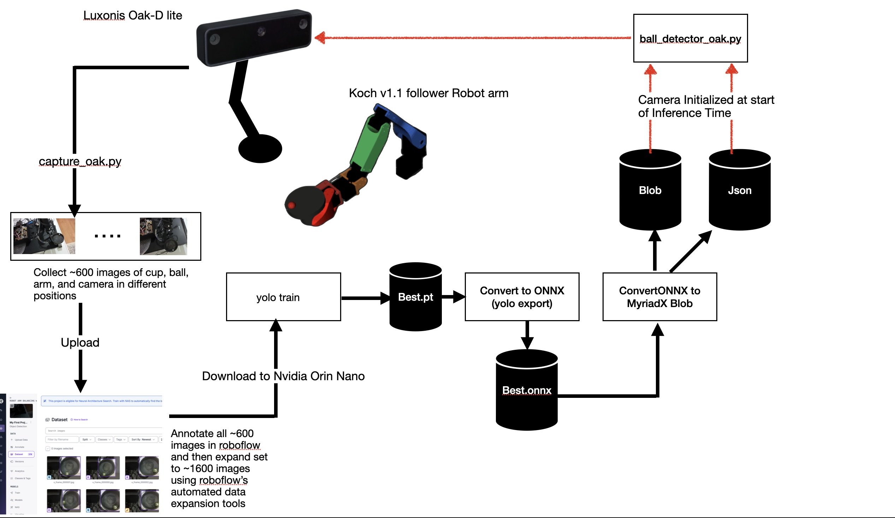
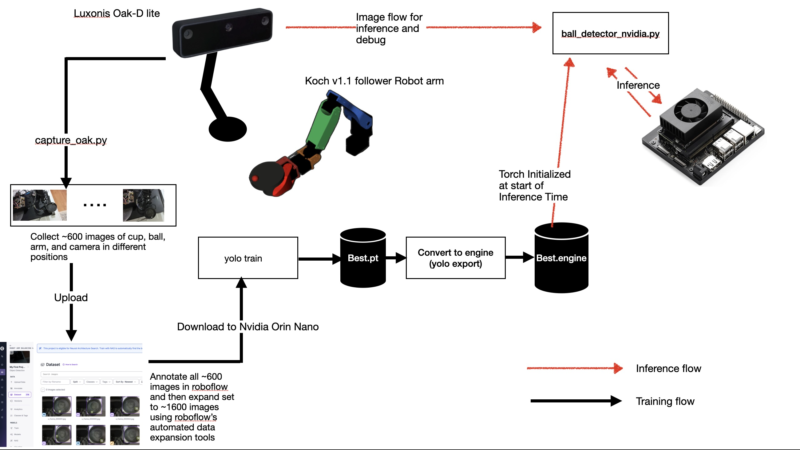

# Vision Model training and building
This section outlines the steps and services used in training and building the cup and ball detection and tracking model. 
## Model building for camera inferencing
The workflow for building the model to run on the Luxonis camera is outlined below. 

  

The detailed steps are provided in the [model training workflow steps](./retraining_workflow.md#ball-detector-training-and-retraining-workflow).

## Model building for Nvidia Orin Nano inferencing with Torch
The workflow for building the model to run on the Luxonis camera is outlined below. 

  

The detailed steps are provided in TBD.
